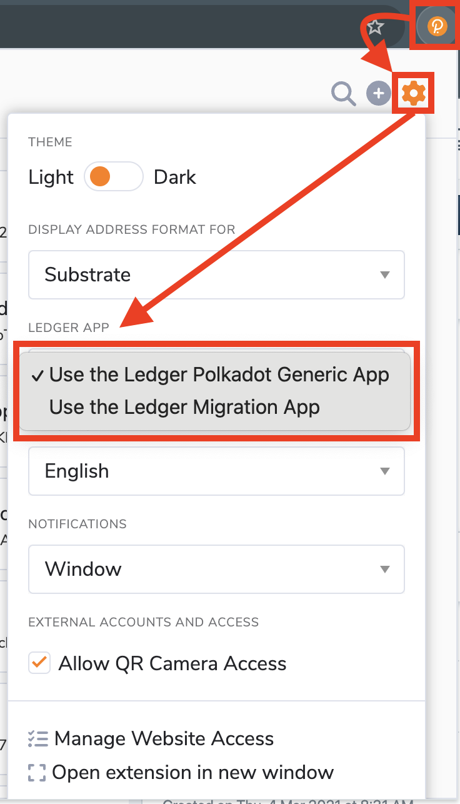
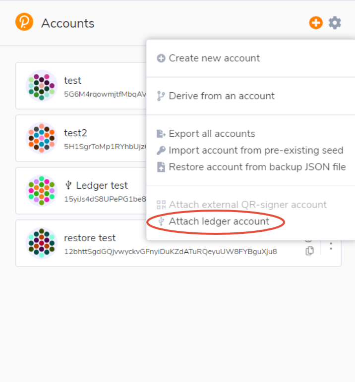
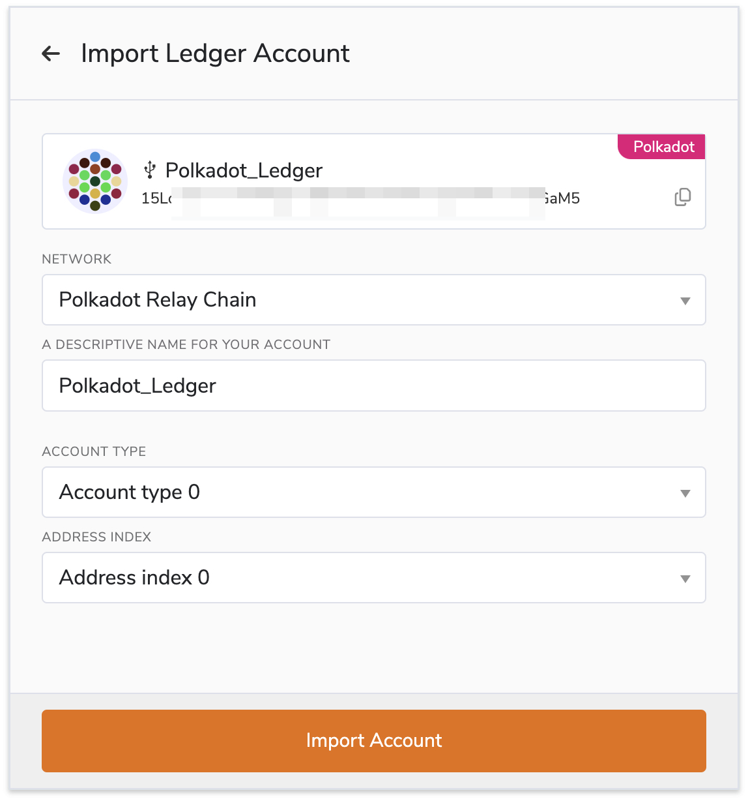

!!!info "Related concepts"
    For the underlying concepts, see [Ledger](../../general/ledger.md).

In this article you will learn how to add your Ledger Polkadot account in the Polkadot Developer Signer, both from the Generic Polkadot app, and the Migration Polkadot app.

The Generic Polkadot app allows you to operate on any network using the account generated from the Polkadot app. On the other hand, the Migration app contains the derivation path for every Substrate network, which allows you to migrate the funds from any account created from a legacy Ledger app to the new Generic Polkadot app account.

* * *

!!! warning "IMPORTANT"

    The Polkadot Developer Signer is an account manager meant for power users and developers. There are several user-friendly browser extensions that support a lot of features right from the extension. Discover them in [this article](where-to-store-dot.md).

**Adding your accounts in the browser extension is highly recommended, as it has many advantages:**

1. It provides better security than using the Web UI directly.

2. Your browser won't "forget" your accounts if its cookies are cleared.

3. It allows you to interact with any Web 3.0 compatible site in the Polkadot ecosystem.

If you haven't installed the Polkadot Developer Signer yet, you can find download instructions [here](signer-where-to-download.md).

!!! tip "GOOD TO KNOW"

    The Polkadot Developer Signer is an account manager, not a wallet. You will still need to use Polkadot Developer Interface to interact with your accounts and see your balance.

* * *

### How to add your Ledger account through the Polkadot Developer Signer

!!! warning "IMPORTANT"

    Ledger is phasing out support for the [Ledger Nano S](https://support.ledger.com/article/Ledger-Nano-S-Limitations). Your funds remain safe, but upgrading is recommended to ensure compatibility with future Polkadot updates.

    Notice that other Ledger models (e.g., Ledger Nano S Plus) aren't affected.

1\. First, update your browser to the latest version. Please note that Ledger hardware device support is only available on Chromium-based browsers (Chrome, Brave, Edge) where WebUSB and WebHID support is available in the browser.

2\. Open the Polkadot Developer Signer, go to "Settings" > "Ledger app," and ensure you have selected the desired option on the drop-down menu. Select whether you want to add an account from the Generic Polkadot app or migrate your funds using an account from the Polkadot Migration app.

3\. Connect and unlock your Ledger and open the Ledger app you selected in the previous step.

4\. Open the extension and click on the plus (+) button on the top right.

5\. Click on "Attach ledger account":

5\. Select the network for which you want to add the account from the drop-down menu.

6\. Once you do, a text field will appear. Give your account a name.

7\. Then, the Account type and index will appear. You can leave them to the default values of zero.

8\. Finally, click on Import Account.

!!! danger "READ THIS FIRST!"

    If you choose to change the Account Type and Index, **make sure to note them down for the future**. Every Account Type and Index combination will produce a different account address. If you need to re-add your Ledger account in the future, **you will need to select the same Account Type and Index** in order to access the same account.

!!! warning "IMPORTANT"

    If you get an error "**No device selected** ", check your browser settings. Go to:

    "Settings" > "Privacy and Security" > "Site Settings" > "Additional permissions" > "USB devices"

    and make sure "Sites can ask to connect to USB devices" is selected. Then try again.

    If this doesn't help, please ensure that your browser has permissions to access USB devices, in particular if it is running as a snap such as Brave on Ubuntu.  As a workaround, uninstall the default version and reinstall it from the official package repositories.

If your Ledger account doesn't appear on your [Accounts page](https://polkadot.js.org/apps/?rpc=wss%3A%2F%2Frpc.polkadot.io#/accounts) right away, allow access to it from "Settings" > "Manage Website access," ensure that the account is selected, and refresh the page.

Remember that from now on, you will need to approve any extrinsic from the imported account using the Ledger app you used to add it to the Polkadot Developer Signer, whether it was the Generic Polkadot app or the Polkadot Migration app.

* * *

If you prefer visual instructions, you can check this video which also shows an example of how you can stake using your Ledger account. This video covers Ledger accounts in general, but you can skip to the 2:30 timestamp in the video to view the instructions on how to add your Ledger account in the Polkadot Developer Signer:

[Connect Ledger to Polkadot Developer Interface](https://www.youtube.com/watch?v=7VlTncHCGPc&t=150s)

* * *
