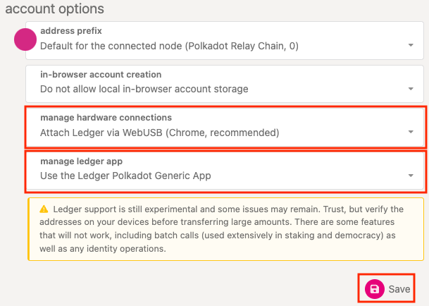
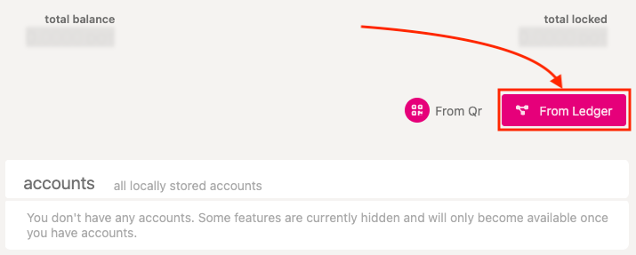
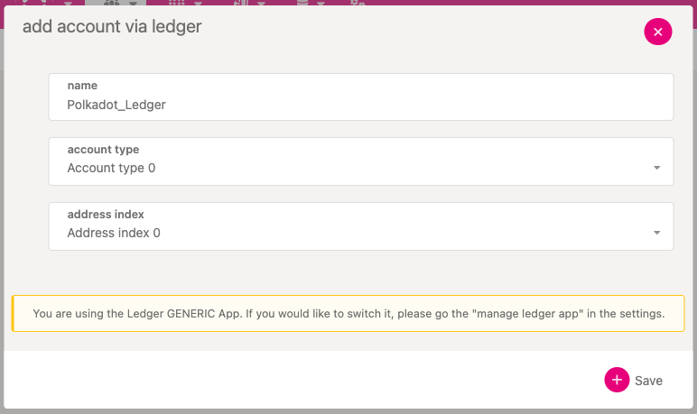
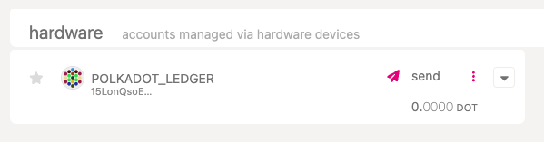

!!!info "Related concepts"
    For the underlying concepts, see [Ledger](../../general/ledger.md).

!!! warning "IMPORTANT"

    Polkadot Developer Interface is a web wallet meant for power users and developers. For everyday use, there are several user-friendly wallets that support a plethora of features and platforms. Discover them in [this article](where-to-store-dot.md).

This article explains how to add a Ledger account directly on the [Polkadot Developer Interface](https://polkadot.js.org/apps/#/accounts), either using the Generic Polkadot app or the Migration Polkadot app.

!!! warning "IMPORTANT"

    Ledger is phasing out support for the [Ledger Nano S](https://support.ledger.com/es/article/Ledger-Nano-S-Limitations). Your funds remain safe, but upgrading is recommended to ensure compatibility with future Polkadot updates. Notice that other Ledger models (e.g., Ledger Nano S Plus) are not affected.

The Generic Polkadot app allows you to operate on any network using the account generated from the Polkadot app. On the other hand, the Migration app contains the derivation path for every Substrate network, which allows you to migrate the funds from any account created from a legacy Ledger app to the new Generic Polkadot app account.

However, **adding your Ledger through the other wallet extensions compatible with Ledger is recommended** :
**[Where to Store DOT: Polkadot Wallet Options](where-to-store-dot.md)**

* * *

1\. Start by installing the Polkadot app or the Polkadot Migration app on your Ledger device by following [Ledger's Support page](https://support.ledger.com/hc/en-us/articles/360016289919) instructions.

2\. Open a Chromium-based browser (Google Chrome, Edge, Brave, etc.) and make sure you're using the latest version.

3\. On the Polkadot Developer Interface, navigate to the [Settings](https://polkadot.js.org/apps/#/settings) tab to change two settings.

4\. Under account options, choose "Attach Ledger via WebUSB" from the drop-down menu "Manage hardware connections."

5\. In the drop-down menu "Manage Ledger app," ensure you have selected the desired option. Select whether you want to add an account from the Generic Polkadot app or migrate your funds using an account from the Polkadot Migration app. Then click Save:

4\. Next, go to the[Accounts](https://polkadot.js.org/apps/#/accounts) page, and you will see the "From Ledger" button:

5\. Click it, and a window asking you to input a local name for your Ledger account, as well as Account Type and Address Index, will pop up:

If you get the "No device selected" error, check your browser settings. Go to Settings > Privacy and Security > Site Settings > Additional permissions > USB devices, and make sure "Sites can ask to connect to USB devices" is selected. Then try again.

6\. As a regular user, simply leave the default setting of 0 and 0. Only if you are an advanced user with several Polkadot accounts on a single Ledger device, enter the appropriate derivation path here. Click Save after you're done.

!!! warning "ATTENTION"

    **Remember the combination** you used here (e.g., 0 and 0) because you will be asked to enter it if you need to re-add your Ledger in the future. Any other combination (e.g. 0/1 or 1/1) will produce a different Polkadot account.

7\. You should see your account appear on the Accounts page under "Hardware" account type:

****

* * *
