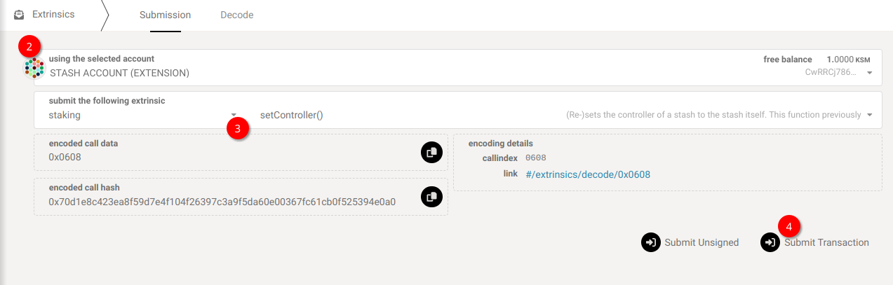

!!!info "Related Wiki page"
    For the underlying concepts, see [Staking (advanced)](../learn-staking-advanced.md).

_Discover the Staking Dashboard that makes staking much easier and check our[extensive article list](https://paritytech.github.io/polkadot-support/staking/staking-basics/staking-dashboard-overview) to help you get started._

* * *

!!! warning "IMPORTANT"

    Polkadot Developer Interface is a web wallet meant for power users and developers. For everyday use, there are several user-friendly wallets funded by the Polkadot Treasury that support a plethora of features and platforms. Discover them in [this article](where-to-store-dot.md).

!!! warning "ATTENTION"

    Controller accounts are being deprecated. You can still use existing ones for now, but creating new ones is no longer possible.

    It is recommended to set your stash account as its own controller as described below.

This article explains how to undo the connection between your stash and controller account by setting the stash account as its own controller using Polkadot Developer Interface.

* * *

### How to change your controller account

!!! tip "GOOD TO KNOW"

    If you don't want to use your stash account often, you can create a staking proxy which can do all staking actions on its behalf. It has the same advantages as the controller, but even more flexibility.

    Check how to do it in our article "[How to Create a Proxy Account](create-proxy-account.md)".

1\. On Polkadot Developer Interface, navigate to Developer > [Extrinsics](https://polkadot.js.org/apps/#/extrinsics) tab.

2\. Ensure that your stash account is selected on the top field, "Using the selected account".

3\. From the drop-down on the right ("Submit the following extrinsics"), select the 'staking' pallet and 'setController' from the one on its left.

4\. Since 'setController' does not accept any other parameter, you must click "Submit Transaction" and sign the extrinsic from your wallet.

And that's it! From now on, only your stash account can sign transactions on its behalf.

* * *
