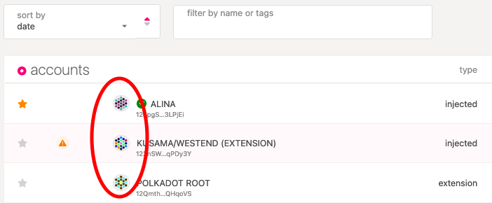
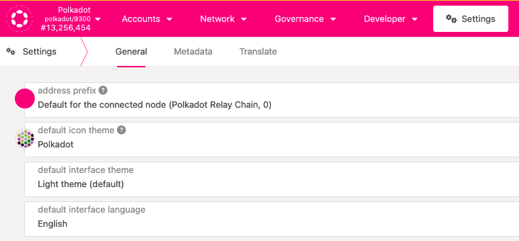
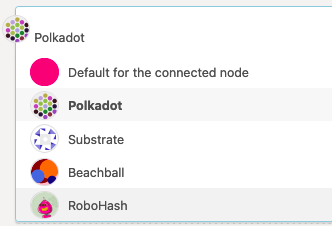
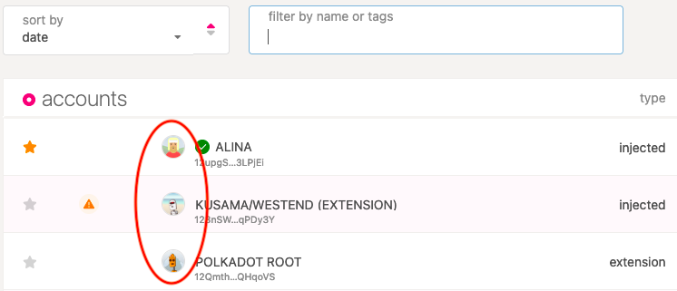

!!!info "Related concepts"
    For the underlying concepts, see [Accounts](../learn-accounts.md).

On the [Accounts page on Polkadot Developer Interface](https://polkadot.js.org/apps/#/accounts), in the Polkadot Developer Signer, and on many block explorers, small icons (also called identicons) appear next to your account address:

They are generated randomly when you create an account on Polkadot. If you don't like them or want to shake things up a little, you can change the icon theme on Polkadot Developer Interface.

* * *

### How to Change the Style of Your DOT Icon on Polkadot Developer Interface

1\. Navigate to the [Settings](https://polkadot.js.org/apps/#/settings) tab on Polkadot Polkadot Developer Interface:

2\. Click on the "Default icon theme" to see a drop-down menu:

3\. Select any theme by clicking on it. You can see an example of what the theme looks like here. We'll choose "RoboHash" in this example.

4\. Click Save on the bottom right to apply the changes.

5\. Navigate back to the Accounts tab, and see your new RoboHash icons!

