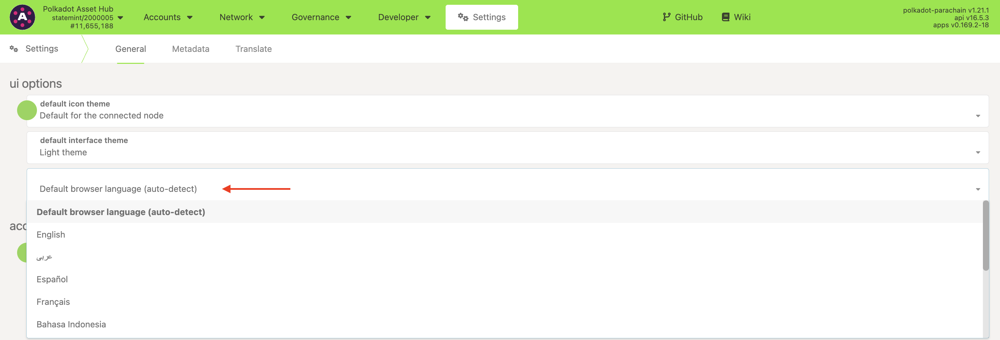

!!!info "Related concepts"
    For the underlying concepts, see [Polkadot Developer Interface](../../general/polkadotjs-ui.md).

!!! warning "IMPORTANT"

    Polkadot Developer Interface (Polkadot-JS UI) is a web wallet meant for power users and developers. For everyday use, there are several user-friendly wallets funded by the Polkadot Treasury that support a plethora of features and platforms. Discover them in [this article](where-to-store-dot.md)

[The Polkadot Developer Interface](https://polkadot.js.org/apps/?rpc=wss%3A%2F%2Frpc.polkadot.io#/accounts) has been translated into several languages, including French, Spanish, Italian, Korean, and more. You can change the language settings under "Default browser language" here:

* * *
