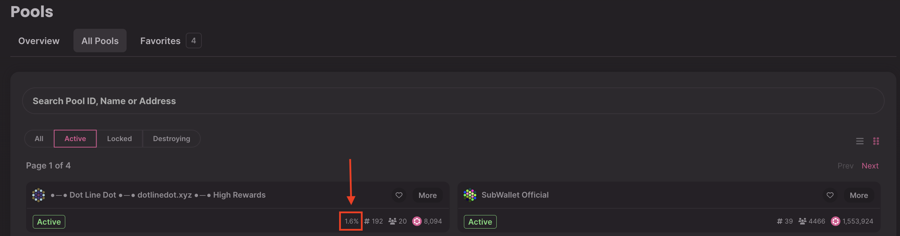
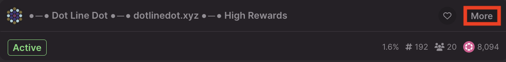
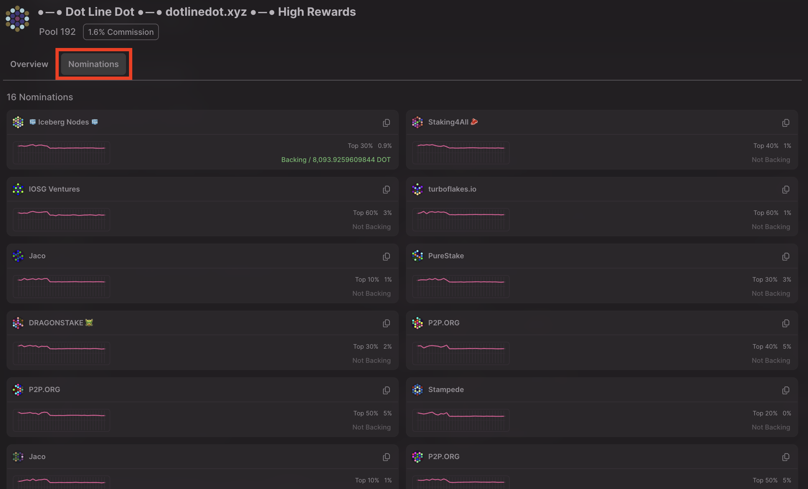
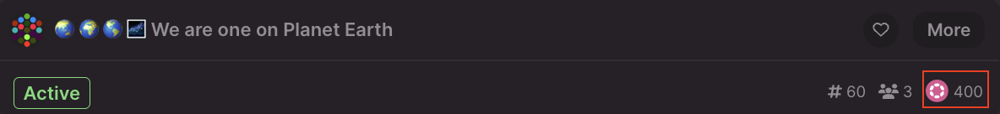
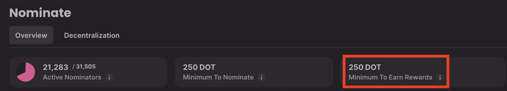
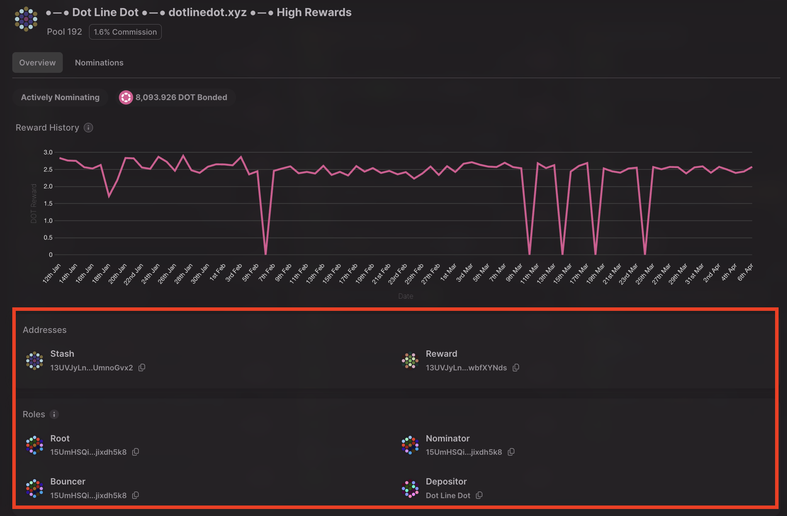

!!!info "Related concepts"
    For the underlying concepts, see [Nomination Pools](../learn-nomination-pools.md).

_Discover this new Staking Dashboard that makes staking much easier and check our extensive article list in the[Overview article](../../general/dashboards/staking-dashboard.md) to help you get started._

* * *

If you're looking to join a nomination pool on Polkadot or Kusama, this article may help you choose the right pool.

Nomination pools are designed to permissionlessly allow members to pool their funds together and act as a single nominator account. The minimum to join a nomination pool and earn rewards is low: just 1 DOT on Polkadot or 0.00166666665 KSM on Kusama. You can read more about nomination pools in [this article](../../general/dashboards/staking-dashboard.md).

It is important to do your own research before joining a nomination pool. When you join a pool, your funds remain in your custody; however, you trust the pool administration to use them to nominate in your interest. If the pool is not managed effectively, you may not earn the expected rewards. The pool administration's choice of validators can lead to slashing, and you and other pool members may lose funds.

!!! warning "IMPORTANT"

    Please remember that to switch a nomination pool, you need to unbond first. The unbonding period is 28 days on Polkadot and 7 days on Kusama. During the unbonding period, you are not earning rewards. So, make sure to choose a nomination pool you'll be happy with.

If you want to have more control of your nominations and monitor them yourself, you can stake solo, but remember that the minimum stake to earn rewards is much higher in that case:

[Staking Dashboard: How to Stake Your DOT](stake-your-dot.md)

[How Do I Know Which Validators to Choose?](choose-validators.md)

* * *

### What You Can Learn About a Pool On-Chain

The following information about a nomination pool can be found on the [Staking Dashboard](https://staking.polkadot.cloud/#/pools) and [block explorers](block-explorers.md).

#### **Pool Commission**

Nomination pools can charge a commission. It is applied to the staking rewards the pool earned after the validators took their commission. On Polkadot and Kusama, a pool commission can be anywhere between 0% and 10%. If a pool has a non-zero percent commission, you will see it on the [Staking Dashboard](https://staking.polkadot.cloud/#/pools):

Pool administration can change this commission over time. You can read more about [pool commissions](../learn-nomination-pools.md#pool-commissions).

#### **Current Pool Nominations**

To see all the validators the nomination pool currently nominates, click "more".

A new screen will be displayed. Click the "Nominations" tab to view the validators that this pool is nominating.

Make sure you agree with the choice the pool administration made. It's recommended to avoid nominating validators with 100% commission. You can check other points to consider in [this article](choose-validators.md).

#### **Total Stake**

You can see the pool's total stake near the DOT logo.

Make sure it's well above the current minimum amount required to earn rewards. You can see the minimum on the [Nominate](https://staking.polkadot.cloud/#/nominate) page:

Please note that this minimum is dynamic and will change over time, as well as the pool's total stake.

#### **Pool Administration Accounts**

If you want to see the public address and roles of a specific pool, you have to click on "More", and on the new displayed screen, you'll find all the information regarding the pool:

You'll find more information about [each specific role's meaning](../learn-nomination-pools.md#roles).

Here are a few things to consider about the accounts that manage the pool:

  * Is the same personal account playing all roles, or are there different accounts in the pool administration? Having one personal account for every role may be convenient for the owner, but it also creates a single point of failure. If the only pool manager loses access to their account or just loses their interest, the pool will be left unattended.
  * Is it a personal account that manages the pool, or a multi-signature one? Multi-signature accounts are controlled by several key owners, not just one, and are a good solution for teams that want to manage a pool collectively.
  * Do the management accounts have on-chain identities with contact information? You may want to talk to the pool manager, e.g., to ask some questions about the pool. Having their contact information will be very helpful in this case.

#### **Pool's Contact Information**

Nomination pools don't have on-chain identities with contact information. However, you can sometimes find the pool's website or social media account information in its name. You may need to check the pool on a block explorer to see its full name. On the pool's website or social media, you may find answers to your "off-chain" questions, which we will cover below, or get in touch with the pool management.

* * *

### What You Can Learn About a Pool Off-Chain

Some questions about how a nomination pool is managed cannot be answered solely by the on-chain information. You may need to talk to the pool management or check the pool's website or social media.

#### **Permissionless Rewards Claiming**

Pool members can allow permissionless claiming of their rewards (to their account, to their stake in the pool, or both). Some nomination pools claim rewards for their members as part of their services, allowing members to compound the rewards without paying transaction fees or monitoring the situation. The more often your rewards are compounded, the more effect it has on your total rewards earned.

#### **Nomination Adjustment**

Nomination pools nominate validators for all members of the pool based on some criteria, like the ones described in [this article](choose-validators.md). Over time, the selected validators can raise their commission, make significant changes to their infrastructure, or even stop validating. The pool administration should review the pool's nominations and adjust them from time to time. You may want to see how often the nominations are changed and on what criteria.

#### **Community Reputation**

Nomination pool administrators can be active on their social media and in the ecosystem channels to answer potential questions, attract new members, and boost their reputation. You can join the [Polkadot community](../../general/community.md) on social media to see what reputation a nomination pool has.

* * *

### Joining a Nomination Pool

Once you have done your own research and picked a nomination pool, join it! The steps are described in these guides:

[Staking Dashboard: How to Join a Nomination Pool](join-nomination-pool.md)

[Polkadot-JS UI: Nomination Pools](nomination-pools-guide.md)

If you are more of a visual learner, take a look at this video guide:

[Staking Dashboard: Create, Manage and Destroy Nomination Pools | Technical Explainers](https://www.youtube.com/watch?v=aTFWhwy_Mxg&t=787s)

* * *
