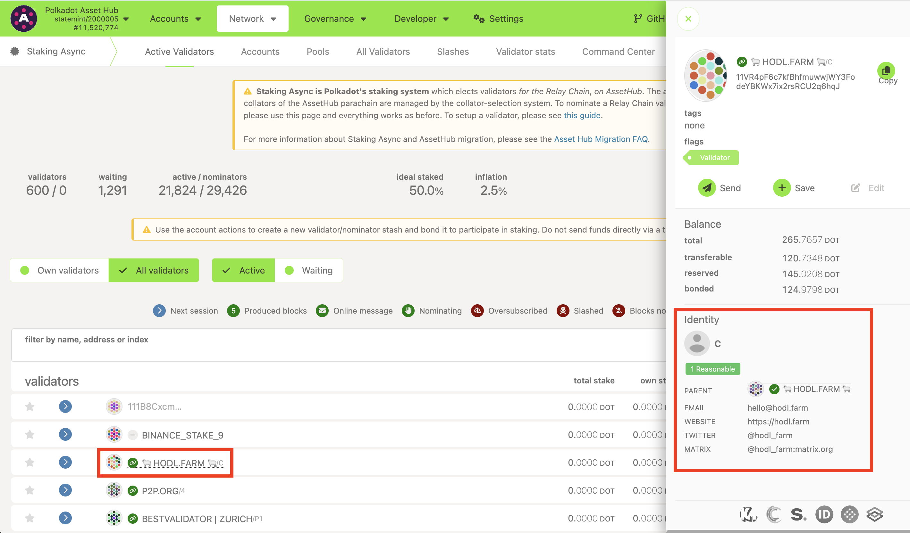
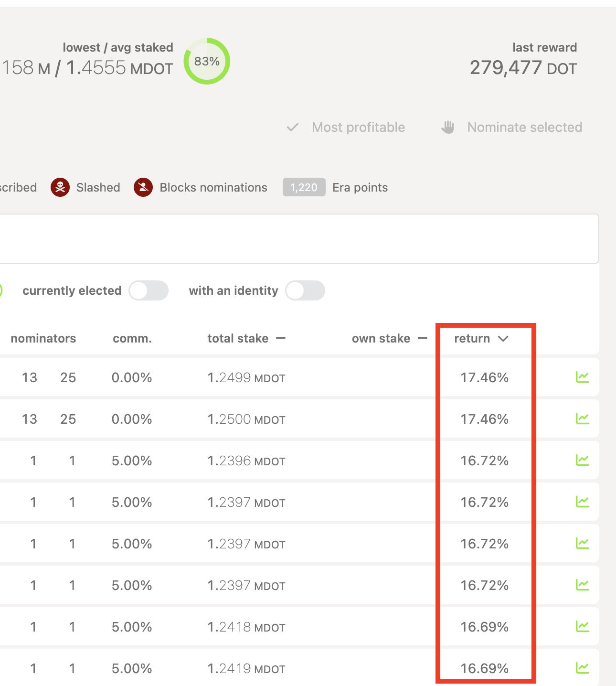

!!!info "Related concepts"
    For the underlying concepts, see [Nominator](../learn-nominator.md).

If you're wondering how to stake on Polkadot, this article has important information on deciding which validators to pick.

It is essential to  **do your own research** before nominating and to keep monitoring your nominations. Nominating on Polkadot is an active role. If your active validator misbehaves, you may lose funds due to slashing. If you just "set it and forget it," you may stop earning rewards over time.

If you do not wish to monitor your selections continually, you can consider joining a nomination pool instead of staking solo. These articles can help you with that:

[Staking Dashboard: Nomination Pool Features](../../general/dashboards/staking-dashboard.md)

[Staking Dashboard: How to Join Nomination Pools](nomination-pools-guide.md)

You can find the information about validators on the [Community](https://staking.polkadot.cloud/#/community) and [Validators](https://staking.polkadot.cloud/#/validators) tabs of the Staking Dashboard.

!!! info

    This article points out some things to consider when choosing your validators. If you want to dive a bit more into the topic, we suggest reading this [blog post](https://polkadot.network/blog/nominating-and-validator-selection-on-polkadot/) from our research team.

### Best Practices for Nominating: Points to consider

#### **1\. Choose more than one validator**

If at least one of the validators you nominate is elected by the election algorithm to be in the active set, you will nominate them with your entire stake. However, there is a risk of getting no rewards if you nominate very few validator candidates and none of them are chosen. Therefore, it is safer to choose as many trustworthy validators as possible (up to 16 on both Polkadot and Kusama).

#### **2\. Check if the validator has verified their identity**

If a validator has set its identity, you'll see the details on the [Validators](https://staking.polkadot.cloud/#/validators) tab of the Staking Dashboard or by clicking on the validator's name on the [All Validators](https://polkadot.js.org/apps/#/staking-async/all-validators) page of the Polkadot Developer Interface. Besides a displayed name, a validator can indicate their email, website, Twitter account, or something else. You can filter out validators without identities both on the Staking Dashboard and the Polkadot Developer Interface. However, not all validators have verified their identity with a registrar on Polkadot. Validators with a verified identity are marked by a green icon next to their name on the Polkadot Developer Interface. Verified identity affirms that the validator's contact information and name have been confirmed.

#### **3\. Be aware of the "high returns" validators**

 Although it may be enticing to select based only on this criterion, this choice may not be the best one. You need to ensure you're choosing good validators by considering the other factors in this guide and video.

#### **4\. Pay attention to the quoted commission**

Block rewards are shared with nominators, but the validators set the commission they take out for their costs before profits are given out. This rate can vary greatly.

**Be aware that if you nominate a validator with** 100% commission **, you will get** NO rewards. These validators are not looking for nominators! Also, commissions can change, so keeping an eye on who you are nominating while you are staking is recommended. Both the Staking Dashboard and the Polkadot Developer Interface let you sort validators based on the commissions and filter out validators with high ones.

Selecting validators with 0% commission may also be enticing, but make sure that the validator isn't cutting on infrastructure costs to make up for this 0% commission. It's usually better to choose validators with higher commissions if you trust them more. The impact of the commission on the rewards is pretty small, after all.

#### **5\. See how much "skin in the game" the validator has**

On the Polkadot Developer Interface, the "own stake" column shows how many of their own DOT tokens the validator has staked. The "total stake" column shows how much your stake will count towards them.

Keep in mind, though, that validators with low "self-stake" don't necessarily have low "skin in the game." Usually, these validators nominate themselves from other accounts, so they do run a risk of losing their own funds if they get slashed.

#### **6\. Get some background details**

More information, such as the [era points](../learn-staking.md), elected stake, rewards & slashes, can be found on the Polkadot Developer Interface by clicking the graph icon on the far right of each validator.

!!! tip "GOOD TO KNOW"

    When you have decided on your validators, add them to your Favourites: click on the heart icon on the Staking Dashboard or the star icon on Polkadot Developer Interface. This will allow you to quickly select them as your nominations later.

#### **7\. Nominate!**

Now that you've decided on your validators, you can nominate them. [This guide](stake-your-dot.md) can help you with the process, but we also recommend checking all the articles in the [Staking Dashboard: Overview](../../general/dashboards/staking-dashboard.md) page.

* * *

### Check online and join the community

Many Polkadot validators also publish YouTube videos or guides to staking on Medium to boost their reputation and attract nominators.

Community members on the forums often share their recommendations and experiences. Join the conversation on our [Polkadot Watercooler](https://matrix.to/#/#polkadot-watercooler:parity.io) on Element/Matrix.

Further information on nominating can be found in the [Polkadot Wiki](../learn-nominator.md#good-nominator-practices).

* * *
