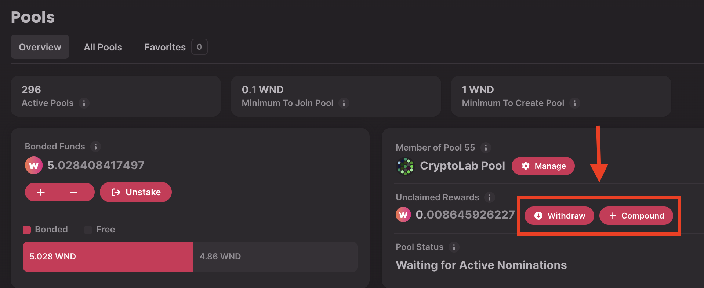
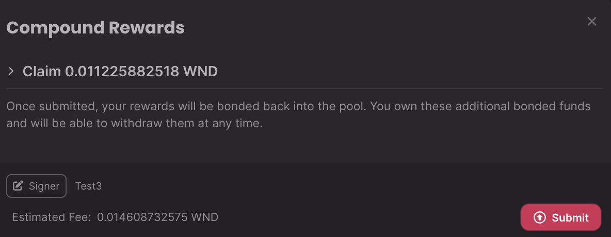
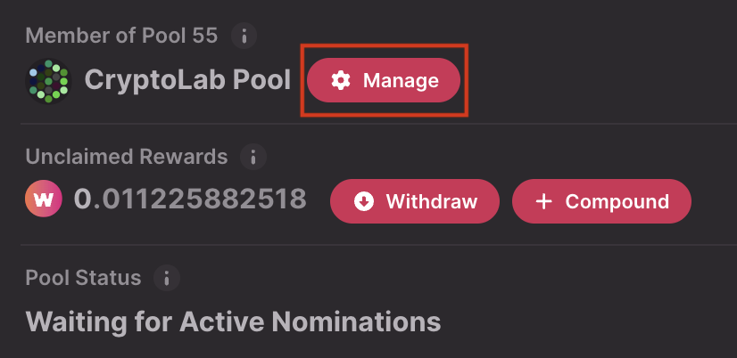
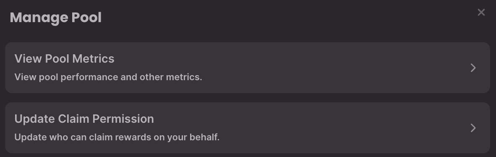
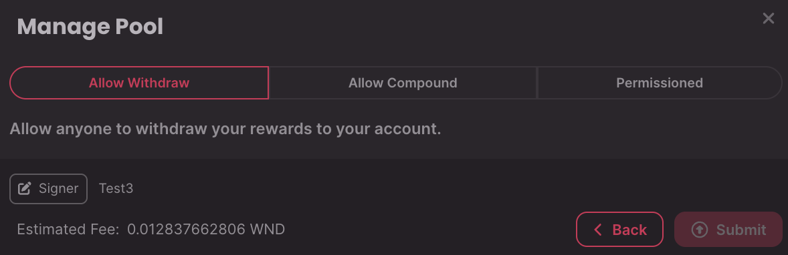

!!!info "Related concepts"
    For the underlying concepts, see [Nomination Pools](../learn-nomination-pools.md).

_Discover this new Staking Dashboard that makes staking much easier and check our extensive article list in the[Overview article](../../general/dashboards/staking-dashboard.md) to help you get started._

* * *

Rewards are split _pro rata_ among the actively bonded members. Therefore, the staking rewards for members will be the same as if they were nominators. Slashes can also be applied proportionally to members who have been actively bonded.

A member can claim their portion of any rewards that have accumulated since the previous time they claimed (or, in the case that they have never claimed, any rewards that have accumulated since the era after they joined).

!!! tip "GOOD TO KNOW"

    Adding to your bond, unbonding, or making a change to your stake in the pool in ANY way, will **automatically** trigger your rewards to be claimed.

### How to manually claim your pool rewards

1\. Navigate to the [Pools](https://staking.polkadot.cloud/#/pools) tab. You will see your unclaimed rewards here and two buttons next to them:

2\. If you want to withdraw your staking rewards to your account, adding them to your transferable balance, click "Withdraw." If you want to return your rewards to the pool and increase your stake, click "+ Compound"

!!! tip "GOOD TO KNOW"

    You can only claim your own rewards; other pool members must claim their rewards separately.

3\. Whatever option you choose, you will see the amount you are about to claim and the estimated transaction fee. Click "Submit" and sign the extrinsic to claim your rewards:

* * *

### Permissionless claiming

Although you can manually claim your rewards at any moment, there's an option to allow anybody to claim your rewards on your behalf. You can do it in just a few clicks from the staking dashboard:

1\. To update your claim permissions, click on "Manage" from the "Pool" tab:

2\. Go to "Update Claim Permission":

3\. From this new window, you have the option to:

  * **Allow Withdraw** : Anyone can claim your rewards on your behalf as a transferable balance in your account (`PermissionlessWithdraw`).
  * **Allow Compound** : It grants permission to anyone to claim and compound your rewards (`PermissionlessCompound`).
  * **Allow Withdraw or Compound** : Anyone can claim your rewards on your behalf and either withdraw them to your account or compound them back into the pool (`PermissionlessAll`).
  * **Permissioned** : Only you can claim your rewards. This means you must withdraw or compound them yourself (`Permissioned`, the default).

4\. Once you choose your preferred option, click "Submit" and sign the transaction to complete the process.

* * *

If you are more of a visual learner, check the video guide below. It covers everything you can do in the Staking Dashboard after you start staking. You can skip to 14:06 to see how to claim your rewards from a nomination pool:

[Staking on Polkadot: The After-Staking using the Dashboard](https://www.youtube.com/watch?v=58pIe8tt2o4&t=846s)

* * *
