!!!info "Related concepts"
    For the underlying concepts, see [Staking](../learn-staking.md).

__

The[Staking Dashboard ](https://staking.polkadot.cloud/#/overview)is a powerful tool in the Polkadot ecosystem that allows you to stake your DOT easily. If this is your first time using it, we recommend reading our [overview article](../../general/dashboards/staking-dashboard.md) to learn how to navigate its tabs.

This article explains how you can connect and disconnect your account to the [Staking Dashboard](https://staking.polkadot.cloud/#/overview). We will show how to connect the following types of accounts:

  * Polkadot Vault accounts
  * Ledger accounts
  * Accounts in browser extensions:
* Enkrypt
* Subwallet
* Talisman
* Polkadot Developer Extension
  * Proxy accounts (in one of the wallets above)
  * Read-only accounts

We will also show how to disconnect and remove accounts:

  * How to disconnect your account
  * How to remove a read-only account

* * *

### How to connect your Polkadot Vault account

1\. Click the "**plug icon"** button in the top right corner:

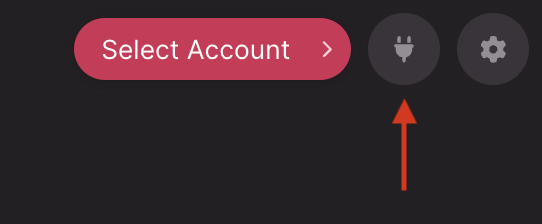

2\. Click the "Polkadot Vault" option:

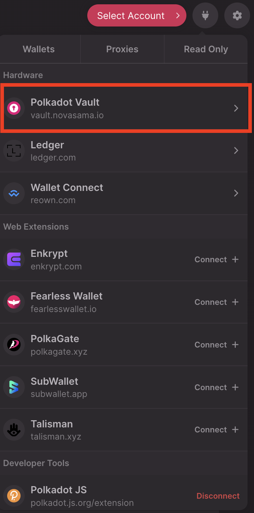

3\. Click "Add Account" to scan the QR code from Polkadot Vault.

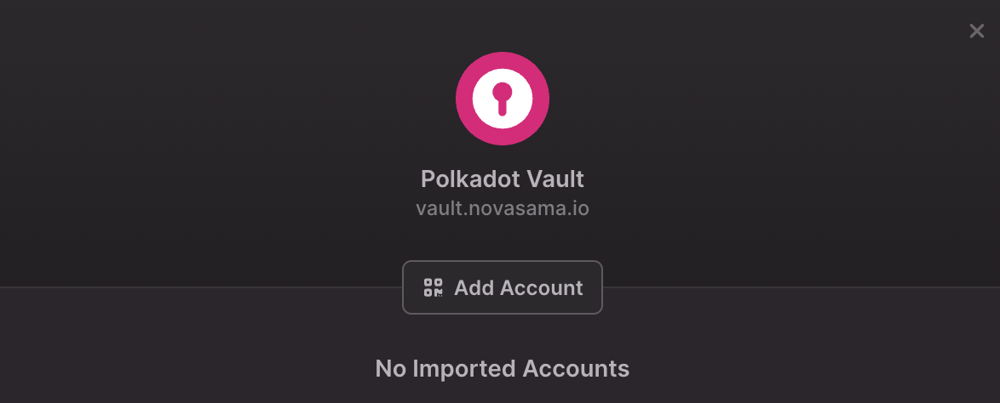

4\. If this is the first time you're adding a Polkadot Vault account, allow the Staking Dashboard to access your camera:

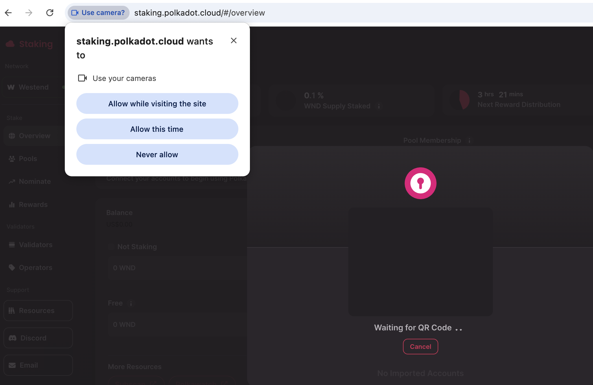

5\. Open the Polkadot Vault app, click on your account name, and select the account you want to link to the Staking Dashboard.

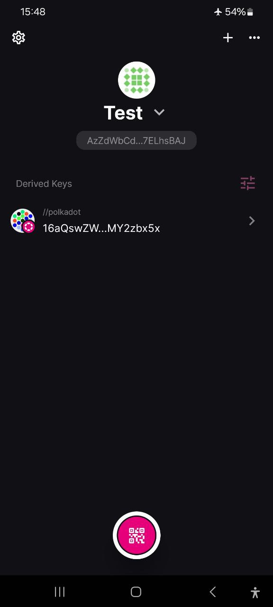

6\. Then select the network. You'll see a QR code with "Public Key" above it and your account name and address below:

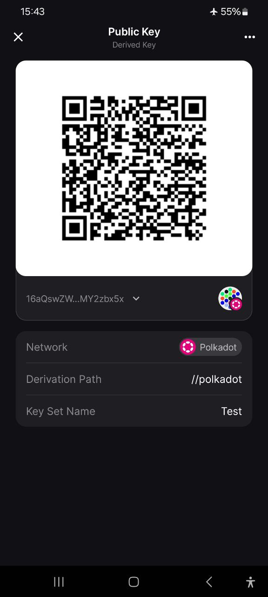

7\. Show the QR to the computer's camera, and the Staking Dashboard will detect your address. Give it a name and close this window to finish adding your Polkadot Vault account to the Staking Dashboard:

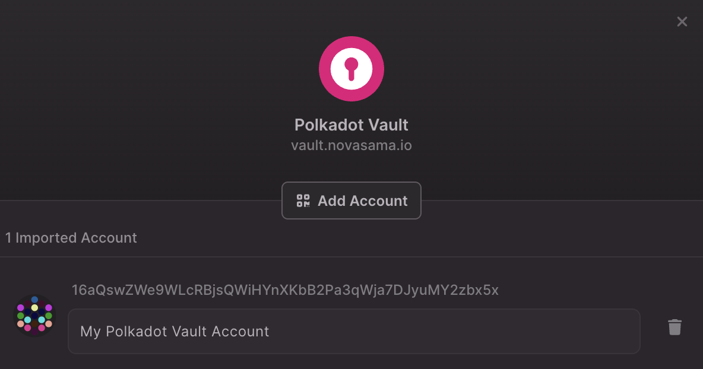

8. Click "Select Account" and choose your Polkadot Vault account from the list. You'll see the Polkadot Vault App logo on the right of your wallet.

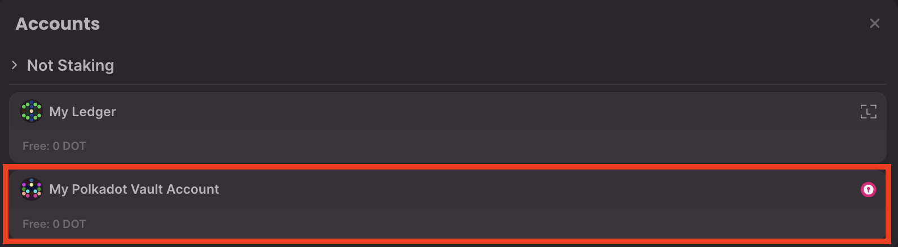

Now, you can [start staking](stake-your-dot.md) or join a [nomination pool](join-nomination-pool.md). Check out [this article](../../general/dashboards/staking-dashboard.md) to see what else you can do on the Staking Dashboard.

* * *

### How to connect your Ledger account

!!! warning "IMPORTANT"

    Ledger can only be connected using Chromium-based browsers, such us Google Chrome, Edge, or Brave.

!!! warning "IMPORTANT"

    If you are staking on Kusama, the Staking Dashboard will not recognize the Polkadot Migration app. It's recommended that you connect your Ledger to a [compatible wallet](where-to-store-dot.md), unbond, and transfer your KSM to the account generated by the Generic Polkadot Ledger app. Remember that the Polkadot Ledger app can now operate on Kusama as well!

    Alternatively, you can connect the Migration app to a compatible wallet and use it on the Staking Dashboard.

1\. Connect your Ledger device to the computer, unlock it, and open the Polkadot app. You should see "Polkadot Ready" on your Ledger screen.

2. On the [Staking Dashboard](https://staking.polkadot.cloud/#/overview), click the "**plug icon** " button in the top right corner:

3\. Click the"Ledger" option:

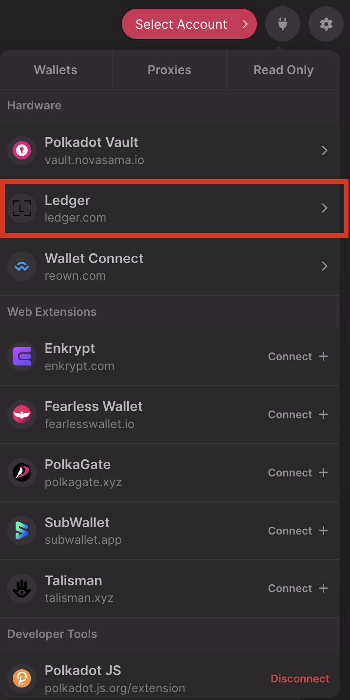

If you are connecting your Ledger for the first time, this screen will appear. Ensure your Ledger device is unlocked and the Polkadot app is open. Then, select your Ledger device and click "Connect." If you've connected before, you can skip to the next step.

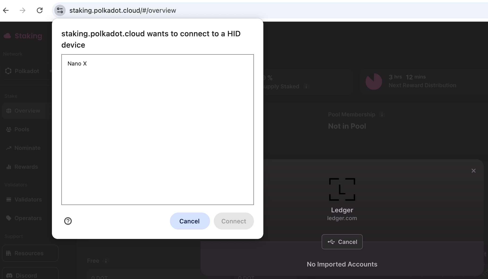

4\. Your default Polkadot Ledger account will appear. Give it a name and leave this window:

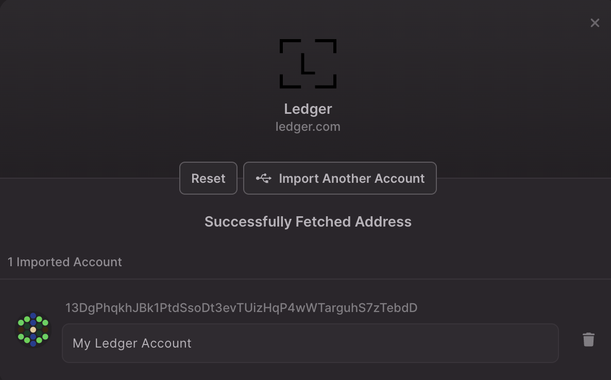

If you're not using the default account type of 0, click the "Import Another Account" button to generate an account with type 1, 2, etc., and import the account you need.

5. Click "Select Account" and choose your Ledger account from the list.

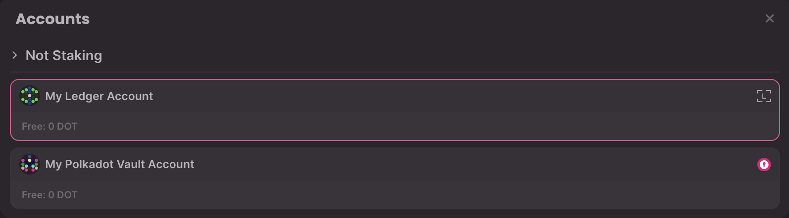

Now you can [start staking](stake-your-dot.md) or join a [nomination pool](join-nomination-pool.md). Check out [this article](../../general/dashboards/staking-dashboard.md) to see what else you can do on the Staking Dashboard.

If you are a visual learner, check out our video tutorial:

[Polkadot Made Easy: How to Connect Your Ledger Account (Staking Dashboard)](https://www.youtube.com/watch?v=-zFvk3dDHRc&list=PLOyWqupZ-WGuiPQ7WRvECJk2ZvZuvfwUK&index=24)

* * *

### How to connect your account through an extension

1\. Click the "**Plug icon"** button in the top right corner:

2\. If this is the first time you are using the dashboard, you will be presented with a list of supported extensions. Choose which one(s) the dashboard should use to import accounts:

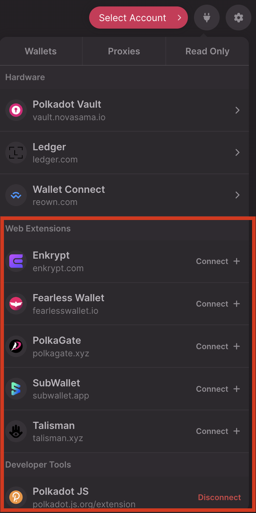

!!! info

    The steps and screenshots below will vary depending on the extension you select, but the fundamental concept of granting access to the Staking Dashboard remains consistent across all wallets.

    Check some of the wallets you can use with the Staking Dashboard in the article "[Where to Store DOT: Polkadot Wallet Options](where-to-store-dot.md)"

3\. If it's the first time you connect the extension, once you select it, a pop-up window will appear asking whether to allow the dashboard to access the accounts in the extension. Select the account(s) you want to use in the Staking Dashboard and continue.

4\. Once you authorize access, the selected accounts in the extension will be connected to the dashboard. Click the "Select Account" button at the top of the panel to view them.

5\. On the next screen, you'll see all the allowed accounts, and you can select the one you want to connect:

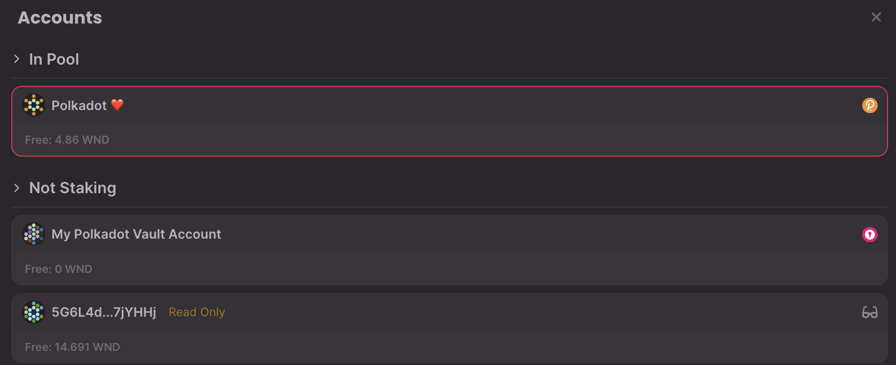

If you already have other accounts either nominating or joining a nomination pool, they will show up under an "Nominating," or "In pool" section:

**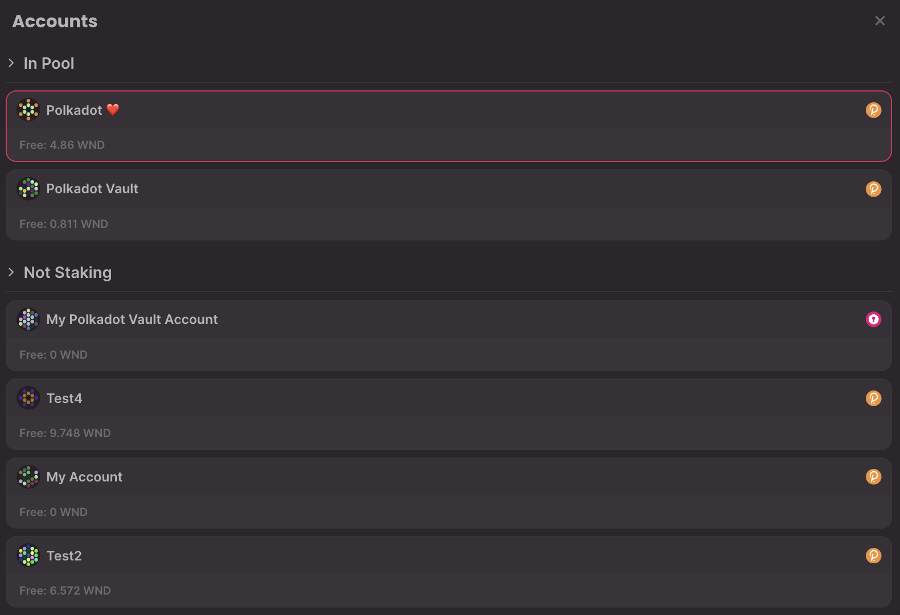**

You have successfully connected your account to the dashboard and can now start staking or managing your stake!

If you are a visual learner, check out our video tutorial:

[Polkadot Made Easy: How to Connect Your Extension Account (Staking Dashboard)](https://www.youtube.com/watch?v=UKSkGdU6lGw&list=PLOyWqupZ-WGuiPQ7WRvECJk2ZvZuvfwUK&index=23)

* * *

### How to connect a proxy account

You can connect a staking proxy to the staking dashboard and operate on behalf of the stash account.

1\. Click on the "**Plug icon"** button in the top right corner:

2\. Click the "Proxies" tab at the top of the options. You can have your proxy account in Polkadot Vault, Ledger, or one of the supported extensions.

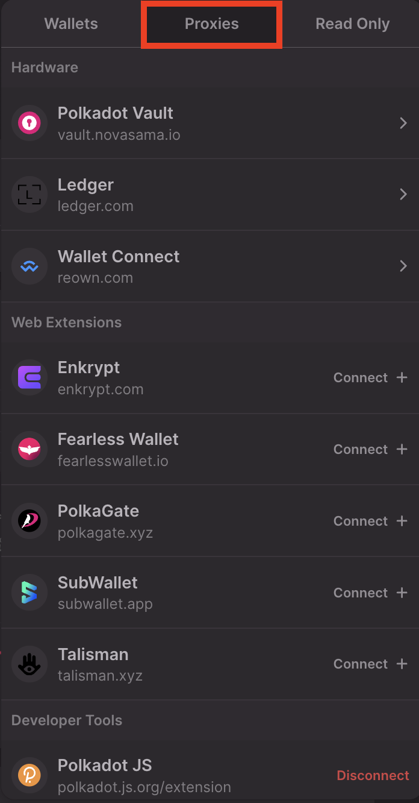

3\. Click on "Proxy Accounts" and declare it by clicking on "+ Declare," pasting your proxied account, and clicking the "Import" button.

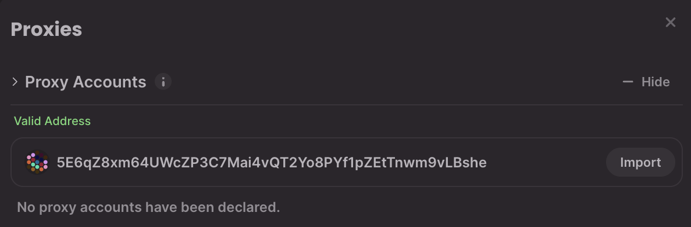

4\. Click "Select Account," and you'll see a list of your accounts, including your individual accounts and your Staking Proxy Account.

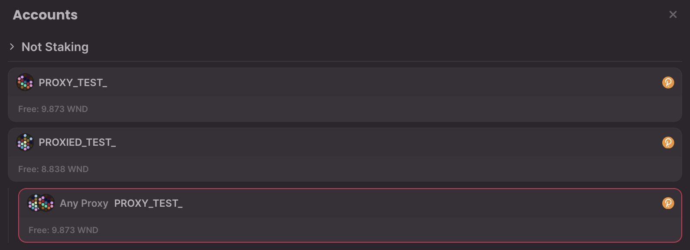

4\. Click the staking proxy account to manage the stash from the Staking Dashboard.

!!! warning "ATTENTION"

    Controller accounts are being deprecated. You can still use existing ones for now, but creating new ones is no longer possible.

    It is recommended to set your stash account as its own controller (learn how to do it [here](dashboard-update-controller.md)) and create a staking proxy to obtain the same benefits and greater flexibility.

    Check out the article on [creating a proxy account](create-proxy-account.md) for more information.

* * *

### Adding a read-only account

If you want, you can add any account as read-only. Perhaps you want to simply monitor your stash that's in cold storage. This doesn't even require that you have an extension installed.

1. Click on the "**Plug icon"** button in the top right corner:

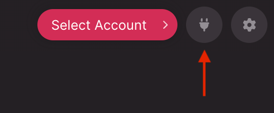

2\. Instead of Wallets, click on "Read Only":

3\. Then click "+ Add" and paste the address you want to monitor and click "Import":

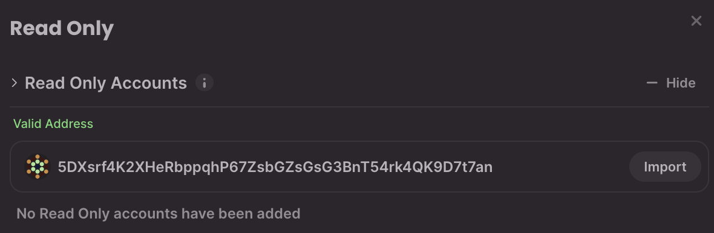

4\. Click "Select Account" to view the read-only account along with the available accounts:

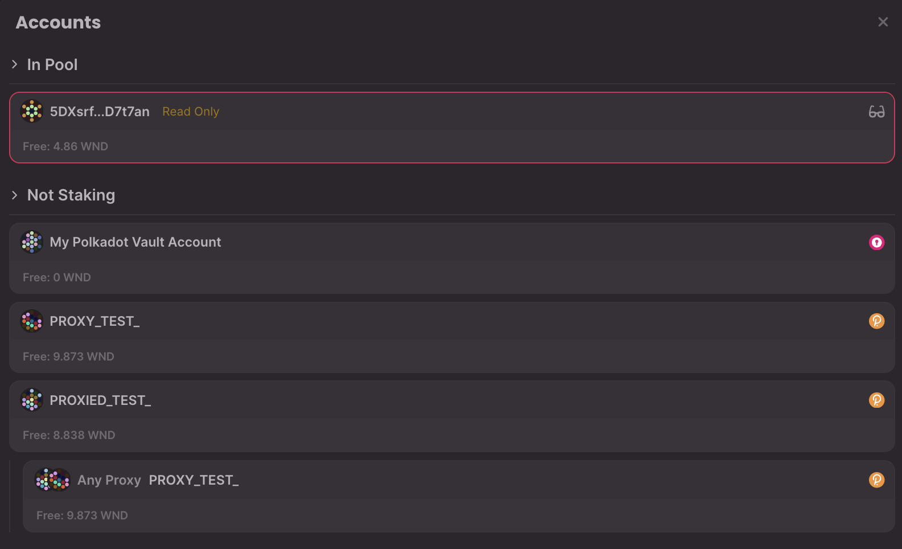

Click on it to connect the account as **read-only**.

Read-only accounts have a small pair of glasses next to them and the words "Read Only." They don't have account names. Instead, the address is shown.

* * *

### How to disconnect your account

1\. After you've connected your account, the "Select Account" button will change to your account's name or address. Click on your account name.

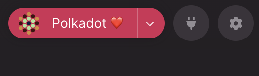

2\. In the modal that opens, click "Disconnect" or change the account by clicking the "Switch Account" option.

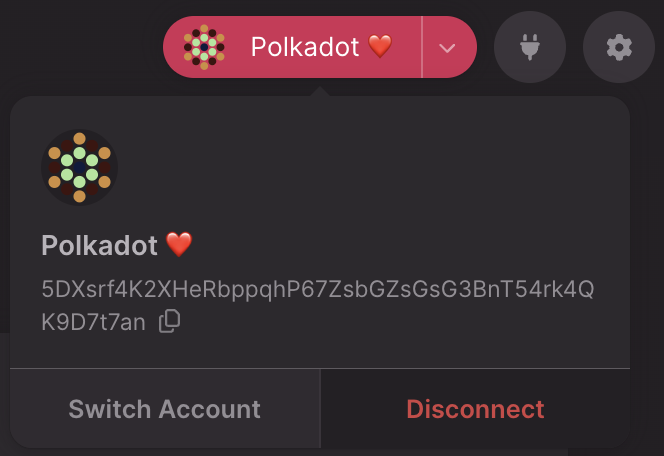

* * *

### How to remove a read-only account

To completely remove a read-only account from the imported accounts, follow these steps:

1\. Click the "Plug icon."

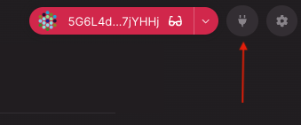

2\. On the modal that opens up, click on the "Read Only" tab:

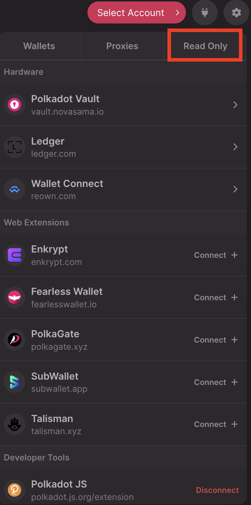

3\. Click on "Forget" next to the account you want to remove:

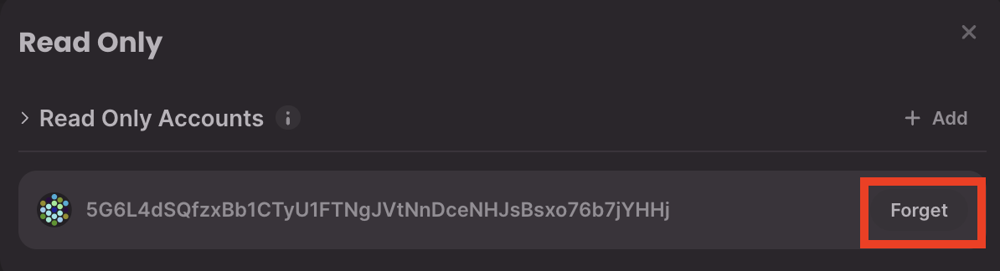

* * *
