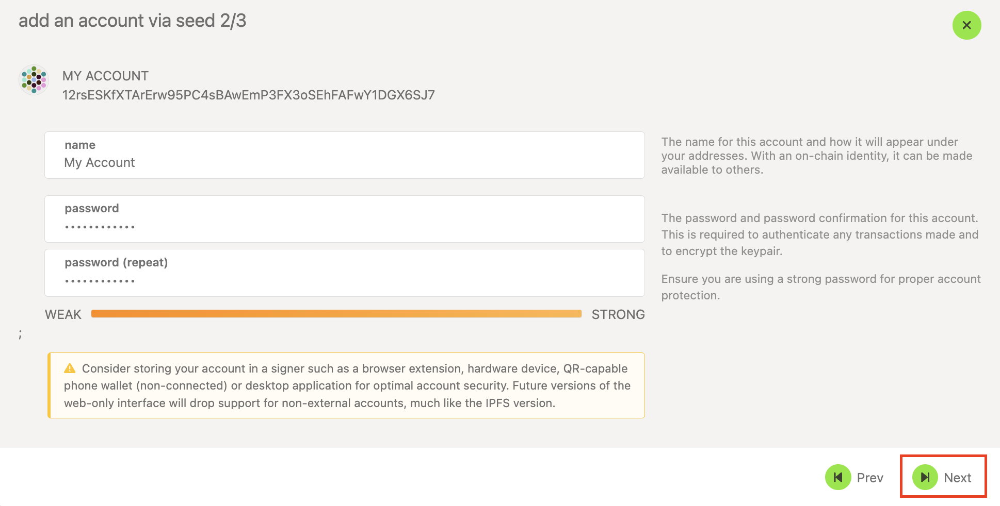

!!!info "Related concepts"
    For the underlying concepts, see [Accounts](../learn-accounts.md).

!!! warning "IMPORTANT"

    Polkadot Developer Interface is a web wallet meant for power users and developers. For everyday use, there are several user-friendly wallets that support a plethora of features and platforms. Discover them in [this article](where-to-store-dot.md).

In this article, you will learn how to create a new account in the Polkadot Developer Interface. For most users, using other wallets instead is strongly recommended:

[Where to Store DOT: Polkadot Wallet Options](where-to-store-dot.md)

**The Polkadot Developer Signer has many advantages:**

  * It provides better security;
  * Your browser won't "forget" your accounts if its cookies are cleared;
  * It allows you to interact with any Web 3.0-compatible site in the Polkadot ecosystem;
  * The extension recognizes all known Polkadot (and not only) scams and alerts you when you access a phishing site. This will help you protect yourself and your funds.

* * *

### How to Create an Account on Polkadot Developer Interface

1. On the Polkadot Developer Interface, navigate to the [Settings](https://polkadot.js.org/apps/?rpc=wss%3A%2F%2Frpc.polkadot.io#/settings) tab. In the account options, allow local in-browser account storage and click Save:

2\. Navigate to the "[Accounts](https://polkadot.js.org/apps/?rpc=wss%3A%2F%2Frpc.polkadot.io#/accounts)" page and click on the "+ Account" button:

3\. You'll see a 12-word mnemonic phrase. [Save it safely](store-mnemonic-safely.md) and check the box saying you have done so, and click "Next":

!!! warning "ATTENTION"

    Make sure to save your mnemonic phrase now, as there is **no way to view it** after the account is created.

4\. Give your account a descriptive name and a good password, and click "Next":

!!! warning "ATTENTION"

    **Your**  **password does not protect your mnemonic phrase**! It is only used to encrypt your account locally on your device. The mnemonic phrase alone can give full access to your account, which is why you can use your mnemonic phrase to restore the account if you forget your password. As a result, an attacker doesn’t need to know your password to compromise your account, just your mnemonic phrase

5\. Review the details, and click "Save." This will also download the JSON backup file for the account on your computer:

6. Your JSON backup file will have the name of your account and will go to your default download folder. Unless you rename it, it will be named like this:

_12rsESKfXTArErw95PC4sBAwEmP3FX3oSEhFAFwY1DGX6SJ7.json_

Your account has been successfully created, and you will see it listed on your "[Accounts](https://polkadot.js.org/apps/?rpc=wss%3A%2F%2Frpc.polkadot.io#/accounts)" page.

* * *

If you are more of a visual type, check this video guide:

[Creating Accounts, Downloading JSON Backup Files, and Changing Passwords on the UI and Extension](https://www.youtube.com/watch?v=DNU0p5G0Gqc)

* * *
