!!!info "Related concepts"
    For the underlying concepts, see [Multi-signature](../learn-account-multisig.md).

Multisig (multiple signatures) accounts are a great tool to increase security or distribute control of an account. A multisig account is an account that consists of several signatory accounts, and it needs the approval of some or all of them to issue an extrinsic.

In this article, you'll learn about the basics of a multisig account, possible use cases, and how to create and use a multisig account.

### Basics of multisigs

A multisig account consists of two parts:

1\. The signatories.

2\. The threshold.

The signatories are the different accounts that constitute the multisig and can be from 2 to 100. This is the number of accounts that can issue transactions from the multisig if an adequate number of the other signatories agree.

The threshold is the number of signatories that need to approve a transaction for it to happen. Usually, it is at least the majority of the signatories. The minimum threshold can be 2, and the maximum is the number of signatories.

So, suppose a multisig has, for example, 5 signatories and a threshold of 3. In that case, it's a 3-of-5 multisig, which means that from the five signatories, three need to approve a transaction for it to happen (including the one who initiated the transaction).

It's **important** to make clear that multisig accounts don't have a mnemonic phrase or private key of their own. They are controlled exclusively by the signatories. Also, the same set of signatories with the same threshold will always produce the same multisig.

Finally, the signatories of a multisig can be any kind of account. They can be a simple account in the Polkadot Developer Signer or a Ledger account controlled by a single person; they can be multisigs themselves, pure proxies, etc. However, the more complex the setup, the more complex it becomes to sign transactions for the multisig. In this article, all signatories are assumed to be simple accounts controlled by one person each.

!!! warning "IMPORTANT"

    Once a multisig account is created, you **cannot change** neither the signatories, nor the threshold. If you need to be able to do that, a more complex setup that uses [pure proxies](../learn-proxies-pure.md) is required, but this article won't cover that.

* * *

### Who are they useful for?

Organizations are usually the ones that utilize multisigs the most. That's because in an organization, usually, a single person shouldn't be able to manage the organization's funds, but instead, several people, the board of directors, for example, need to agree to a transaction.

In this case, the organization can create a multisig account, where the signatories are the members of the board, and the threshold is the specific number of directors who need to agree for a transaction to happen.

These are usually N-of-M multisigs, where the threshold is less than the total number of signatories.

But multisigs can be used for personal accounts as well. In that case, they offer more security. For example, instead of keeping your funds in a Ledger account (which is very secure on its own), you want more security, so you store them in a 3-of-3 multisig that consists of your Ledger account, an account on Polkadot Vault, and an account on Polkadot Developer Signer. Or on three separate Ledger devices. So, in this scenario, your funds can get compromised only if **all three** of these accounts are compromised. Triple the security.

Obviously, signing transactions with such an account is more cumbersome, so you need to find the right balance between security and usability that meets your needs.

These multisigs are usually N-of-N, meaning that all signatories are needed to approve a transaction because all of them are controlled by the same person, and the goal is more security.

!!! danger "READ THIS FIRST!"

    If you create a N-of-N multisig and you lose access to even one of the signatory accounts, **you lose access to the multisig as well.**

* * *

###  How to create a multisig account

Suppose Alice, Bob, and Charlie want to create a 2-of-3 multisig to manage their startup's funds jointly. Here's how it's done.

1\. They first need to add everyone else's account in their Address Book on Polkadot Developer Interface. This example plays as Alice, but the other two need to do the same. Obviously, everyone is assumed to have access to their own account on the Accounts page.

On Polkadot Developer Interface, go to "Accounts" > "[Address Book](https://polkadot.js.org/apps/#/addresses)":

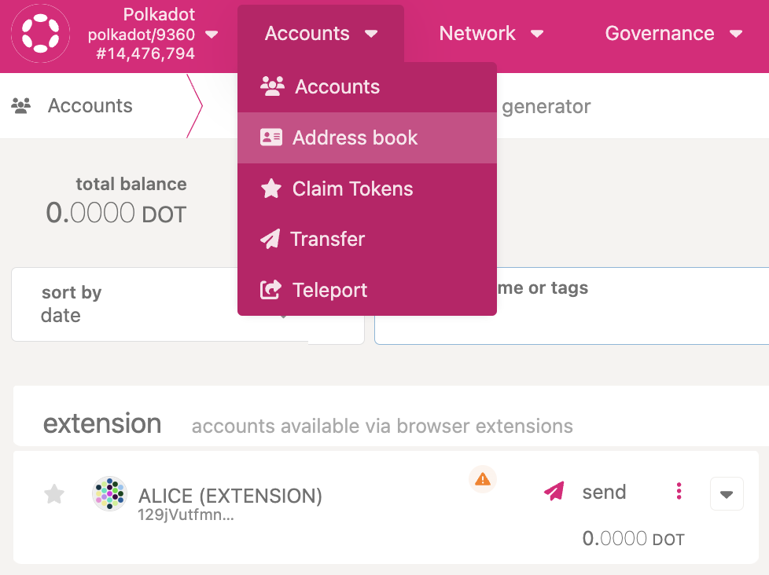

2\. Click the "Add contact" button on the right side. Enter Bob's address and give the contact a name. Then click "Save":

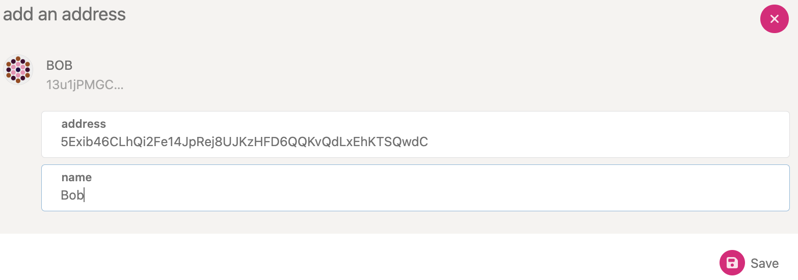

3\. This will add Bob's account as a _read-only_ account, and you do the same for Charlie's account. In the end, you should have both accounts in your Address book:

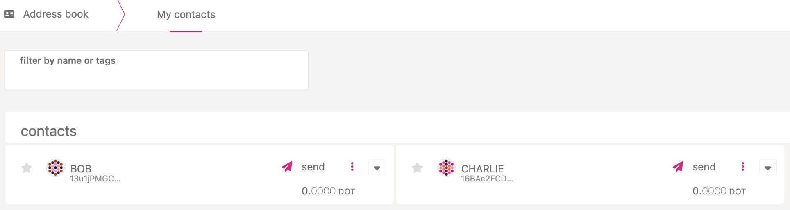

!!! info

    If you are creating a multisig for your personal use, only with accounts you already control yourself, you don't need to add them to the Address Book. They are already in your Accounts page.

4\. Now it's time to create the multisig account. All three signatories need to do this process to add the multisig to their Accounts page.

Go to the "Accounts" page and click on the "+ Multisig" button:

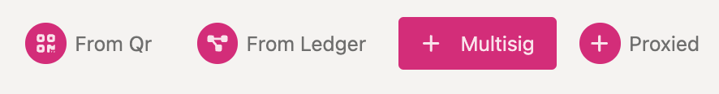

5\. In the window that opens up, click on Alice's, Bob's, and Charlie's accounts under the "Available signatories" column, moving them over to the "Selected signatories" column:

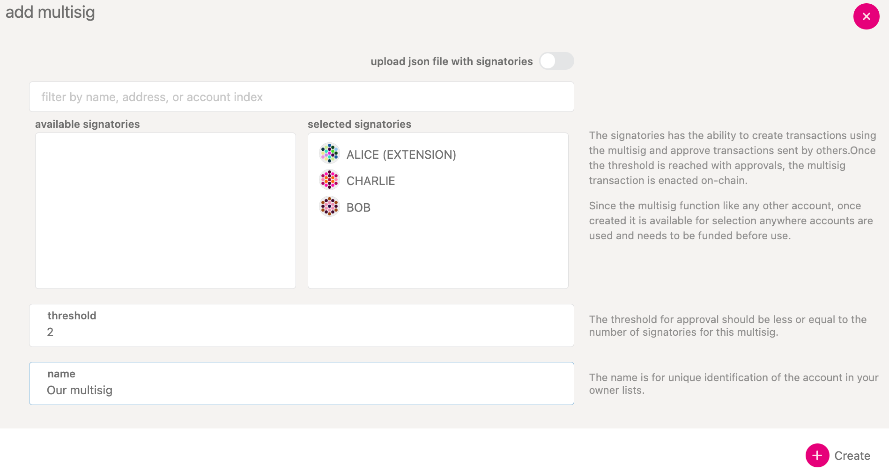

6\. Then enter the threshold. Since this is a 2-of-3 multisig, leave it at the default value of 2. If you wanted to create a 3-of-3 multisig, you'd need to change it to 3.

7\. Finally, name the multisig account and click the "Create" button.

8\. The multisig account is created. You can see it on the Accounts page:

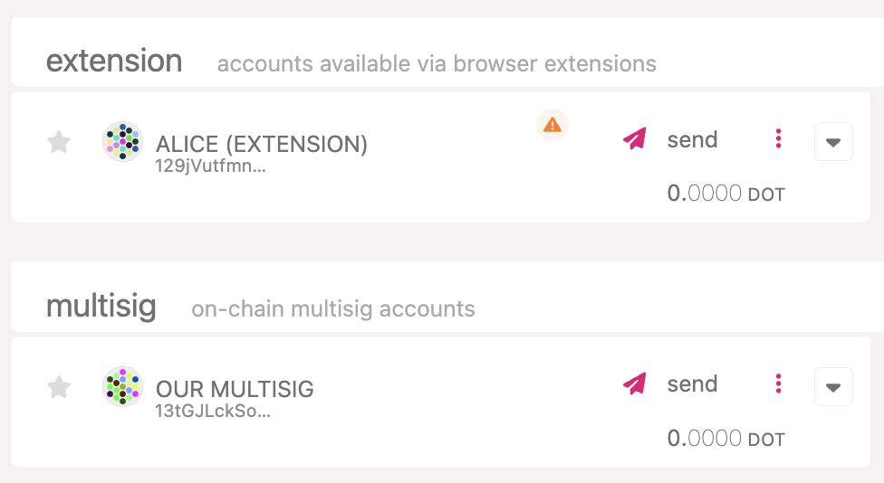

* * *

### How to use a multisig account

Now that the multisig is created and funded, Alice, Bob, and Charlie want to make a transaction.

Whenever a multisig transaction (call) is initiated, whoever initiated it must **reserve a deposit** of a little more than 0.2 DOT. The exact amount depends on how large is the threshold of the multisig. If you want to know exactly how much it is and how it's calculated, you can check [this article](../learn-account-multisig.md). This reserve is released when the transaction is approved or canceled. The rest of the signatories don't need to reserve a deposit.

This is done to prevent bloating of the chain state from multisig calls that are initiated but never completed. So, whoever plans to initiate calls needs to have at least 0.25 DOT transferable balance in their account to be able to pay for the deposit.

Here's how it's done. In this example, the Westend testnet is used, but the process is the same on Polkadot.

1\. Alice is the one that initiates the transaction, which is a balance transfer of 1 WND to Michalis. Do that like any other [balance transfer](transfer-funds.md) from the multisig account:

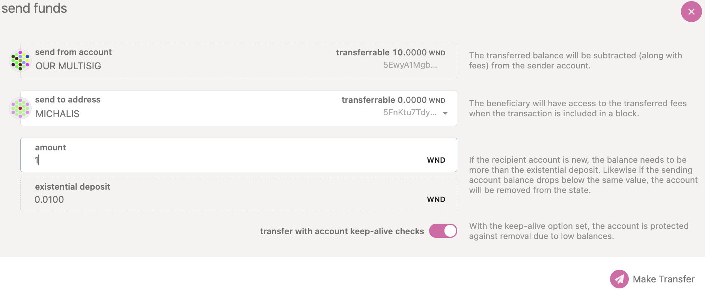

2\. Click on "Make Transfer," and the following screen appears:

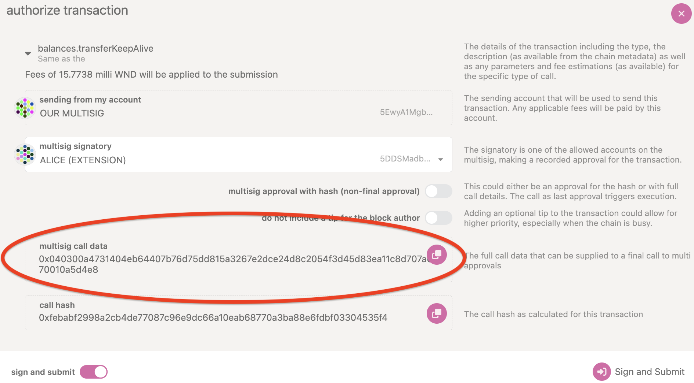

Here, you can see:

  * The sender account, the multisig.
  * The signatory signing the transaction, Alice.
  * And the multisig call data, which you need to copy.

3\. Copy "multisig call data" and share it with Bob and Charlie. They'll need this information to finalize the call. Then click "Sign and Submit."

4\. Once the extrinsic is signed, the multisig call is initiated, and some funds (about 20 DOT on Polkadot) are reserved in Alice's account. Also, an icon appears next to the multisig account, indicating there's a pending call that needs approval.

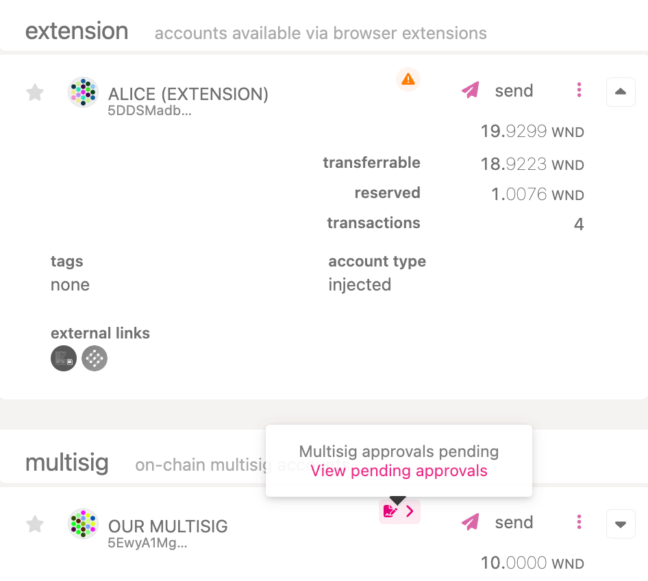

5\. Bob sees this, hovers over the icon, and clicks on "View pending approvals." The following screen appears:

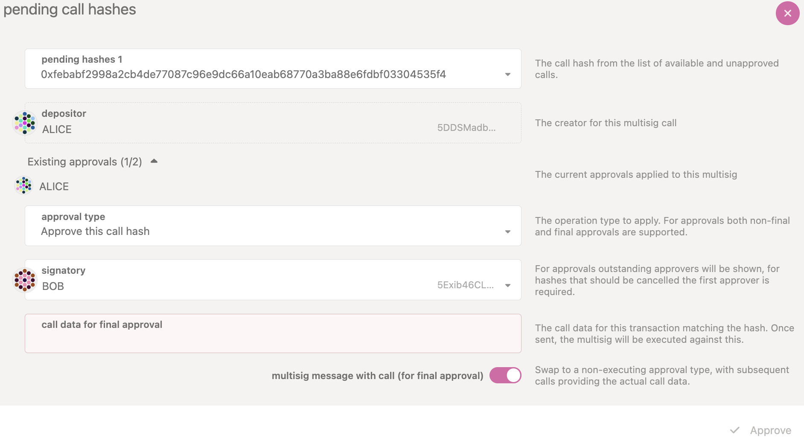

Here, he can see:

  * The depositor who initiated the call, Alice.
  * Existing approvals: 1 out of 2, Alice.
  * The signatory that is signing this approval, Bob.
  * And the place for the multisig call data to be pasted.

6\. Since this is a 2-of-3 multisig, only one more approval is needed to issue the transaction, so in this case, the second approval is also the final one. The signatory providing the final approval must paste the "multisig call data" provided by the initiator (depositor) to finalize the call. So, Bob pastes the call data Alice shared and clicks "Approve."

If the threshold were higher than 2, then the intermediary signatories wouldn't need to paste the call data; they would approve without it. Only the final signatory needs the call data to provide the final approval.

This switch is **automatically** enabled or disabled based on whether this is the final approval and **should not be changed.**

7\. Before signing the transaction, Bob wants to verify what exactly he's signing and ensure Alice didn't make a mistake. He goes to "Developer" > "Extrinsics" and goes to the tab "Decode." There he pastes the multisig call data and can see exactly what the transaction is from the multisig account he's about to approve:

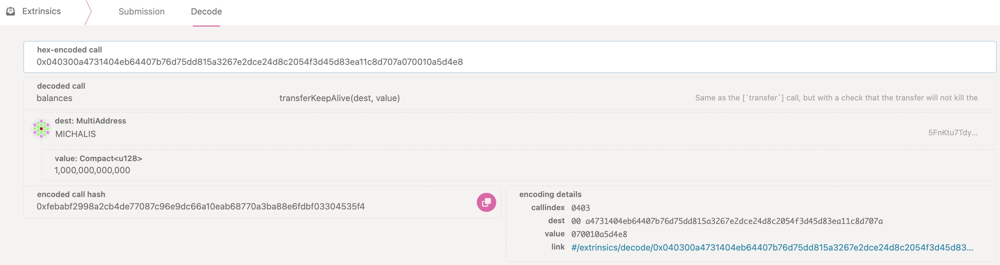

8\. Satisfied that everything is in order (keep in mind that the value above is displayed in [Planck](../learn-DOT.md#the-planck-unit)), Bob gives the final approval, and the balance is transferred. Also, Alice's deposit is unreserved:

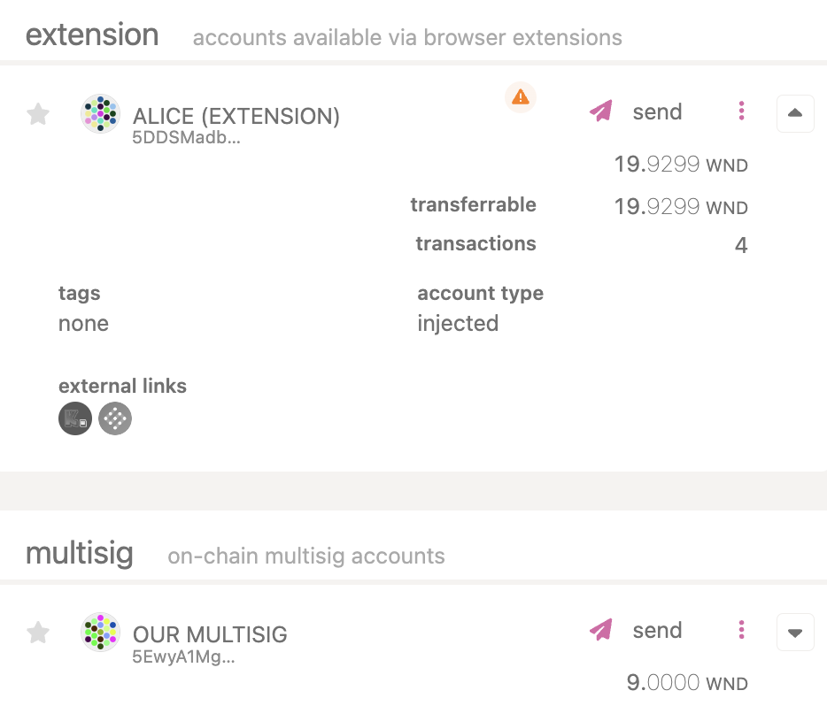

* * *

### How to cancel a multisig call

Suppose Alice (or Bob or Charlie) realizes that she made a mistake when issuing the extrinsic, and they want to cancel it. This needs to happen before the call is finalized, and **only the initiator (depositor) of the call can cancel it.** Here's how:

1\. Click on "View pending approvals," as explained above.

2\. On the modal that opens up, click on the "Approval type" drop-down menu and select "Cancel this call hash." Then click "Reject." This will cancel the multisig call and release the reserved deposit in Alice's account.

**Reminder:**  Only the signatory who initiated the call can do that.

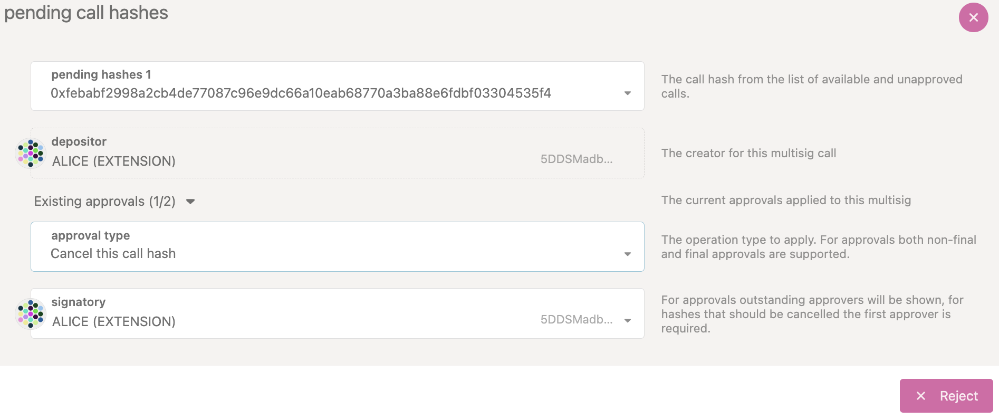

* * *

In this article, you learned how to create and use a multisig account and what they're useful for. If you want to learn more about multisigs, you can check [this article](../learn-account-multisig.md).

If you are more of a visual learner, check these video guides:

  * [Start using your Multisig Account with the Polkadot Developer Interface](https://www.youtube.com/watch?v=-cPiKMslZqI)
  * [Use your Multisig Accounts like a Pro with the Polkadot Developer Interface (Advanced Tutorial)](https://www.youtube.com/watch?v=T0vIuJcTJeQ)

* * *
