!!!info "Related concepts"
    For the underlying concepts, see [Nomination Pools](../learn-nomination-pools.md).

__

The  [Staking Dashboard ](https://staking.polkadot.cloud/#/overview)is a powerful tool in the Polkadot ecosystem that allows you to stake your DOT easily. If this is your first time using it, we recommend reading our [overview article](../../general/dashboards/staking-dashboard.md) to learn how to navigate its tabs.

This article explains how to create a pool using the [Staking Dashboard](https://staking.polkadot.cloud). If you'd like to learn how to join an already existing pool, check out [these instructions](join-nomination-pool.md) instead.

When creating a pool, you can set the administrative roles and make an initial deposit to the pool. An account can only be a member of one pool at a time.

!!! warning "ATTENTION"

    Creating pools is considered an advanced topic. Only create a pool if you plan to attract nominators and are aware of the [limitations](../learn-nomination-pools.md#limitations-of-nomination-pools).

!!! warning "ATTENTION"

    Closing a nomination pool is not simple and it takes time. For a minimum duration of two unbonding periods (56 days in Polkadot and 14 days in Kusama), multiple extrinsics must be issued between initiating the pool's destruction and its complete dismantling. Make sure you understand and accept this process before creating a nomination pool.

    For more information, visit the [Polkadot Wiki](../learn-guides-staking-pools.md#pool-destruction-with-polkadot-js).

### How to create a pool

1\. Click "Create Pool":

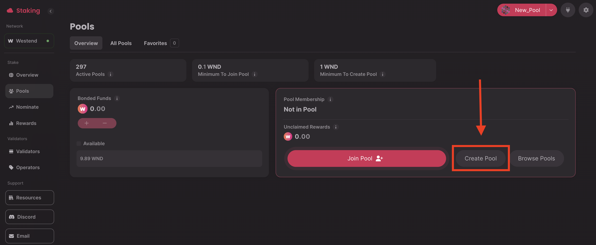

2\. Give your pool a name, and select "Continue":

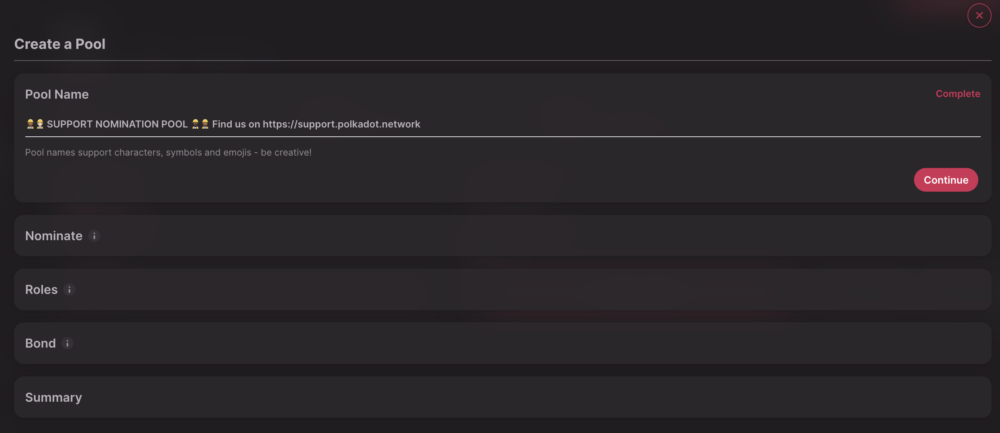

3\. Choose your nominations (up to 16 in Polkadot). You can use the built-in feature to automatically select validators based on several criteria or choose them from your favorites. Select the option you prefer, and a new screen will appear. Then, choose the validators you want to include in your pool. After making your selections, click "Continue."

Notice that whoever holds the Nominator role can update these nominations in the future.

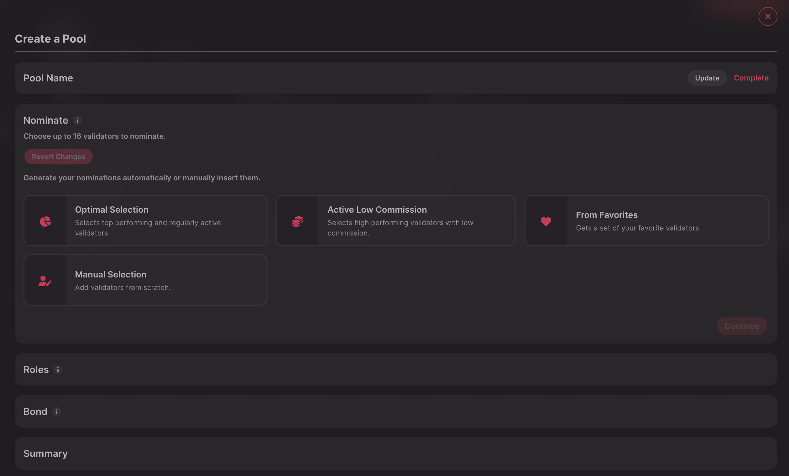

4\. You can edit your Root, Nominator, and Bouncer roles by clicking the "Edit" button. When all the roles are ready, click "Continue":

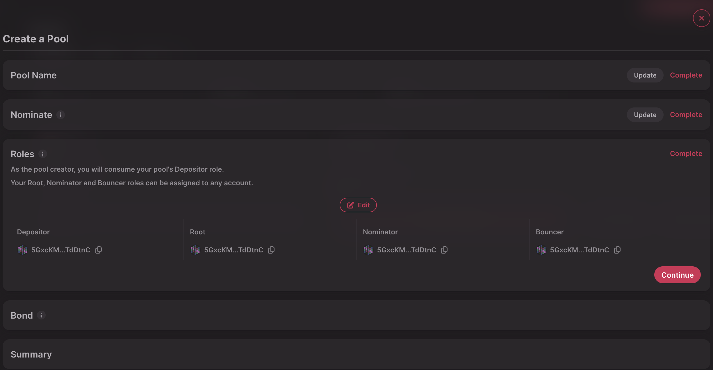

!!! info

    See this [wiki article](../learn-nomination-pools.md#roles) for a detailed overview of roles and limitations.

5\. In the "Bond" section, you can choose the initial deposit amount. Once you have done this, click "Continue."

!!! warning "ATTENTION"

    The minimum initial bond from the pool creator on Polkadot is **500 DOT**.

    As mentioned below, this manager's bond can be withdrawn from the pool only if the pool is in the "destroying" phase and all other pool members have exited the pool.

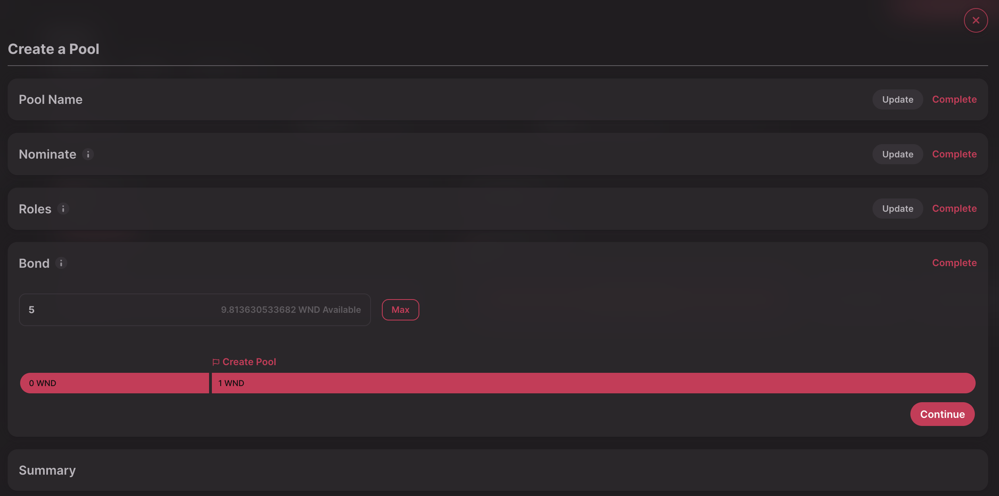

6\. Review your selections to make sure everything is correct. If not, you can use the "Update" button to make changes.

If everything looks good, select "Create Pool":

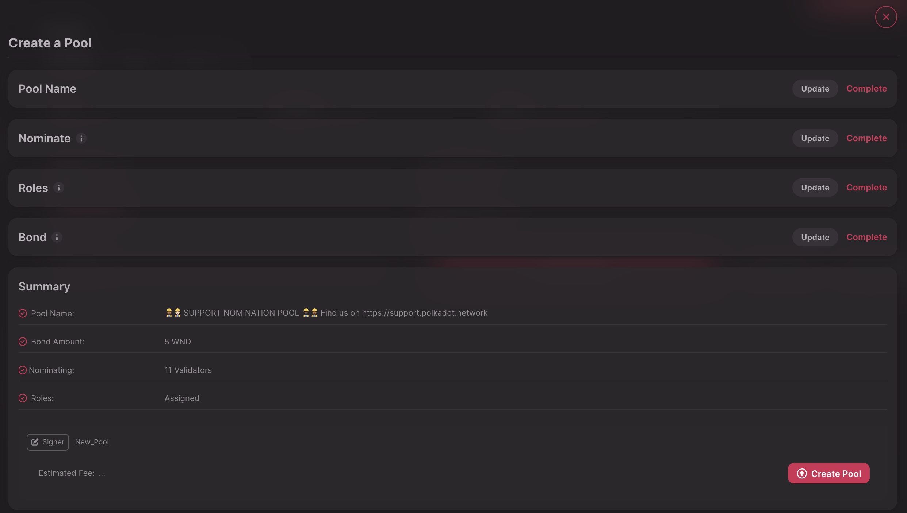

The "Overview" tab will display your role once the transaction is complete.

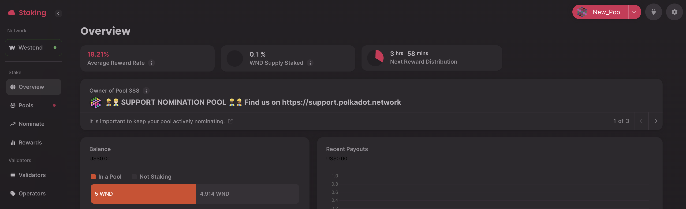

* * *

### Pool management options

Once a pool is created, some of its features can be modified by the Root account from the "Manage" menu:

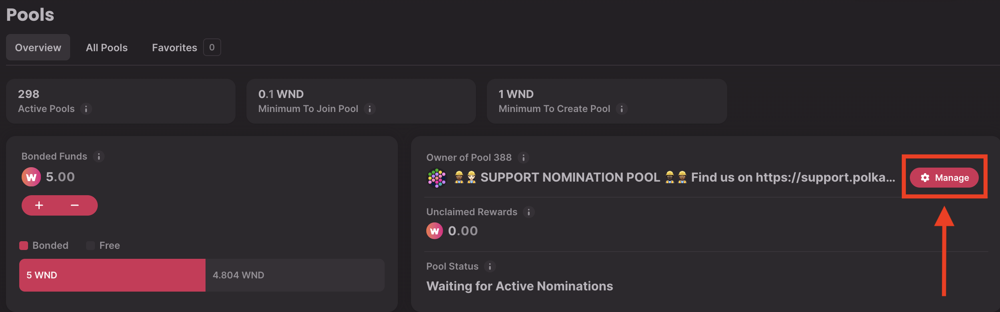

The "Manage Pool" panel provides the Root account with access to the following options:

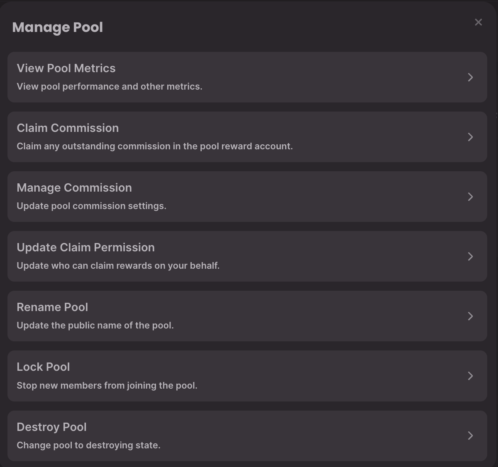

  * **View Pool Metrics:** This option will display information regarding the pool and its metrics.
  * **Claim Commission** : If the nomination pool had set commission to the pool's rewards, it could be claimed from here.
  * **Manage Commission** : A commission rate can be set after importing the payee account. This commission can be increased up to the value of "Max Commission" at a specified "Change Rate." Once set, the "Max Commission" and the "Change Rate" can only be decreased. To learn more about nomination pools commission, visit the [wiki article](../learn-nomination-pools.md#pool-commissions) on the topic.

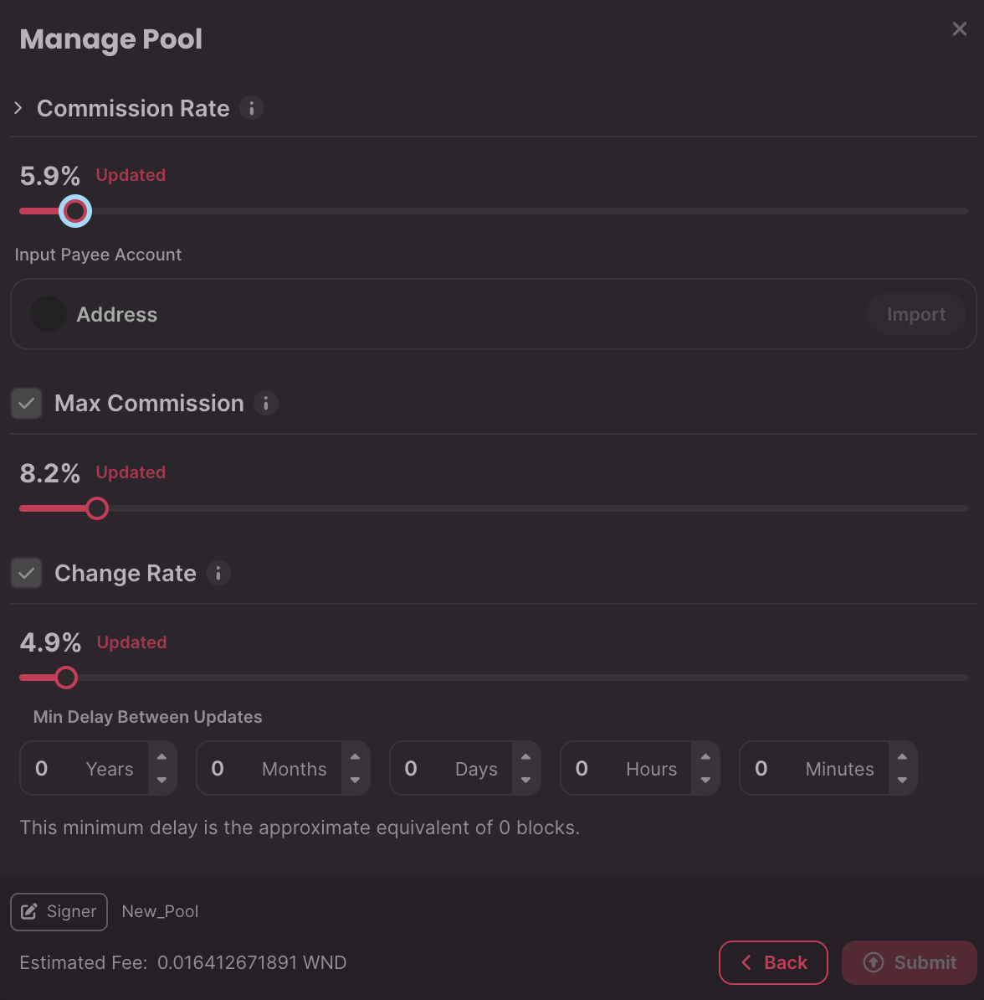

!!! warning "IMPORTANT"

    The "Global Maximum Commission" is set by public referenda. Currently it's set to 10% in Polkadot and Kusama.
    

  * **Update Claim Permission:** As a pool member, you can allow anybody to claim your rewards on your behalf by compounding them back to the pool or withdrawing them to your account.

Please note that this setting only affects your own account. Each member must make their own choice.

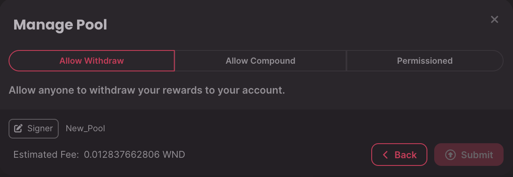

  * **Rename Pool:** As Root, you can update the name of the nomination pool.
  * **Lock Pool:** Limits new members from joining the nomination pool.
  * **Destroy Pool:** Initiates the pool destruction as described in the following section.

* * *

### How to initiate the destruction of a pool

!!! warning "IMPORTANT"

    As the pool manager, your deposit must remain locked as long as the pool exists. Only after all other members have left will you be able to _initiate_ the unbonding from the pool.

1\. To destroy the pool, connect the account with the "Bouncer" role and click the "Manage" button:

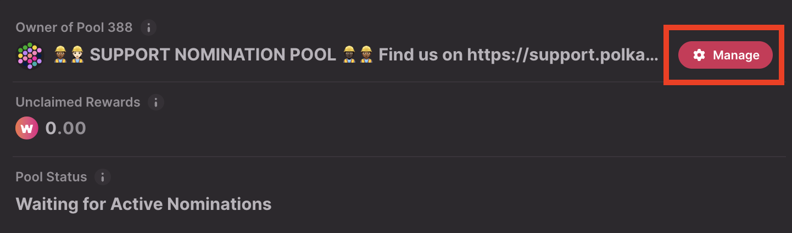

2\. Choose the "Destroy Pool" option:

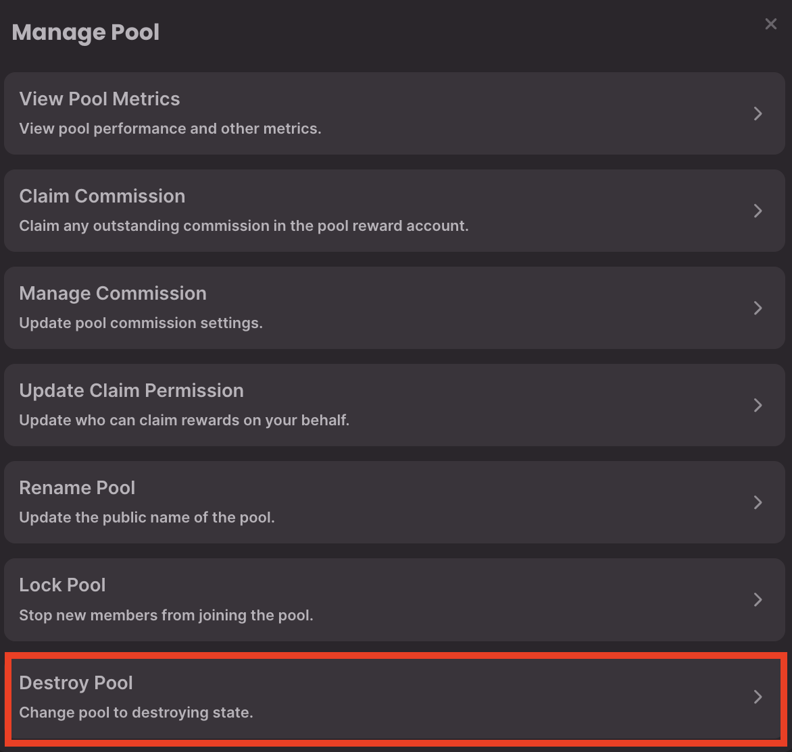

3\. Note the transaction fees, and click "Submit"**:**

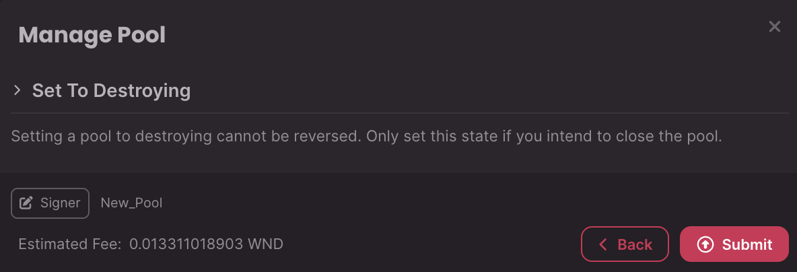

4\. Now, every member of the pool can be permissionlessly unbonded. Once the unbonding period ends, members' funds can be permissionlessly withdrawn to their free balance. Only then you can initiate the unbonding of your funds as a manager.

* * *

If you prefer to see the whole process in action, take a look at the following video showing the walkthrough:

[Staking Dashboard: Create, Manage and Destroy Nomination Pools | Technical Explainers](https://www.youtube.com/watch?v=aTFWhwy_Mxg)

* * *
