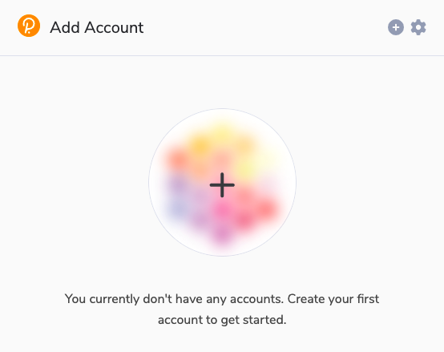
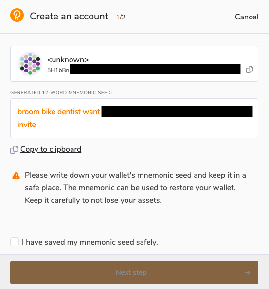
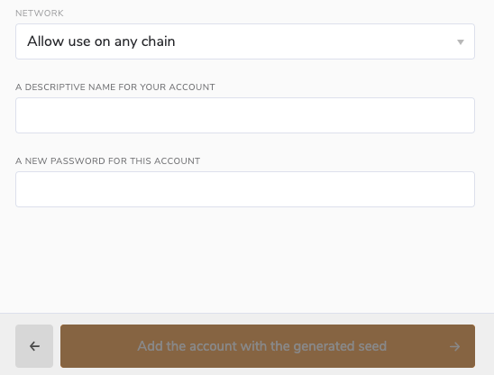

!!!info "Related Wiki page"
    For the underlying concepts, see [Accounts](../learn-accounts.md).

If you're looking to store your DOT safely, there are several recommended wallets available. These range from more advanced options to user-friendly products made by the community for the community.

This article will guide you through creating a Polkadot account using the battle-tested Polkadot Developer Signer. However, for newcomers, we strongly advise opting for any of the user-friendly wallets. These wallets offer the same functionalities and security standards but present them in a more approachable interface.

### User-friendly wallets

!!! tip "GOOD TO KNOW"

    The wallets mentioned in this section are highly recommended most users, specially for newcomers. They provide identical functionalities and security standards, but the interface and user experience are tailored for everyday use.

On the [Support website](https://paritytech.github.io/polkadot-support/wallets/), you can find articles about some wallets funded by the Polkadot Treasury and well-regarded by the community, describing some of their basic features like creating an account, receiving and sending funds, staking, etc.

The following Support articles guide you through the process of creating a Polkadot account using these user-friendly wallets:

  * [Talisman Wallet: How to Create an Account](https://paritytech.github.io/polkadot-support/wallets/talisman/talisman-wallet-how-to-create-an-account)
  * [Nova Wallet: How to Create an Account](https://paritytech.github.io/polkadot-support/wallets/nova-wallet/nova-wallet-how-to-create-an-account)
  * [Subwallet: How to Create an Account](https://paritytech.github.io/polkadot-support/wallets/subwallet/subwallet-how-to-create-an-account)
  * [PolkaGate: How to Create an Account](https://paritytech.github.io/polkadot-support/wallets/polkagate/polkagate-how-to-create-an-account)

* * *

### Hardware wallets

By creating your Polkadot account using a hardware wallet, you would take advantage of the highest security standards in the industry to store your assets while you can still access and use your Polkadot account whenever you wish.

Here are two articles on how to create your account in Polkadot Vault (rebranding from Parity Signer) and Ledger:

  * [Polkadot Vault](vault-create-account.md) (former [Parity Signer](parity-signer-create-account.md))
  * [Ledger: Create a Polkadot (DOT) account in Ledger Live](https://support.ledger.com/hc/en-us/articles/360016289919-Polkadot-DOT?docs=true)

* * *

### Wallet for advanced users

The following wallets are oriented toward **developers and advanced users** :

  * Polkadot Developer Signer - This is the wallet we cover in this article
  * [Polkadot Developer Interface](create-account.md)
  * [Subkey (needs technical knowledge)](create-account-subkey.md)

#### **How to create an account with the Polkadot Developer Signer**

!!! warning "IMPORTANT"

    The Polkadot Developer Signer is an account manager meant for power users and developers. There are several user-friendly browser extensions funded by the Polkadot Treasury that support a lot of features right from the extension. Discover them in [this article](where-to-store-dot.md) and check how to create a Polkadot account with them in the section above.

No matter the [type](https://paritytech.github.io/polkadot-support/getting-started/basics/polkadot-developer-interface-what-are-the-different-account-types) of your account, we recommend that you add your accounts through a browser extension, as it has many advantages:

  * It provides better security than using the Web UI directly.
  * Your browser won't "forget" your accounts if its cookies are cleared.
  * The extension recognizes all known Polkadot scams and alerts you when you access a phishing site. This will help you protect yourself and your funds.

!!! tip "GOOD TO KNOW"

    You will still need to use the Polkadot Developer Interface to use your accounts and issue transactions. The Polkadot Developer Signer is an account manager, not a wallet, and it needs a UI to interact with.

1\. Install the Polkadot Developer Signer. It is available for both [Google Chrome](https://chrome.google.com/webstore/detail/polkadot%7Bjs%7D-extension/mopnmbcafieddcagagdcbnhejhlodfdd) (and Chromium-based browsers like Brave) and [Firefox](https://addons.mozilla.org/en-US/firefox/addon/polkadot-js-extension/).

2\. After installing the extension, you should see the orange and white Polkadot Developer Signer logo in your browser's menu bar. If you don't, click on the little puzzle icon to pin it. Then click it to open the extension:

3\. Click the big plus button, or select "Create new account" from the small plus icon in the top right.

4\. A new mnemonic phrase of twelve words will be generated for you. **Make sure to[save the mnemonic phrase safely](store-mnemonic-safely.md) now**, as there is no way to view it after the account is created.

!!! danger "READ THIS FIRST!"

    **[Keep your mnemonic phrase secret and safe!](store-mnemonic-safely.md) Anyone who knows it can have full access to your account!**

5\. Once you have saved your mnemonic phrase, mark that you have saved it safely and proceed to the next step.

6\. Give your account a descriptive name. It's for your use only and will not be visible to other users.

!!! tip "GOOD TO KNOW"

    At this point you can choose to use the account on any chain or allow it for a specific chain only, from the drop-down menu. Read [this article](https://paritytech.github.io/polkadot-support/getting-started/basics/can-i-use-the-same-account-on-polkadot-kusama-and-parachains) for more details.

7\. Set a password for your account. You will need to enter this password when signing any transaction with your account, like sending funds out. We recommend using only Latin letters, numbers, and symbols. It's important you remember your password. There is no way to recover it later.

!!! danger "READ THIS FIRST!"

    The password isn't stored anywhere and we can't recover it for you. It's only used to encrypt your account locally on your computer. It does **not** protect your mnemonic phrase!

8\. Confirm your password and add the account.

You are all set! Refresh the [Accounts](https://polkadot.js.org/apps/#/accounts) page on the Polkadot Developer Interface and you should see your account.

* * *

To see the whole process of creating an account using the Polkadot Developer Signer, please watch this video tutorial.

[Create an Account using Polkadot JS Extension](https://www.youtube.com/watch?v=sy7lvAqyzkY)

* * *
