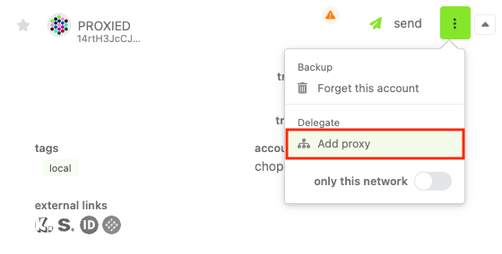
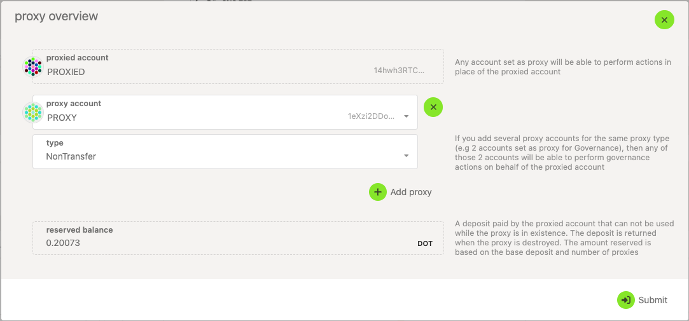
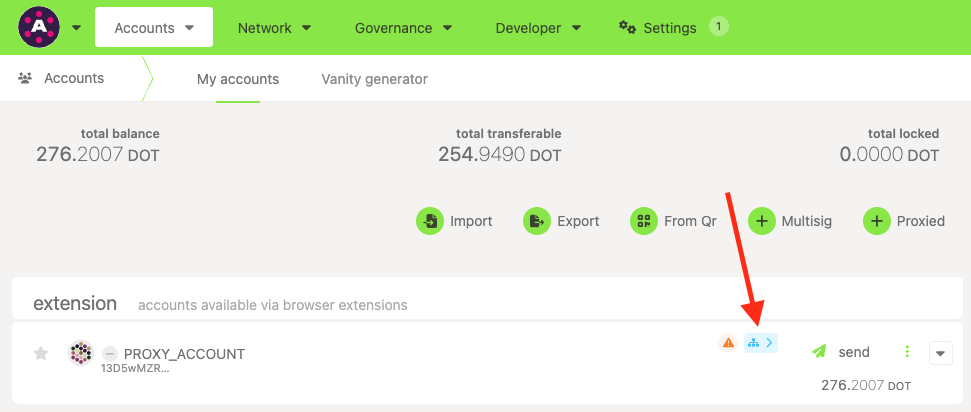
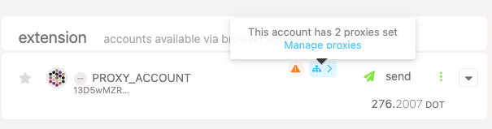
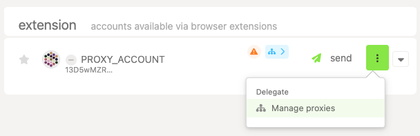
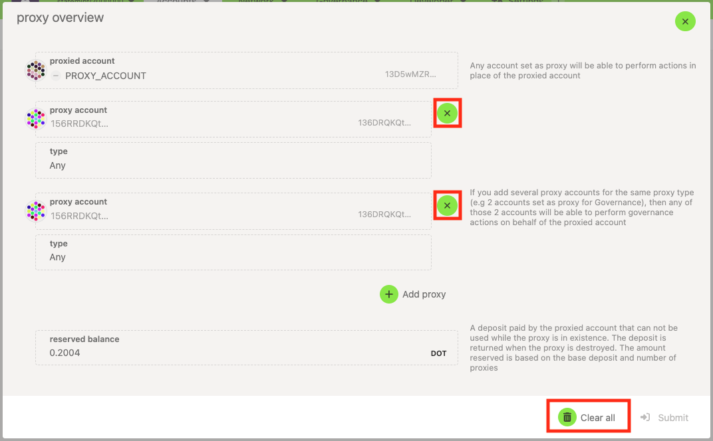

!!!info "Related concepts"
    For the underlying concepts, see [Proxies](../learn-proxies.md).

Polkadot allows users to set proxy accounts to perform a limited number of actions on their behalf. There are a few different types of proxies you can set up. You can read about the differences in [this article](../learn-proxies.md#proxy-types).

### Setting Proxies

1\. To set up a proxy account on the [Polkadot Developer Interface](https://polkadot.js.org/apps/#/explorer), navigate to the "[Accounts](https://polkadot.js.org/apps/#/accounts)" page and click on the three vertical dots next to the account you'd like to select.

!!! warning "IMPORTANT"

    The assignment of a proxy account in Polkadot or Kusama requires an initial deposit of 0.2004 DOT or 0.00667999998 KSM, plus 0.00033 DOT or 0.000010999989 KSM, respectively, for each proxy account added. This deposit is returned when the proxy is removed.

    The deposit is deducted from your account's free balance, which after the deduction will need to be larger than the [existential deposit](existential-deposit.md), otherwise the call will fail.

2\. Next, select "**Add proxy** ."

3\. Select the "**Add proxy"** button again in the menu below. This will allow you to select or paste the account that will act as a proxy and the type of proxy it will be.

4\. Sign and submit the transaction. The proxy account will then be assigned, and is denoted with a blue symbol on the "Accounts" page:

!!! tip "GOOD TO KNOW"

    You can't create a pure proxy type from the "Accounts" page; to do this you must be on the "Extrinsics" page. To create a pure proxy, follow [these steps](create-pure-proxy.md) instead.

* * *

### Removing Proxies

There are two ways to clear proxies using the UI. The first is by clicking the blue symbol to select "**Proxy overview**."

The second is by selecting the menu next to your account and clicking "**Manage proxies** " where "Add Proxy" used to be:

Either method will present the same menu, in which you can remove individual proxy accounts, or clear all of them at once:

!!! info

    Note that to remove the proxy, the extrinsic must be signed with the proxied account or its proxy of type "Any."

* * *

### Types

Polkadot offers different types of proxies you can set, depending on the permissions use case. You can create the following types with the [Polkadot Developer Interface](https://polkadot.js.org/apps/#/accounts), among others:

  * Any - this proxy type has permission to make any type of transaction, including balance transfers.

  * Non-transfer - this proxy type will allow any type of transaction except for balance transfers.

  * Governance - proxies of this type can make transactions related to governance (Democracy pallet, Treasury pallet, etc).

  * Staking - these proxies allow staking-related transactions. Not to be confused with the soon-to-be-deprecated _controller_ accounts, which are needed for certain transactions. Staking proxies are meant to allow you to access your stash account less frequently.

For more proxy types, visit the [Proxy Types](../learn-proxies.md#proxy-types) article.

See more in-depth info about proxy types [in this article](../learn-proxies.md).

!!! warning "ATTENTION"

    Controller accounts are being deprecated. You can still use existing ones for now, but creating new ones is no longer possible.

    It is recommended to set your stash account as its own controller (described in [this article](change-controller-account.md)) and create a staking proxy to obtain the same benefits and greater flexibility.

* * *

### What are they useful for?

Proxies are helpful for a few specific purposes because they add a layer of security. Rather than using funds in one sole account, smaller accounts with unique roles complete tasks for the main stash account.

For example, perhaps the owner of an account, Ferdie, wishes to delegate certain actions to her friend, such as decisions around Polkadot OpenGov. Rather than hand over her seed phrase, which would give that person full control over the account (and the ability to run away with the funds), they can instead create a governance proxy and set their friend's account as the proxy account. The proxy account won't be able to submit other types of extrinsics such as balance transfers. This allows Ferdie to give her friend permission to execute governance transactions (for example, voting, referenda creation, etc.) on her behalf, in a more trustless manner.

* * *

Check out this video from the Tech Ed team, which explains proxy accounts in more detail:

[What are Proxy Accounts on Polkadot Network?](https://www.youtube.com/watch?v=1tcygkq52tU)

* * *
