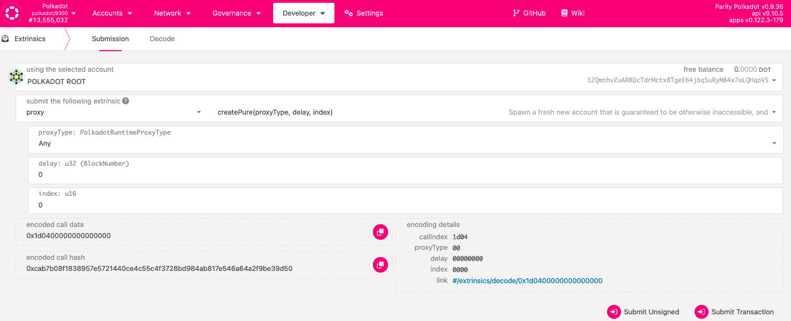
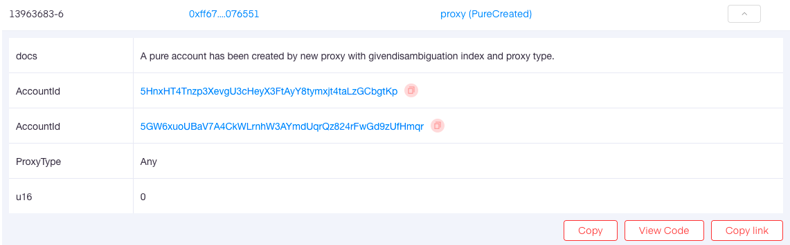
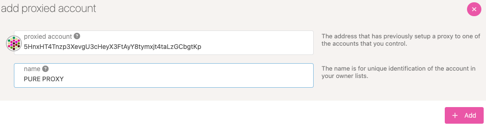
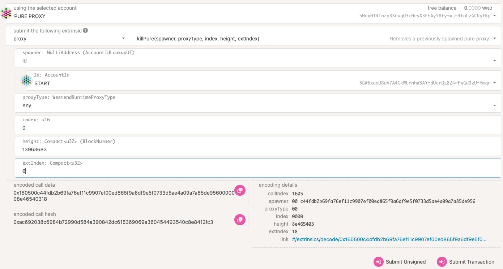
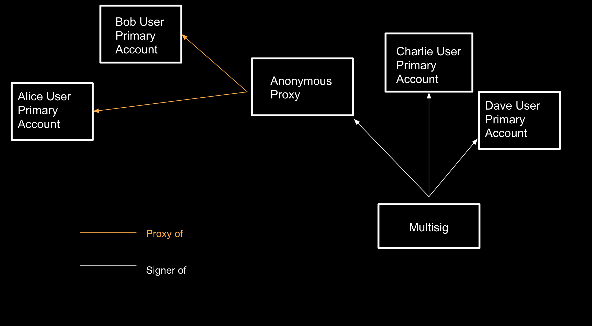

!!!info "Related concepts"
    For the underlying concepts, see [Pure Proxies](../learn-proxies-pure.md).

Pure proxies (used to be called anonymous proxies) are an advanced feature and can only be created from the [Extrinsics](https://polkadot.js.org/apps/#/extrinsics) page.

!!! danger "READ THIS FIRST!"

    It is critical to set up pure proxies with care. Take note of appropriate permissions and be aware of the potential dangers. There is no way to get access to the pure proxy account after deleting it.

    Instead, the **killPure** extrinsic must be called **from** the _pure_ proxy. This means the pure proxy must be added as an account on the Polkadot-JS UI [Accounts](https://polkadot.js.org/apps/#/accounts) page.

    **Making a mistake could result in loss of funds!**

### Setting a Pure Proxy

1\. To set a pure proxy, head to the Polkadot-JS UI and navigate to the "Developer" > "[Extrinsics](https://polkadot.js.org/apps/#/extrinsics)" tab. A page should display similar to this:

2\. Select the proxy type, and add a delay (in block height) if necessary. The index will typically always remain at 0. Sign and submit the transaction to create the pure proxy account.

!!! danger "READ THIS FIRST!"

    The first pure proxy you add should always be of _type_ **Any**. Also, if there are multiple pure proxies for the proxied account, you should keep at least _one_ **Any** type. Without having an **Any** type proxy, you won't be able to send funds, add new proxies, kill the pure proxy, or take any action not specifically allowed by the types of the proxies that have been set up for the account.

* * *

#### **Time Delayed Proxies**

The _delay: u32_ field allows you to set a delay for each call that the proxy account makes. You can enter this value in blocks. For example, if you create a proxy with a delay value of 100 blocks, proxy calls made by this account will take approximately 10 minutes to execute (100 * 6 (seconds) = 600 seconds). Within this delay time frame, the origin account is able to reject the announcement from the proxy account. If your intention is to create a normal proxy account, use the default value of 0.

* * *

#### **Types**

Polkadot offers different types of proxies you can set, depending on the permissions use case. You can create the following types with the [Polkadot-JS UI](https://polkadot.js.org/apps/#/accounts):

  * Any – this proxy type has permission to make any type of transaction, including balance transfers.

  * Non-transfer – this proxy type will allow any type of transaction except for balance transfers.

  * Governance – proxies of this type can make transactions related to governance (Democracy pallet, Treasury pallet, etc).

  * Staking – these proxies allow staking-related transactions. Not to be confused with the soon-to-be-deprecated _controller_ accounts, which are needed for certain transactions. Staking proxies are meant to allow you to access your stash account less frequently.

  * Identity Judgement – proxies that are in charge of allowing registrars to make judgement on an account's identity. See more information [here](../learn-identity.md#judgements).

  * Auction – proxies of this type allow transactions related to auctions and crowdloans.

See more in-depth info about proxy types [in this article](../learn-proxies.md).

!!! warning "ATTENTION"

    Controller accounts are being deprecated. You can still use existing ones for now, but creating new ones is no longer possible.

    It is recommended to set your stash account as its own controller (described in [this article](change-controller-account.md)) and create a staking proxy to obtain the same benefits and greater flexibility.

    Check out the article on [creating a proxy account](create-proxy-account.md) for more information.

* * *

### Removing a Pure Proxy

The procedure for removing a Pure Proxy is different, and there are a few functions on the extrinsics page that will help to accomplish this. The following steps can be used to remove your pure proxy:

1\. Use a block explorer to find the following information:

  * The **account** you created the pure proxy from

  * **Type of proxy** , and index (almost always 0)

  * **Block height** it was created at

  * The **extrinsic index** on the block (on most block explorers, you will see the extrinsic ID listed as something along the lines of "11111111-2". 11111111 is the block height (block number), and 2 is the extrinsic index.

2\. Navigate to the [accounts](https://polkadot.js.org/apps/#/accounts) page and make sure you are on the correct network. Click "**Proxied** " and add your address; name it PURE PROXY. You should now see this address in your accounts.

3\. Navigate to the "Developer" > "[Extrinsics](https://polkadot.js.org/apps/#/extrinsics)" page.

4\. You need to remove the proxy _from_ the pure proxy. It is important to note that pure proxies _work backward_ in that the original account acts as the proxy. Call the extrinsic '**proxy.killPure** ' using the selected account PURE PROXY with the following parameters:

  * _Spawner_ (original account)

  * _Proxy type_ (kind of proxy)

  * _Index 0_ (almost always, but this can be found on the block explorer in the original extrinsic)

  * _Block number x_

  *  _Extrinsic index y_

5\. Submit and sign the extrinsic.

* * *

### What are they useful for?

Pure proxies, in particular, can be used for permissionless management. In the example below, there is a multisig with four different accounts inside. Two of the accounts, Alice and Bob, have a pure proxy attached to them. In the case that the multisig account wanted to add or remove Alice or Bob or even add a new account into the pure proxy, the pure proxy would take care of that change. If a multisig wanted to modify itself without a pure proxy, a whole new multisig would be created.

* * *

If you are more of a visual learner, check these videos from our Tech Ed team. They show how to create and delete pure proxies and when you may want to use them:

  * [Creating and Deleting Anonymous (Pure) Proxies on Polkadot ](https://www.youtube.com/watch?v=T443RcCYP24)
  * [When and Why you can use Anonymous (Pure) Proxies on Polkadot](https://www.youtube.com/watch?v=YkYApbhU3i0)

* * *
