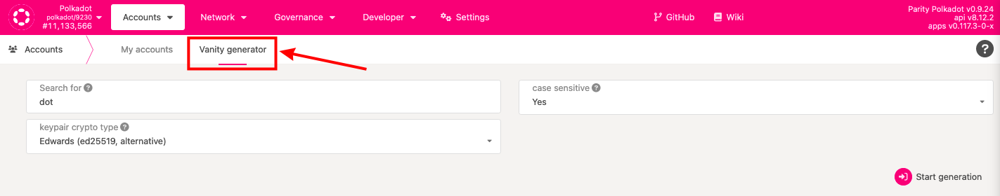
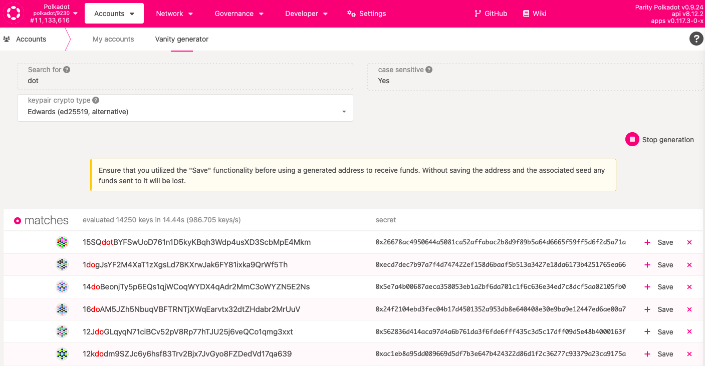
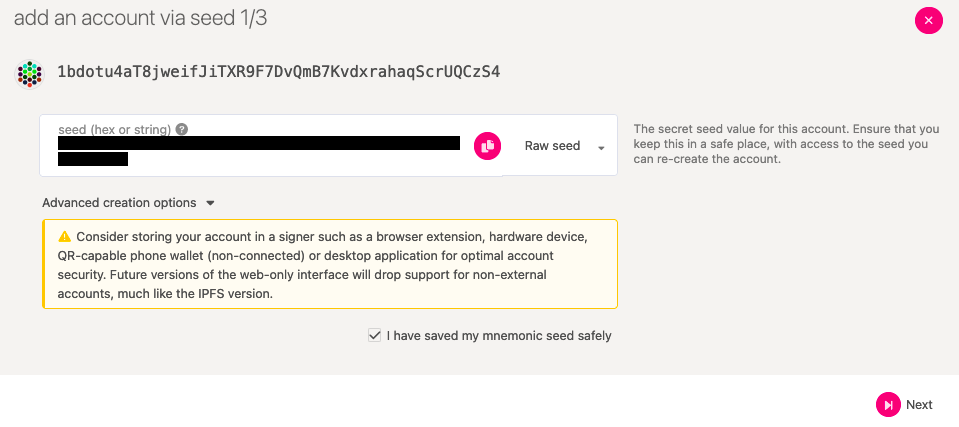
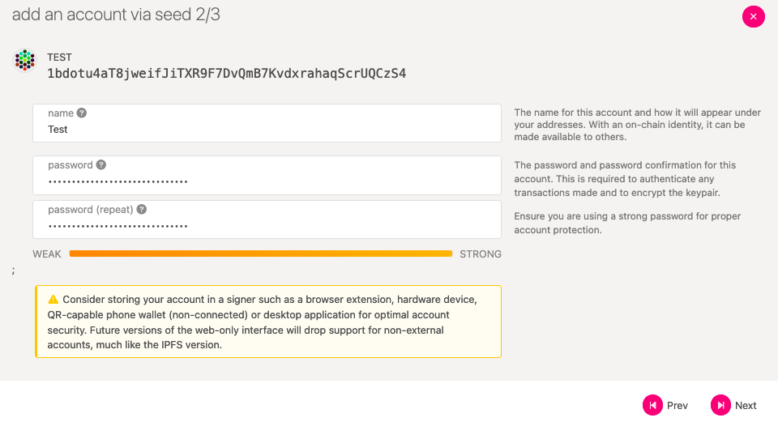
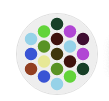
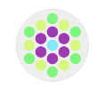

!!!info "Related Wiki page"
    For the underlying concepts, see [Accounts](../learn-accounts.md).

_If you want your DOT address to contain specific words, letters, or numbers, you can use the_ vanity generator _. It lets you generate multiple addresses with the parameters you choose._

* * *

### How to create your vanity address

1\. On the [Accounts](https://polkadot.js.org/apps/#/accounts) page on Polkadot-JS UI, click on the [Vanity generator](https://polkadot.js.org/apps/#/accounts/vanity) tab.

2\. Enter the word, letter, or number combination you want your address to contain in the "search for" field. You can choose if you want it to be case-sensitive. You can also specify what type of account you'd like to generate: Edwards will allow you to find the address you want faster, but Schnorrkel is more secure. Once you've set the parameters, click the "Start generation" button.

!!! info

    The address format in Substrate-based chains is SS58, a modification of [Base58Check](https://en.bitcoin.it/wiki/Base58Check_encoding) from Bitcoin. This encoding does not allow characters that look the same in some fonts (i.e., 0OIl).

In this example, we'll use the word "dot":

3\. The vanity generator will produce a series of addresses, starting with _d_ , _do,_ and finally, _dot_. Note that it may take some time before the accounts appear, depending on the length of the combination you are searching for and the type you chose:

**4\. When you find an address you like, click the "Save" button on the right to claim this address. The accounts are not saved if you do not choose to do this.**

Clicking the "Save" button will open a window to save your private key. In the vanity generator, only **Raw seed** is available for generated addresses. To ensure you can always restore your account, [save the raw seed safely.](store-mnemonic-safely.md)

!!! warning "IMPORTANT"

    **Do not switch to** **Mnemonic** when saving an account in the vanity generator. The mnemonic phrase generated will correspond to a **random account** and not the one you wanted to save.

After you've saved your raw seed, click on the checkbox and then click "Next":

5\. Give your new account a name. An account name is only for your convenience and won't be displayed to anyone else. Set a [good password](store-mnemonic-safely.md) for your account. Then click "Next" again:

6\. You can save your account and download your JSON backup file on the following screen. Your JSON backup file is a secondary backup method, which, combined with the password you just set, will allow you to restore your account at any time in the future. You need to [store it safely](store-mnemonic-safely.md).

* * *

### Recognizable account icons

You may have noticed that each Polkadot account has an icon like this:

These are also called identicons, and it is a visual representation of your account address. Your identicon is generated when you [create a new account on Polkadot](create-polkadot-account.md). It appears next to your address on your Accounts page on Polkadot-JS or a [block explorer](../learn-account-advanced.md).

Although account identicons seem random, generating many accounts increases your chance of finding a recognizable account identicon. Like these:

You can use the vanity generator to generate multiple accounts and pick a memorable identicon from the list of generated addresses.

!!! info

    The look of the identicons can be changed to different styles. Check the article "[How to Change the Style of Your DOT icon](change-dot-icon-style.md)" to learn how.

* * *
