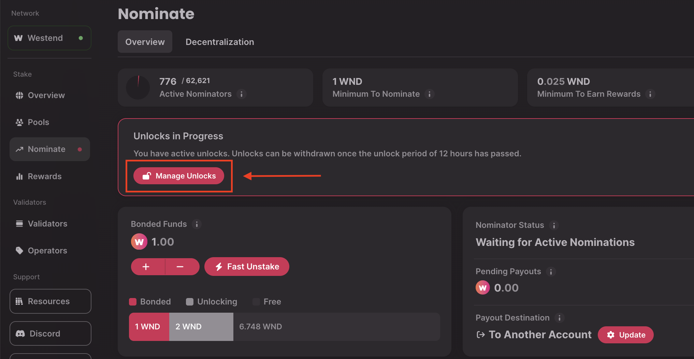
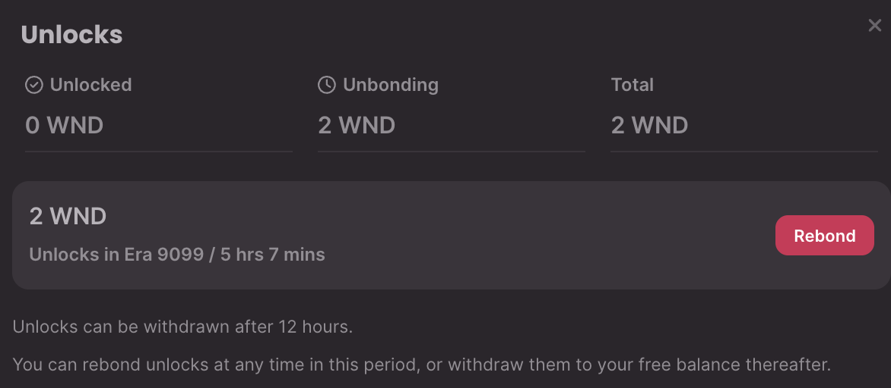
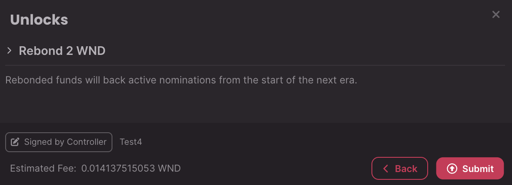

!!!info "Related concepts"
    For the underlying concepts, see [Staking](../learn-staking.md).

__

This article explains how to use the[Staking Dashboard](https://staking.polkadot.cloud/#/overview) to rebond your locked tokens before the unbonding period is over. At any point during the unbonding period, you may rebond your tokens if you change your mind. Your tokens will be immediately rebonded, and if you unbond again, the full unbonding period will need to elapse before your tokens are unbonded.

!!! warning

    You **cannot rebond during the unbonding period** with a nomination pool. If you change your mind, you must wait for the unbonding period to end before you can join a nomination pool again.

!!! tip "GOOD TO KNOW"

    You can only rebond the full amount that is currently unbonding. You cannot choose to rebond only part of your unbonding tokens.

In this example, we are using the Westend testnet, but the process is the same for Polkadot and Kusama.

* * *

### How to Rebond Tokens during the Unbonding Period

1\. First, [connect your account](connect-account.md) to the Staking Dashboard.

2\. Navigate to the [Nominate](https://staking.polkadot.cloud/#/nominate) tab and click on the "Manage Unlocks" button:

3\. Here, you can see information about your unbonding tokens. Click on the "Rebond" button next to the tokens you want to rebond:

4\. Then, click "Submit" to sign the transaction and rebond your tokens:

That's it! You will see your bonded funds increasing soon after you sign the transaction.

* * *

If you are more of a visual learner, check out our video tutorial:

[Polkadot Made Easy: How to Bond Extra to Your Stake](https://youtu.be/hkj4Rl8q6tQ?si=_PVXMJHkOmMkepmb&t=81)

* * *
