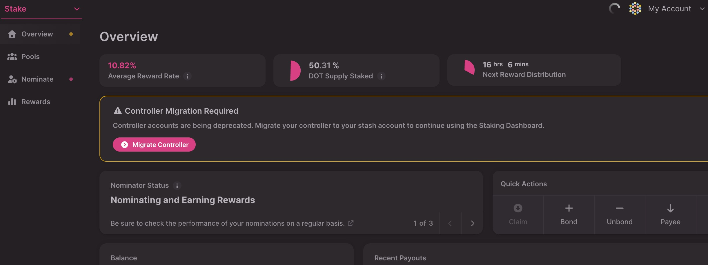
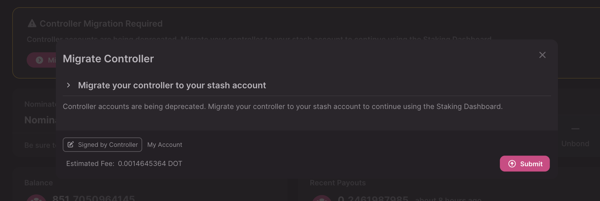

!!!info "Related concepts"
    For the underlying concepts, see [Staking (advanced)](../learn-staking-advanced.md).

_Discover the Staking Dashboard, which makes staking much easier and check our extensive article list in the[Overview article](../../general/dashboards/staking-dashboard.md) to help you get started._

* * *

!!! warning "ATTENTION"

    Controller accounts are being deprecated. While existing ones can still be used for now, creating new controller accounts is no longer possible.

    It is recommended to set your stash account as its own controller using the Polkadot Developer Interface. Follow the instructions in the link below to learn how:

    [Polkadot Developer Interface: How Can I Change My Controller Account?](change-controller-account.md)

    If you want to manage your staking from a different account, you can create a staking proxy, which preserves the same functionality and adds more flexibility.

    Check out the article on creating a proxy account for more information:

    [How to Create a Proxy Account](create-proxy-account.md)

This article explains how to update your controller account using the Staking Dashboard. By the end of the process, your stash account will be its own controller and no other account could sign any transactions on its behalf.

* * *

### How to change your controller account

1\. First, connect your account to the [Staking Dashboard](https://staking.polkadot.cloud/).

2\. In the Overview tab, you'll find a warning about migrating your controller account. Click the "Migrate Controller" button:

3\. In the new window, click "Submit" and approve the transaction:

That's it! You have now updated your controller account to your stash!

* * *
