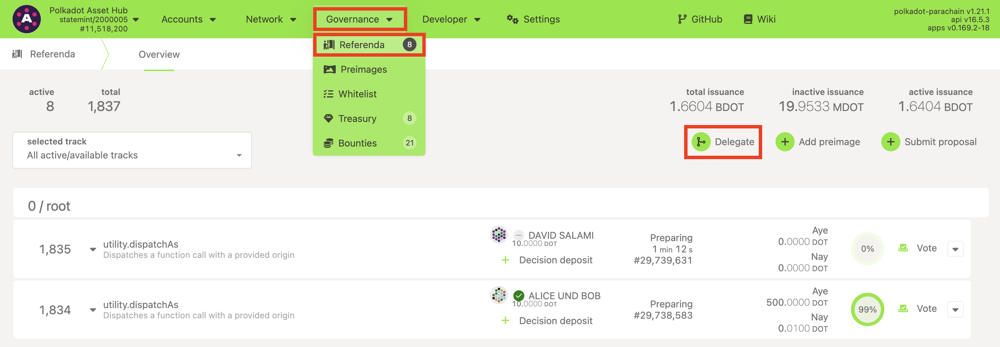
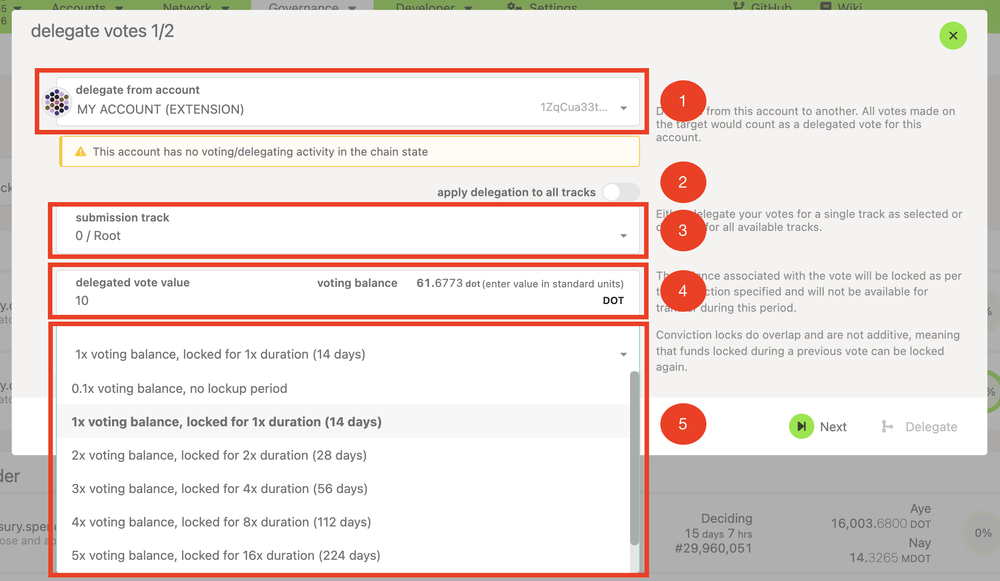
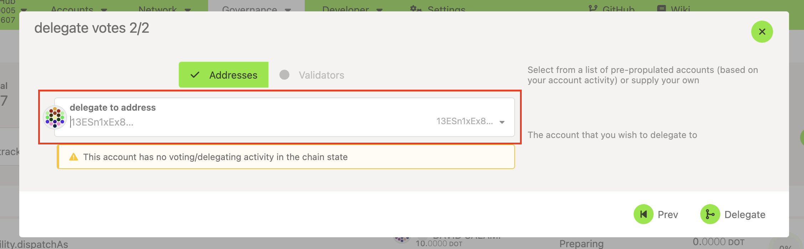
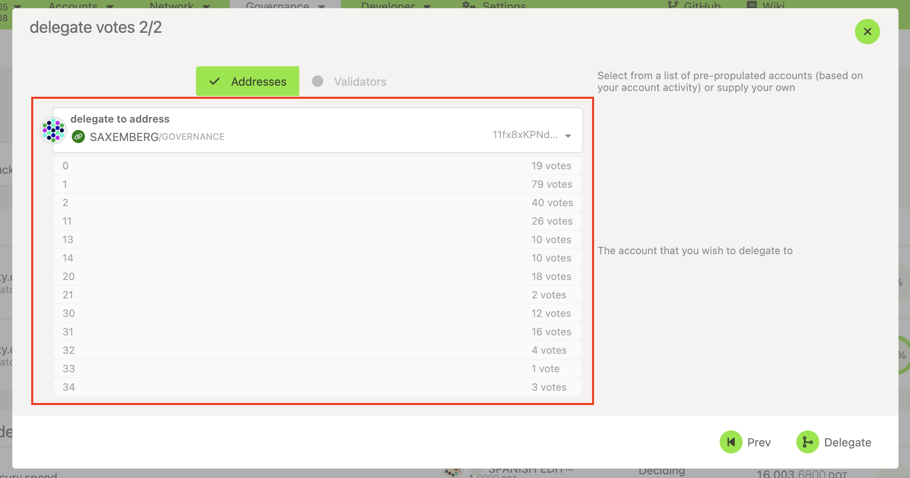
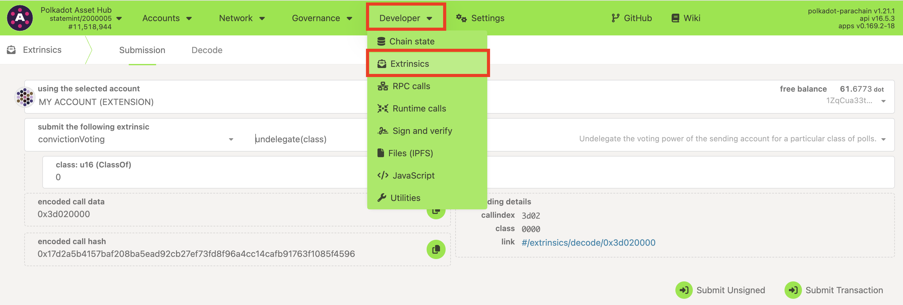
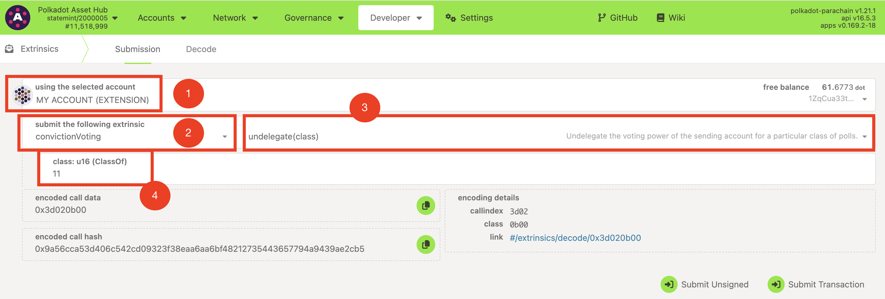

!!!info "Related concepts"
    For the underlying concepts, see [Polkadot OpenGov](../learn-polkadot-opengov.md).

Delegating voting power to a trusted community member can be an effective way to participate in the decision-making process of Polkadot OpenGov. It allows you to empower others who share your values and vision for the ecosystem to represent you and vote on your behalf. This article will explore how to delegate and undelegate your voting power to another account from the familiar Polkadot Developer Interface.

!!! danger "READ THIS FIRST!"

    This article provides instructions on how to delegate your voting power using the Polkadot Developer Interface. However, the Polkadot Developer Interface is a web wallet meant for power users and developers. Please refer to the article "[Polkadot OpenGov: How to Participate](opengov-participate.md)" to learn how to do it from more user-friendly platforms like [Subsquare](https://polkadot.subsquare.io/).

### Conviction locks

When you [vote in a referendum](vote-opengov.md), you can increase your voting power by locking your tokens for a longer period of time. This is known as the "conviction lock." Similarly, you can choose the duration of the conviction lock you wish to apply to your delegation. Read about conviction locking in the article "[Voluntary Locking](../learn-polkadot-opengov.md#voluntary-locking-conviction-voting)."

It's important to highlight that the duration of the locking period of your balance depends on the conviction lock you chose when you delegated your vote, not the conviction used by your delegate. For example, if you delegated with a 1x conviction and your delegate votes with a 6x conviction, your balance will be locked for a duration equivalent to a 1x conviction.

!!! warning "IMPORTANT"

    Undelegating your voting power doesn't mean that your funds will be immediately accessible, even if your selected delegate never voted. Your voting balance will become available after the conviction lock period you applied to it has expired and only once you unlock it.

    Learn how to unlock your referenda locks in "[How to Remove Expired Referenda Locks](remove-referenda-locks.md)"

* * *

### **Delegate on the Polkadot Developer Interface**

1\. Go to the ["Governance" > "Referenda](https://polkadot.js.org/apps/?rpc=wss%3A%2F%2Frpc.polkadot.io#/referenda)" tab on the Polkadot Developer Interface and click on the "Delegate" button:

2\. A new panel will show you the following options for your delegation:

  * The account you will be delegating from (1).
  * You can apply that delegation to every track by toggling the option for it (2).
  * A list of tracks on "Submission track" (3) if you want to delegate on specific ones.
  * The voting balance you will be delegating (4).
  * The conviction lock (5). It's a multiplier to your voting balance, so these two determine the "voting power" you are delegating. The greater the conviction, the greater the voting power, and the longer the tokens will be locked for the referenda voted by your delegate.

3\. After you are done configuring your delegation settings, click "Next," and a new panel will appear where you must select your delegate. You might have three options:

  * Paste your delegate of choice in the "Delegate to address" field:

  * The "Validators" button will be active if any of your accounts are nominating. You might select any of your nominated validators in case you want to delegate your voting power to them.

After selecting an account, a brief overview of its Polkadot OpenGov activity will be displayed below it. This summary shows the number of votes of the account in each track, either for active referenda or for concluded referenda for which the account owner hasn't removed the expired locks. It also shows any tracks on which the account itself is delegating:

This information can help you identify the delegates who are or have been active in Polkadot OpenGov and determine if they themselves are delegating to others.

!!! warning "ATTENTION"

    Delegations don't propagate. If you delegate to an account which is already delegating on a track, your voting power won't be considered in any referenda on that track.

4\. When you are satisfied with your delegation, click 'Delegate,' and that's it. Your voting power will participate in every referendum your delegate votes on within the selected tracks.

!!! warning "IMPORTANT"

    If you voted on a track, you won't be able to delegate on the same track until the locking period has passed (or you remove and unlock your vote). Otherwise, you will get the error '[convictionVoting.AlreadyVoting](https://paritytech.github.io/polkadot-sdk/master/pallet_conviction_voting/pallet/enum.Error.html#variant.AlreadyVoting)'.

#### **Undelegate on the Polkadot Developer Interface**

If you wish to stop delegating, whether because you want to vote personally or delegate to another account, you can remove your delegations for specific tracks from the "Developer" tab on Polkadot Developer Interface. Follow the steps below to proceed:

1\. Go to the ["Developer" > "Extrinsic"](https://polkadot.js.org/apps/?rpc=wss%3A%2F%2Frpc.polkadot.io#/extrinsics) tab on Polkadot Developer Interface:

2\. Select the account for which you want to remove an existing delegation (1), select 'convictionVoting' from the drop-down on the left (2), and 'undelegate(class)' from the one on the right (3). In the "class" field (4), enter the track index for which you want to undelegate (check [this page](../learn-polkadot-opengov-origins.md#origins-and-tracks-info) to learn the index of each track).

3\. Click on the "Submit Transaction" button, review and sign the transaction on your wallet, and that's it, you just undelegated all your voting power for the selected track.

!!! warning "ATTENTION"

    If you want to remove your delegation for several tracks, you need to individually execute the 'convictionVoting.undelegate' extrinsic for each one.

* * *
