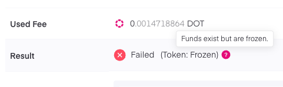

!!!info "Related concepts"
    For the underlying concepts, see [Transactions](../learn-transactions.md).

Any account on Polkadot can hold multiple assets and not just the native DOT token. The native asset is usually responsible for keeping the account active by maintaining the required existential deposit (ED). If an account drops below the ED on every sufficient asset, the account is reaped ("deactivated"), and any remaining funds, like non-sufficient assets, are destroyed.

Learn more about the existential deposit and non-sufficient assets in the article below:

[What is the Existential Deposit?](existential-deposit.md)

To avoid the destruction of non-sufficient assets when reaping the account, a transaction that would send all your DOT may fail with the error message “Funds exist but are frozen.”

Keep reading to learn why this happens and how to resolve it.

### Error when sending all your DOT

The native token DOT is usually responsible for keeping an account active by maintaining the [existential deposit](existential-deposit.md). However, there are also other assets known as “sufficient assets," such as USDC, USDT, or ETH, that can independently keep an account alive without relying on DOT.

Other assets, such as DED or MYTH, are considered [non-sufficient assets](existential-deposit.md#native-sufficient-and-non-sufficient-assets), meaning they cannot keep the account alive on their own on the Polkadot network. If the balance of DOT (or any other sufficient asset) falls below the ED, the account is reaped, becomes inactive, and all non-sufficient assets in it are destroyed. This situation is what the failed transaction and error message avoid.

Unfortunately, not all wallets display every asset stored in an account. This can lead to confusion, and you might think you only hold DOT, while other assets like DED or MYTH are still present but hidden. In such cases, if you attempt to send all your DOT to another account, the transaction may fail. This prevents the deactivation of the account, which would otherwise destroy the remaining non-sufficient assets.

* * *

### How to prevent the 'frozen' error

If you're using a wallet that doesn't support viewing or managing multiple assets on Polkadot (for example, Trust Wallet, Ledger Wallet, etc.), you have two options:

  * **Leave a small balance of DOT** in your account to maintain the existential deposit and cover transaction fees. Keeping around 0.015 DOT should be enough. If you face a similar situation in Kusama, you can leave about 0.0002 KSM to keep the account active and pay for the transaction fees.
  * **Restore or import your account using a different wallet** that supports multiple assets (for example, Nova Wallet, Talisman, Subwallet). Once you can see all your assets, transfer the non-sufficient assets (DED, MYTH, etc.) to another account before sending out all your DOT.

* * *
