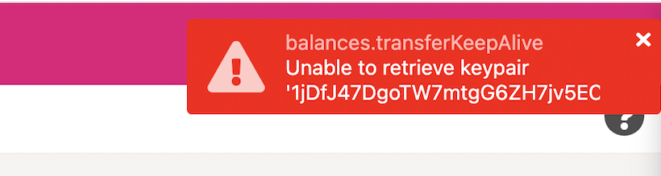
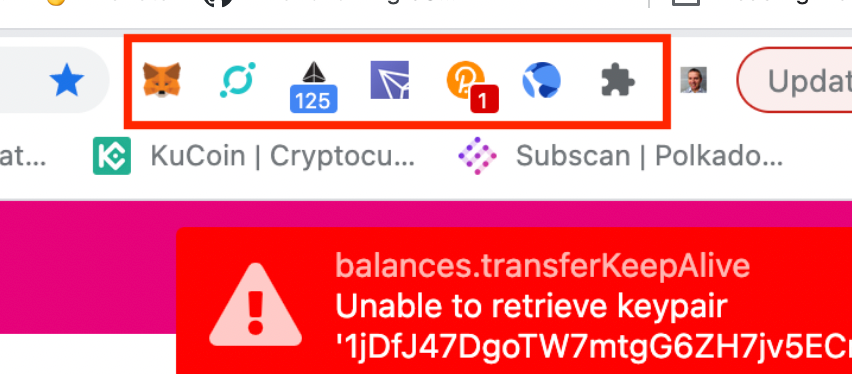

!!!info "Related concepts"
    For the underlying concepts, see [Accounts](../learn-accounts.md).

There are several situations where errors can occur, but the message should indicate the potential source of the issue. In this article, we will discuss the error and potential remedies for the "Unable to retrieve key pair" message that may arise when attempting to use Polkadot Developer Interface.

* * *

### Error

Although uncommon, some users have reported the "Unable to retrieve the key pair" error. It happens when the account does not match the keypair stored for that particular address.

Below you will find a list of ways to troubleshoot this.

* * *

### Possible causes and solutions

The error may be due to several reasons and situations. Below you will be guided through some of them and offered some possible solutions to the problem.

#### **Are you using a Ledger hardware wallet?**

Make sure your Ledger device is connected to your computer, it's unlocked, and the Polkadot app is open.

#### **Troubleshoot the Polkadot Developer Signer**

Update your browser to the latest version and then restart it.

  1. Go to [Polkadot Developer Interface](https://polkadot.js.org/apps/?rpc=wss%3A%2F%2Frpc.polkadot.io#/accounts). It's likely that you'll see a small "1" next to Settings. If that's the case, go to Settings > Metadata and click on "Update metadata".
  2. Then go to the Accounts page and try sending again.

If that doesn't work, please do the following:

  1. Open the extension and click on the gear icon on the top right.
  2. Click on "Manage Website Access". Is [polkadot.js.org](https://polkadot.js.org/) listed there and enabled?
  3. If it's not, try to enable it and then refresh the Accounts page and try sending again.
  4. If it's not clickable, then go back, click on the gear again and click on "Open extension in new window".
  5. Follow the same process to enable it.

#### **Disable other extensions**
****

If none of the above solved the issue, then there could be another extension interfering with the Polkadot Developer Signer. In order to troubleshoot this, disable them one by one and try again.

Start with any Substrate extension (any wallet able to connect to Polkadot, Kusama or their parachains), and any crypto-related extensions to pinpoint exactly which extension is causing trouble.

#### **Restore the account**

If the issue persists after trying the possible solutions above, it might be solved after restoring the account from your mnemonic phrase or the JSON file.

!!! warning "IMPORTANT"

    Do not remove the account from the Polkadot account before checking that you have access to its mnemonic phrase or JSON file and password.

Follow the article "[How to restore your account in the Polkadot Developer Signer](restore-account-signer.md)" to restore your account back to the Polkadot Developer Signer.

* * *
