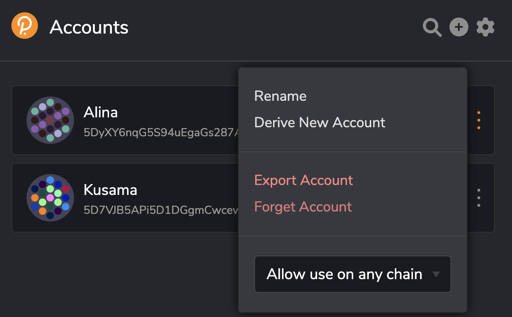
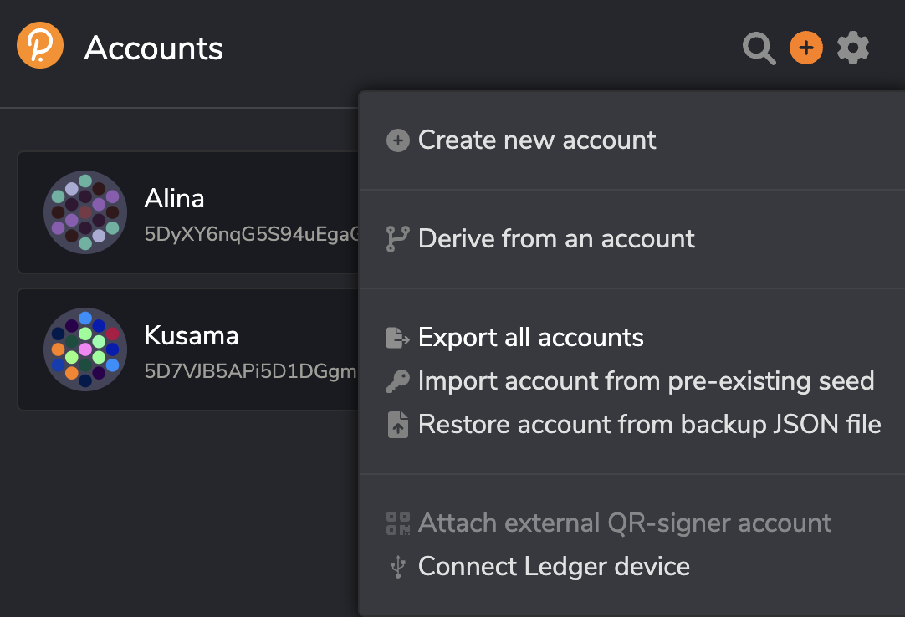
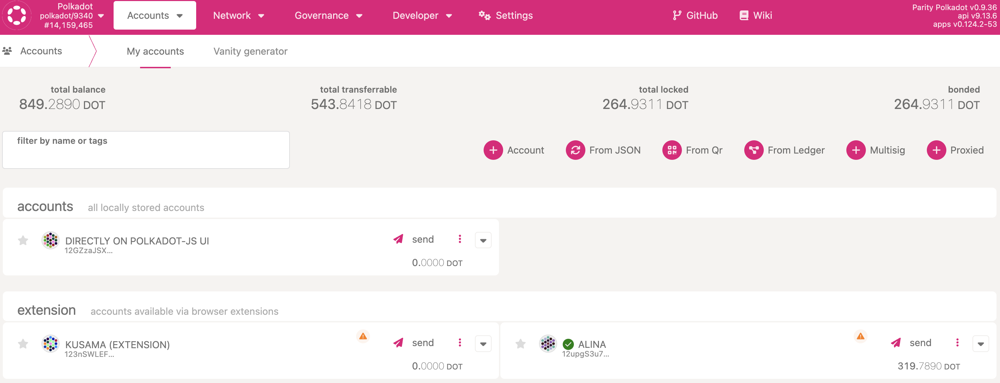
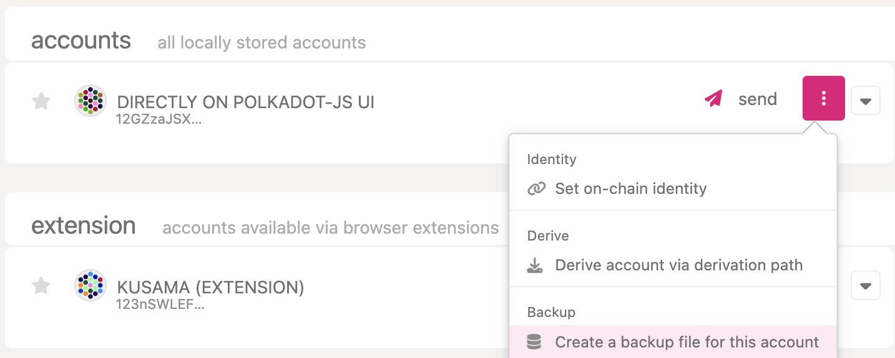

!!!info "Related Wiki page"
    For the underlying concepts, see [Accounts](../learn-accounts.md).

The JSON backup file stores your account's information encrypted with the account's password. It's a second recovery method in addition to the mnemonic phrase.

When you [create your account directly on the Polkadot Developer Interface](create-account.md), the JSON file is automatically downloaded to your Downloads folder. If you [create your account in the Polkadot Developer Signer](create-polkadot-account.md), you need to export the JSON file manually.

This article will teach you how to manually export your JSON backup file in the Polkadot Developer Signer and Polkadot Developer Interface.

### In the Polkadot Developer Signer

1\. To export your JSON backup file, click on the three dots to the right of your account and select "Export Account":

2\. Next, you will be asked for your account's password. Enter it, and click on the button to export the account.

3\. Finally, the JSON file will be downloaded to your default Downloads folder. Its filename will be like this:

_[your account address].json_

* * *

###  Export all accounts in the Polkadot Developer Signer

The Polkadot Developer Signer allows you to export all your accounts added to it in a single "batch" file.

1\. Click on the plus icon and select "Export all accounts":

2\. Enter a password for the batch JSON file.

!!! warning "ATTENTION"

    The password you enter in this step is for the batch JSON file **only!** You will need this password in order to restore your accounts from the JSON file.

    This password is **unrelated** to the individual passwords of your accounts. After restoring from the batch file, each account will still need its own password to make transactions.

3\. The JSON file will be downloaded to your default Downloads folder. Its filename will be like this:

_batch_exported_account_1641303451011.json_

where the number at the end is a [Unix timestamp](https://en.wikipedia.org/wiki/Unix_time) of the time it was exported.

* * *

### On the Polkadot Developer Interface

1\. First, navigate to the [Accounts](https://polkadot.js.org/apps/#/accounts) page of the Polkadot Developer Interface:

2\. Next, click the three dots to the right of the "send" button, and select "Create a backup file for this account":

This will only work for accounts that were [created directly on the Polkadot Developer Interface](create-account.md). Please check the sections above if you added your account through the Polkadot Developer Signer.

3\. You will be asked to enter the account's password, which will also be the JSON file's password.

4\. Finally, the JSON file will be downloaded to your default Downloads folder. Its filename will be like this:

_[your account address].json_

* * *

That's it! Your backup JSON file has been exported!

If you ever need to restore your accounts, you can do so with this file and the password. For more details on how to restore, check these articles:

[How to restore your account in the Polkadot Developer Signer](restore-account-signer.md)

[Polkadot Developer Interface: How to Restore Your Account](restore-account.md)

* * *

If you prefer visual instructions, this video covers the creation of accounts and exporting the JSON file, as well as changing your password, both on the Polkadot Developer Interface and the Polkadot Developer Signer. The instructions for manually exporting the file from the Polkadot Developer Signer are at the 03:13 timestamp:

[Creating Accounts, Downloading JSON Backup Files, and Changing Passwords on the UI and Extension](https://www.youtube.com/watch?v=DNU0p5G0Gqc&t=193s)

* * *
