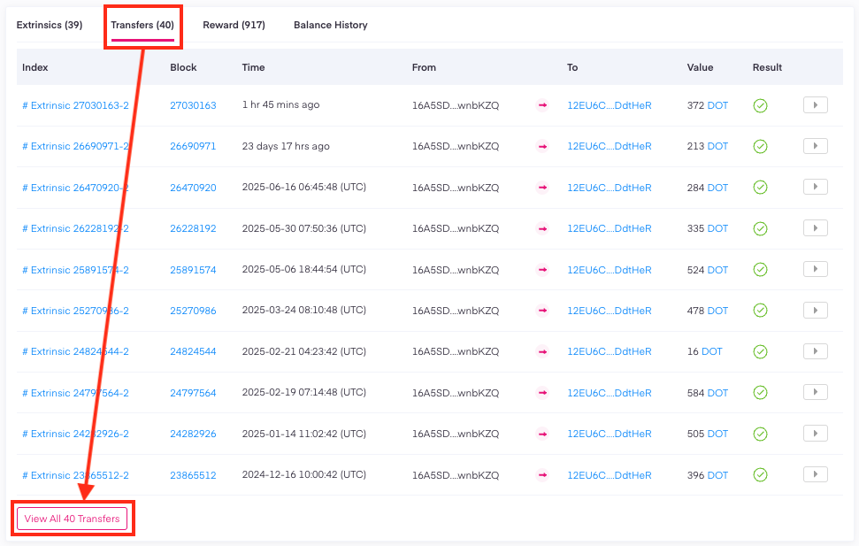
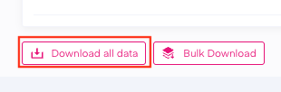

!!!info "Related concepts"
    For the underlying concepts, see [Transactions](../learn-transactions.md).

To see and export your account's transaction history, you need to use a block explorer. In this example, we offer instructions for Subscan.

* * *

### How to view and export your transaction history

1\. First, check [this article](block-explorers.md) on how to view your account's balance on a block explorer.

2\. In this example, we use Subscan. Click on the "Transfers" tab and then on "View All (x) Transfers":

3\. Next, scroll to the bottom of the page and click on the "Download" button.

4\. Verify you are human by filling in the reCAPTCHA, and the CSV file will be downloaded to your computer.

!!! info "Downloading your full history"

    The download button exports only the transactions shown on the current page, so you need to repeat the process for each page. To download your entire history in bulk, you need a [Subscan API key](https://support.subscan.io/) and to run a script against the API.

#### **How to view and export your staking rewards**

Your staking rewards will not automatically be included in the output file. However, you can export them exactly the same way by clicking on the "Reward" tab.

#### **How to view and export your cross-chain transfers**

Similarly, if you want to view and export your transaction history to and from rollups, you can do it in the same way from the "XCM transfer" tab.

* * *
