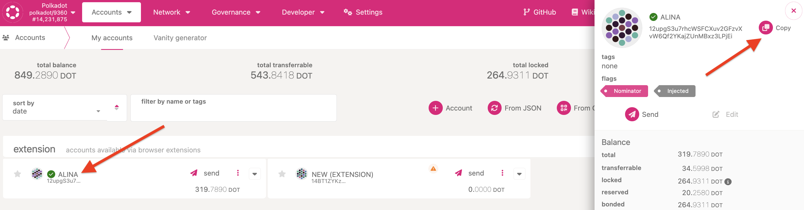
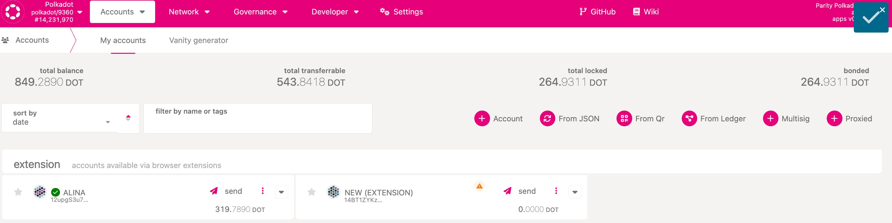

!!!info "Related concepts"
    For the underlying concepts, see [Accounts](../learn-accounts.md).

!!! warning "IMPORTANT"

    Polkadot Developer Interface (Polkadot-JS UI) is a web wallet meant for power users and developers. For everyday use, there are several user-friendly wallets funded by the Polkadot Treasury that support a plethora of features and platforms. Discover them in [this article](where-to-store-dot.md).

The [Accounts](https://polkadot.js.org/apps/?rpc=wss%3A%2F%2Frpc.polkadot.io#/accounts) page lists all your Polkadot accounts, whether they were added directly on the Polkadot Developer Interface or through compatible browser extensions.

In this article we demonstrate two ways to copy your address from there.

* * *

### How to copy your account's address from Polkadot Developer Interface

There are two ways to copy your address:

1\. You can see your address by clicking on your account name. This will open a pop-up on the right, showing your DOT address, account name, balance, and other information. You can copy the address from there:

2\. You can copy your address quicker by clicking on your account icon. Every account has its own icon, also called an identicon:

Hover over this icon, and you'll see a green plus next to your cursor. To copy your address, just click on the identicon. A checkmark will appear in the top right corner to indicate that the address was copied:

Once copied, you can paste your account address into a text file, a block explorer, or anywhere else you want to view it.

* * *
