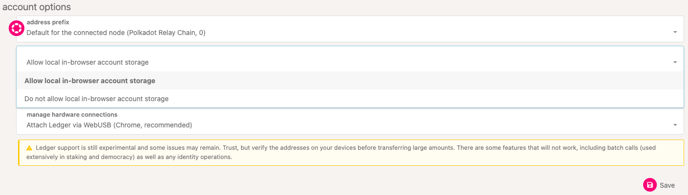
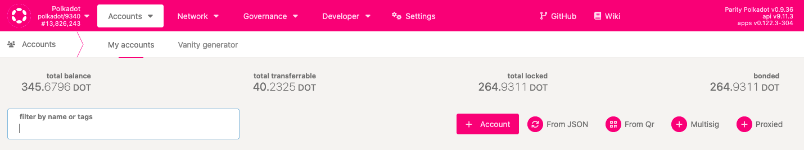
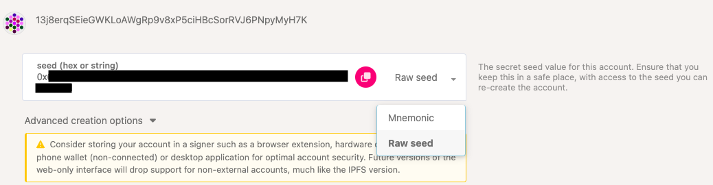

!!!info "Related Wiki page"
    For the underlying concepts, see [Accounts](../learn-accounts.md).

!!! warning "IMPORTANT"

    Polkadot Developer Interface (Polkadot-JS UI) is a web wallet meant for power users and developers. For everyday use, there are several user-friendly wallets funded by the Polkadot Treasury that support a plethora of features and platforms. Discover them in [this article](where-to-store-dot.md).

Most wallets use a 12-word or 24-word mnemonic phrase to back up your account. You can find instructions on how to your account with its mnemonic phrase [in this article](restore-account-signer.md).

However, if you are using a multi-chain wallet not specific to the Polkadot ecosystem, it's possible that the mnemonic phrase doesn't generate the same account. Also, it could be that you have a **raw seed** instead of a mnemonic phrase for some other reason. To import this type of account, you'll need to use the [Polkadot Developer Interface](https://polkadot.js.org/apps/?rpc=wss%3A%2F%2Frpc.polkadot.io#/accounts) web wallet instead of the Polkadot browser extension.

!!! danger "READ THIS FIRST!"

    Exposing your private key online poses a**security risk**. You should only do this if you have no other options and if you are planning to send your funds to a new account with a new mnemonic phrase.

* * *

### How to import your private key on the Polkadot Developer Interface

1\. Export your private key from your original wallet. You may have to check with the Customer Support of your wallet provider on how to do that.

2\. Once you have your private key, go to Polkadot Developer Interface and navigate to the [Settings](https://polkadot.js.org/apps/#/settings) tab. In the account options, allow local in-browser account storage and click Save:

3\. Navigate to the Accounts page and click on the "+ Account" button.

!!! warning "IMPORTANT"

    If this button isn't visible, go to Settings and select "Allow local in-browser account storage" under the "in-browser account creation" setting. Then click "Save".

4\. Click on the word "Mnemonic" and select "**Raw seed** " from the drop-down menu that appears.

Delete the shown private key and enter yours instead.

!!! warning "IMPORTANT"

    **If your key doesn't start with _0x_ , add it manually in front of it.**

5\. This should generate your account address on top of the window. Check the box "I have saved my mnemonic seed safely" and click Next.

6\. Give your account a descriptive name and a [good password](store-mnemonic-safely.md). Click Next, review the details, and click Save.

And that's it, your account has now successfully been imported, and you will see it listed on your [Accounts page](https://polkadot.js.org/apps/#/accounts).

* * *
