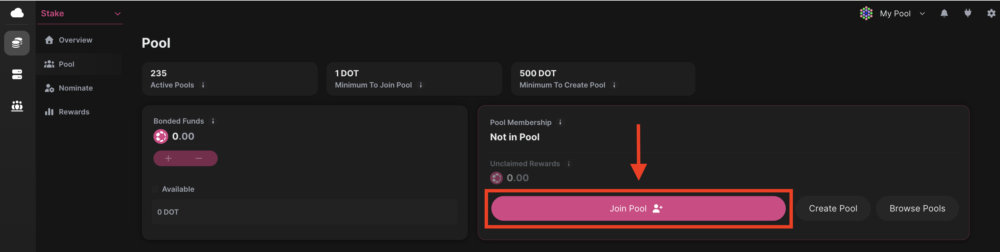
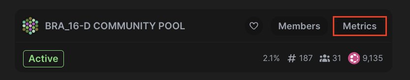
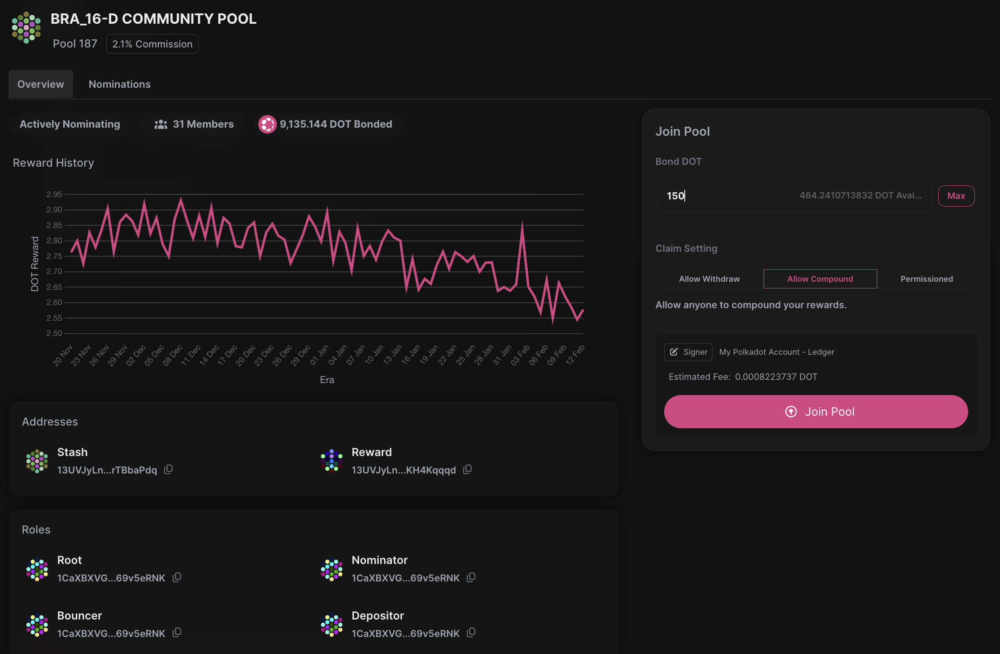
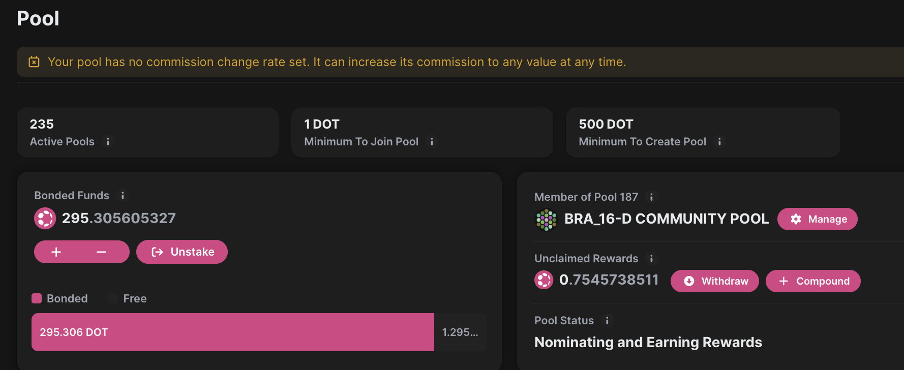
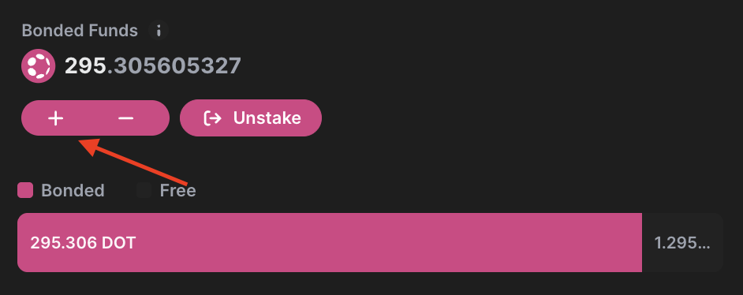
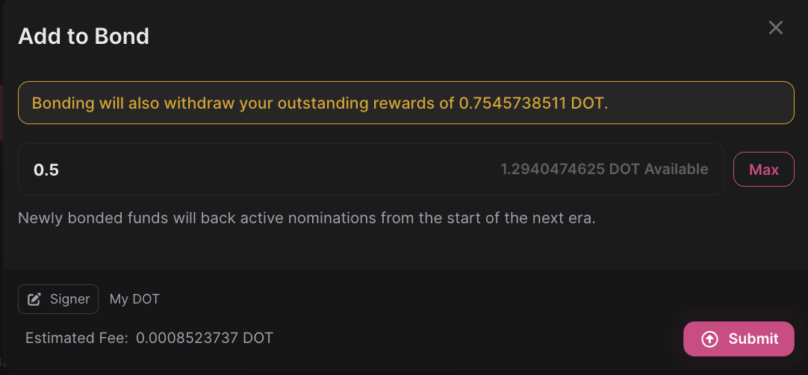

!!!info "Related concepts"
    For the underlying concepts, see [Nomination Pools](../learn-nomination-pools.md).

__

The[Staking Dashboard](https://staking.polkadot.cloud/#/overview) is a powerful tool in the Polkadot ecosystem that allows you to stake your DOT easily. If this is your first time using it, consider reading the [overview article ](../../general/dashboards/staking-dashboard.md)to learn how to navigate its tabs.

This article explains how to use the [Staking Dashboard](https://staking.polkadot.cloud/#/pool) to join a nomination pool.

This example uses the Westend testnet, but the process is the same for Polkadot and Kusama.

### How to Join a Nomination Pool

!!! warning "IMPORTANT"

    You can now join a nomination pool with tokens that are locked for governance in addition you can vote in governance while your tokens are staked in a pool. The bonded tokens remain in your account and under your control, but can't be transferred. The pool handles validator nominations and reward distribution.

!!! tip "GOOD TO KNOW"

    An account can only be a member of **one pool at a time**.

1\. [Connect](connect-account.md) your account to the Staking Dashboard.

2\. Navigate to the "[Pool](https://staking.polkadot.cloud/#/pool)" tab and click the "Join Pool" button. The system will show you Polkadot Cloud pool. You can select it if it suits you, or click "Choose Another Pool" to view a different one. Alternatively, you can go to the "[Browse Pools](https://staking.polkadot.cloud/#/pools)" to do your own research and choose the pool that best matches your preferences.

You can learn how to choose the best nomination pool based on your preferences in this [article](choose-nomination-pool.md):

3\. Find the pool you would like to join and click "Metrics":

!!! tip "GOOD TO KNOW"

    Nomination pools have the possibility to charge a commission for their services. Always check the pool's commission before joining it.

!!! warning "IMPORTANT"

    Choose wisely. As a pool member you must wait for the unbounding period before switching pools: 28 days on Polkadot and 7 days on Kusama.

4. In this panel, under the "Overview" tab, you can see key information about the pool, such as the reward history, total bonded amount, and assigned roles. In the "Nominations" tab, you can check which validators the pool is nominating.

On the right side, you can enter the amount you want to bond and choose how rewards will be claimed. You can allow anyone to claim them to your account, automatically compound them back into the pool, or select permissioned mode, where only you can claim your rewards. When ready, click "Join Pool" and sign to confirm:

5\. Once you sign the extrinsic, the "Pool" page will be presented again, displaying the information about the nomination pool you joined:

* * *

### How to Increase Your Bond in the Pool

1\. To increase your stake, click the plus button on the ["Pools"](https://staking.polkadot.cloud/#/pools) page.

2\. Enter the amount you want to add to your stake and click "Submit":

* * *

### Limitations

  * To switch pools, a member must wait for the unbonding period: 7 days on Kusama and 28 days on Polkadot.
  * Auto-compounding isn't enabled by default, but it can be done manually or permissionlessly, depending on your chosen settings.
  * A member can also partially unbond their staked funds in the pool, with up to 16 partial unbonds allowed. See [this article](unbond-from-nomination-pool.md) for more details on how to unbond or exit a pool.
  * See this [article](../learn-nomination-pools.md) for a comparison between nominating directly and joining a nomination pool.

For guidance on creating or destroying pools, refer to [this article](create-nomination-pool.md).

* * *

If you are more of a visual learner, check this video guide:

[Polkadot Made Easy: How to stake DOT through Nomination Pools](https://www.youtube.com/watch?v=hkj4Rl8q6tQ&list=PLOyWqupZ-WGuiPQ7WRvECJk2ZvZuvfwUK&index=22)

* * *
