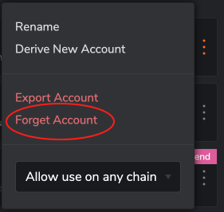
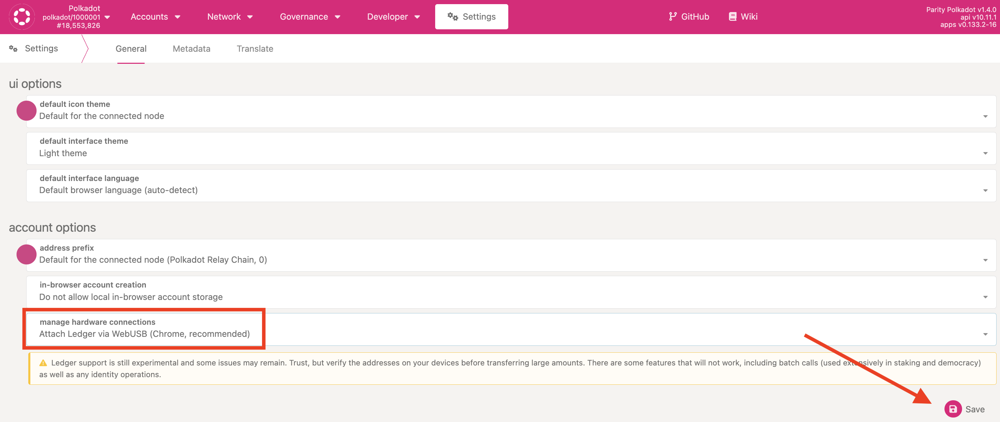
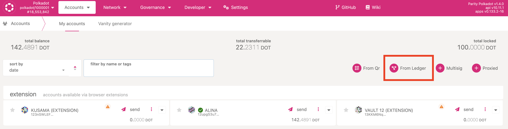

!!!info "Related concepts"
    For the underlying concepts, see [Ledger](../../general/ledger.md).

In this article, you will learn how to use your Ledger device with Polkadot Asset Hub (former Statemint), Polkadot's system parachain that natively supports custom assets and NFTs.

!!! warning "IMPORTANT"

    Ledger is phasing out support for the [Ledger Nano S](https://support.ledger.com/es/article/Ledger-Nano-S-Limitations). Your funds remain safe, but upgrading is recommended to ensure compatibility with future Polkadot updates. Notice that other Ledger Models (e.g., Ledger Nano S Plus) are not affected.

#### **TABLE OF CONTENTS**

  * Things to know before operating on Asset Hub
  * How to create a Polkadot Asset Hub account with Ledger
  * How to use a Ledger account on both Polkadot and Polkadot Asset Hub

* * *

### Things to know before operating on Asset Hub

Let's address a few things that you need to **pay attention to:**

1\. All your Polkadot accounts in Polkadot-JS UI, regardless of type, are also available on Polkadot Asset Hub, even if they're not [set to be available on all chains](../learn-account-advanced.md). Polkadot Asset Hub uses DOT as its native token; hence, it makes sense for accounts on Polkadot to also be available on Polkadot Asset Hub.

2\. The opposite is not true: accounts created on Polkadot Asset Hub are not available on Polkadot.

!!! info

    All the information in this article also applies to Kusama and Kusama Asset Hub, Polkadot Asset Hub's cousin on Kusama.

* * *

### How to create a Polkadot Asset Hub account with Ledger

If you want to create a Ledger account that's only available on Polkadot Asset Hub but not Polkadot, you can add it directly on Polkadot-JS UI on Asset Hub.

1\. Switch to Polkadot Asset Hub following the instructions [here](switch-network-nodes.md).

2\. Install the Statemint or Polkadot Asset Hub app on your Ledger, if you haven't already, using Manager in Ledger Live.

3\. Open the Statemint or Polkadot Asset Hub app on your Ledger device.

4\. Then, add the Ledger account normally, following the instructions [here](add-ledger-account.md).

If you already have a Polkadot Ledger account, that one will also be available on Polkadot Asset Hub, as mentioned above. If you want to add a different account that's only available on Polkadot Asset Hub, you'll need to select a different Account Type and Index than your Polkadot account.

!!! warning "ATTENTION"

    Make sure to note the combination of Account Type and Index you selected. You will need it if you ever have to re-add your account.

* * *

### How to use a Ledger account on both Polkadot and Polkadot Asset Hub

You'll most likely want to use the same Ledger account on both Polkadot and Polkadot Asset Hub. In that case, if your Polkadot Ledger account was added directly on Polkadot-JS UI (it will show up under the ["hardware" type](../learn-account-advanced.md)), there's nothing more you need to do! You can already use the account on both chains.

!!! warning "IMPORTANT"

    You need a **Chromium-based browser** to connect your Ledger to Polkadot-JS UI.

**If your account is in the Polkadot extension**  (it shows up under the "injected" type), you'll need to remove it from the extension and re-add it directly on Polkadot-JS UI **on the Polkadot chain.**  Follow these steps to do so:

1\. Open the extension.

2\. Click on the three dots next to your account.

3\. Select "Forget account" and confirm your choice:

Now you can add your account to Polkadot-JS UI:

1\. On Polkadot-JS UI, [switch to Polkadot](switch-network-nodes.md) and navigate to [Settings](https://polkadot.js.org/apps/#/settings).

2\. Allow local in-browser browser account storage and choose to attach Ledger via WebUSB, then click "Save":

3\. On the [Accounts](https://polkadot.js.org/apps/#/accounts) page, click "From Ledger":

4\. Give your account a descriptive name. Leave the Account Type and Index at default values unless you changed them originally to create your Ledger account.

!!! warning "ATTENTION"

    **Make sure to note the combination of Account Type and Index you selected.** You will need it if you ever have to re-add your account.

5. Open the **Polkadot**  app on your Ledger device and click "Save" on Polkadot-JS UI. Allow Polkadot-JS UI to connect to your Ledger to add the account.

6\. Install the Statemint or Polkadot Asset Hub app on your Ledger, if you haven't already, using Manager in Ledger Live.

7. That's it! To use the account on either chain, simply [switch](switch-network-nodes.md) to it on Polkadot-JS UI, open the respective app on your Ledger, and issue the extrinsic you want.

* * *

For a detailed guide on how to operate Asset Hub from your Ledger device, check out this video from our TechEd team:

[How to use Statemine on ledger | Technical Explainers](https://www.youtube.com/watch?v=j0O-KziV9iw)

* * *
