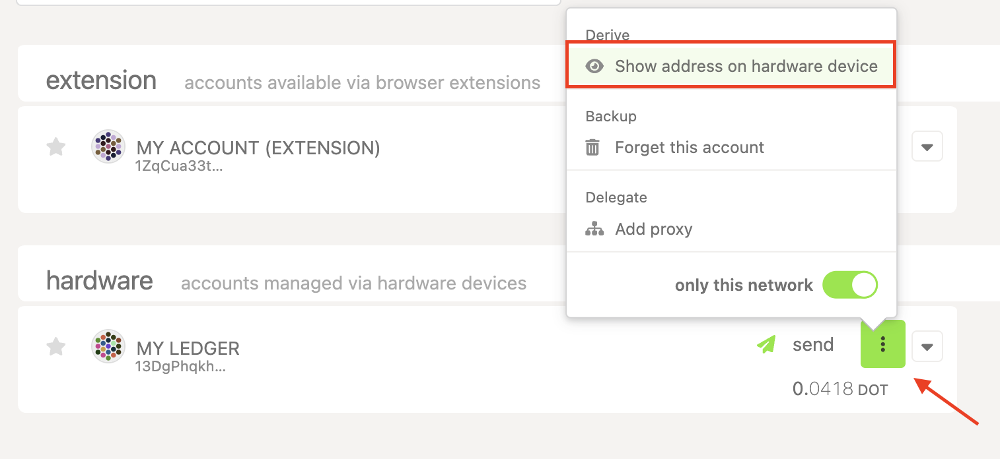
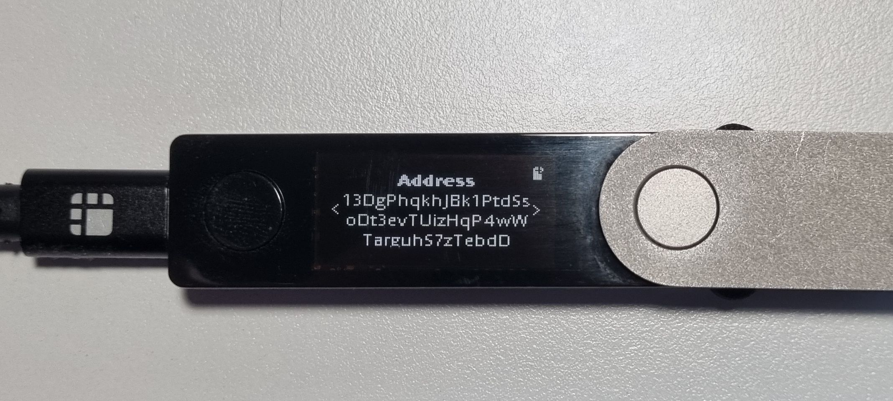

!!!info "Related concepts"
    For the underlying concepts, see [Ledger](../../general/ledger.md).

One of the security features hardware wallets offer is to confirm your account address on the device to ensure that what you see on your computer is the correct address and has not been changed either by the UI or after copying it. This way, you are sure that when you send tokens to your account, they will arrive at the correct destination.

!!! warning "ATTENTION"

    Some malware can monitor your clipboard for cryptocurrency addresses and change them while you copy-paste them. For this and other reasons, it is **important** **to always triple-check the address** you are about to send or receive funds to. With hardware wallets especially, you can always verify the correct address on the device.

In this article, you will learn how to confirm your account address on your Ledger from the Polkadot Developer Interface.

!!! warning "IMPORTANT"

    Ledger is phasing out support for the [Ledger Nano S](https://support.ledger.com/article/Ledger-Nano-S-Limitations). Your funds remain safe, but upgrading is recommended to ensure compatibility with future Polkadot updates.

    Notice that other Ledger models (e.g., Ledger Nano S Plus) are not affected.

* * *

### How to confirm your address on Ledger

!!! tip "GOOD TO KNOW"

    This is available only if your Ledger account has been added directly on Polkadot Developer Interface (it will have a type of '_hardware')_. If it is added in the Polkadot Developer Signer or any other browser extension (type '_extension')_ , this functionality will not be available.

1\. On the [Accounts](https://polkadot.js.org/apps/#/accounts) page on Polkadot Developer Interface, click on the three dots next to your Ledger account and select "Show address on hardware device":

2\. The "Please review" message will appear on your Ledger. Press the right button to see your address and compare it to the one shown in the UI or the one you just pasted to receive funds:

3\. Then press the right button again. Press both buttons on the "Approve" or "Reject" screen to discard the message on your device.

* * *
