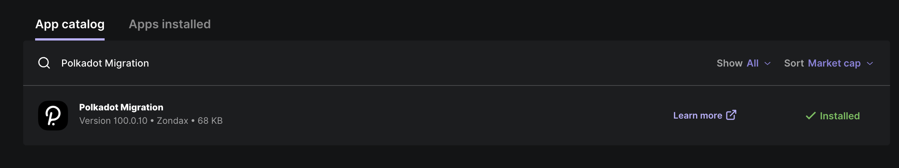
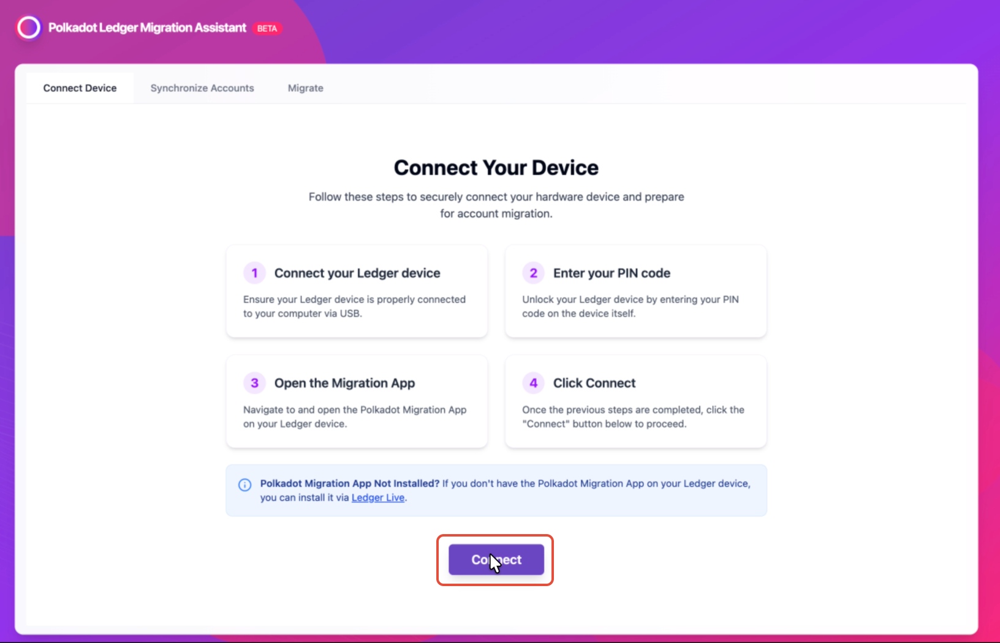
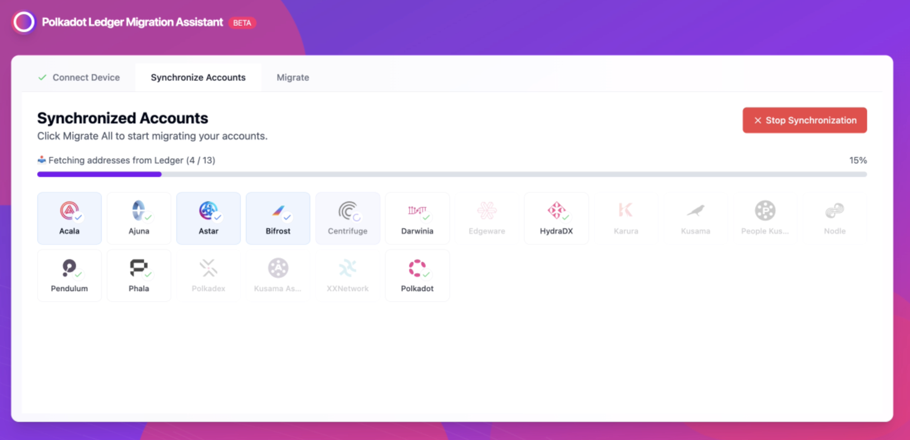
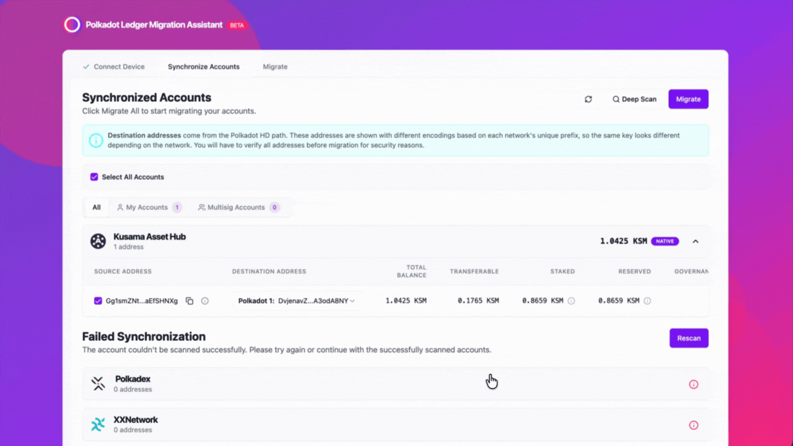
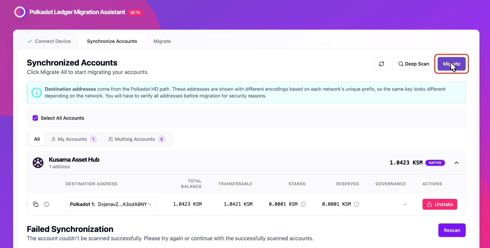
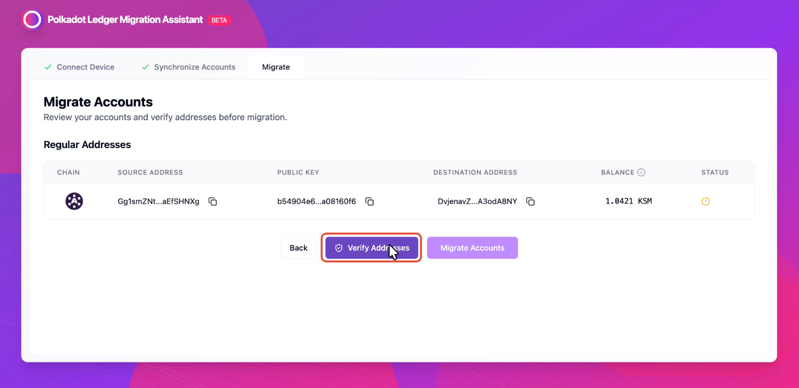
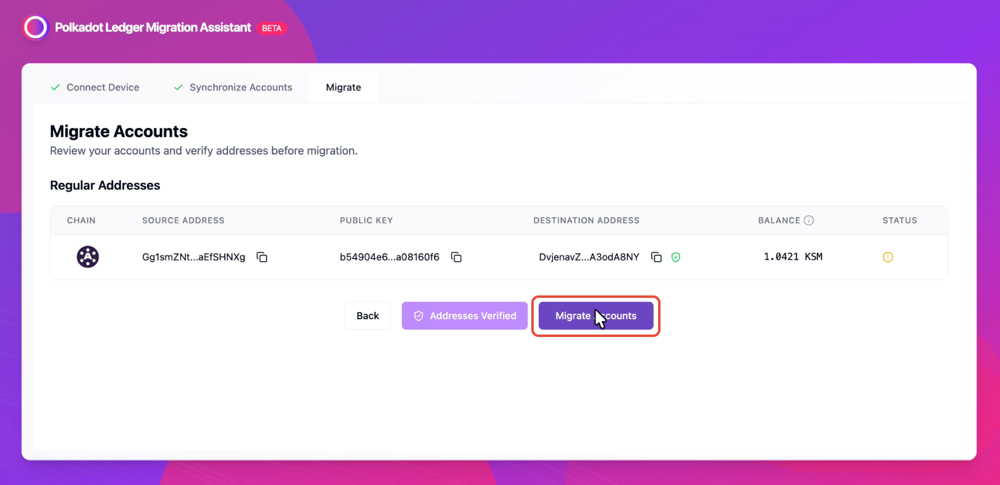
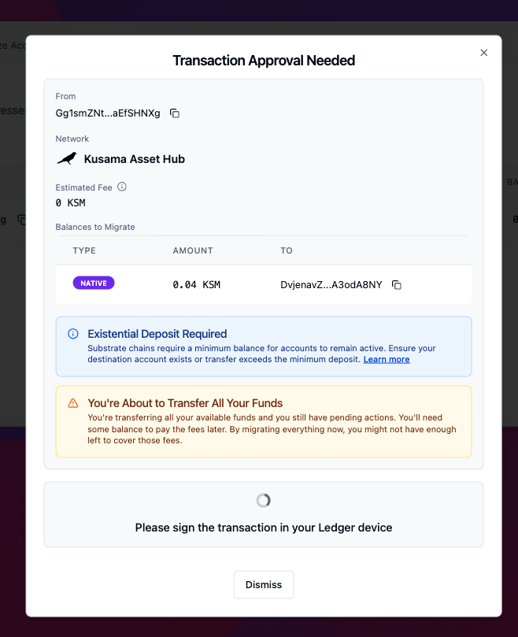
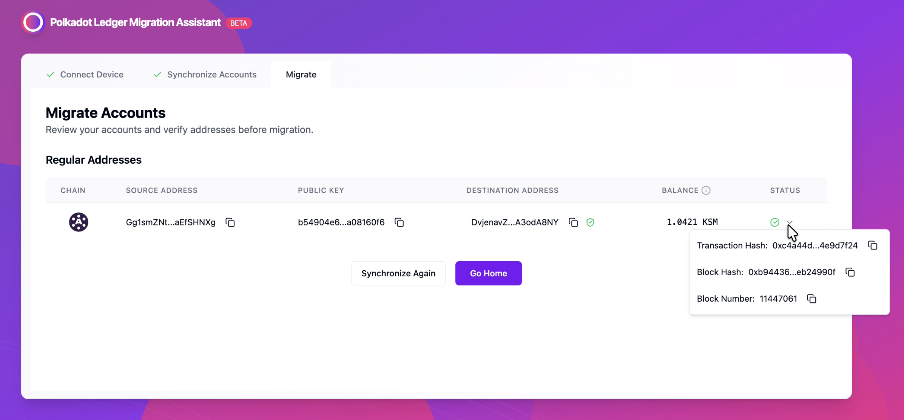

!!!info "Related concepts"
    For the underlying concepts, see [Ledger](../../general/ledger.md).

Until recently, Polkadot, Kusama, and several rollups used separate apps on Ledger, which made it more difficult to manage assets and view balances across networks. To simplify this experience, the Polkadot Generic App was created.

This app allows you to use a single account across Polkadot, Kusama, and most rollups, without installing separate apps for each network. Currently, this is the only available option, as the legacy apps are no longer maintained.

However, many users still have funds stored in legacy accounts created with the older Ledger apps. To help migrate these accounts and align them with the Polkadot Generic App, Zondax has developed a specific tool called the Polkadot Ledger Migration Assistant. This tool guides you step by step through the migration, even if you have funds locked in staking or governance.

Below you will find the full step-by-step migration process.

* * *

!!! warning "ATTENTION"

    You don't need to migrate any assets from Polkadot, as the "generic" Polkadot app handles accounts created using older versions of the Polkadot app (i.e., versions earlier than 100.x) as well as accounts created with the Statemint app (Polkadot Asset Hub), since both have always used the same Polkadot derivation path.

1\. Install the Polkadot Migration app in your Ledger using Ledger Live:

2\. Go to <https://polkadot.zondax.ch/> and click "Start Migration":

3\. Connect and unlock your Ledger device, then open the Polkadot Migration app and click "Connect" on the Polkadot Ledger Migration Assistant:

!!! warning "IMPORTANT"

    You can connect your Ledger only using a Chromium-based browser, such as Google Chrome, Brave, and Edge.

4\. The tool will automatically scan your Ledger to detect accounts that can be migrated. Keep your Ledger device on during the process:

5. After the scan, you will see a list of accounts to be migrated. To verify if you have locked tokens, you'll need to scroll right in your account:

6\. If you do not have any pending locks, skip this step. Otherwise, keep reading.

To unlock your funds, click the pink button labeled with the required action. A pop-up will appear. Then click "Sign Transfer" and approve the transaction on your Ledger. Once the transaction is completed, click "Update Synchronization" to refresh your account status.

!!! tip "GOOD TO KNOW"

    Some locked funds might have an unlocking period. If this applies to your account, you'll need to come back once the unlocking period has ended and take the required steps to move them to your transferable balance.

7\. Click "Migrate" to proceed with the migration:

8\. Click "Verify Addresses" to confirm the source and destination addresses, and approve the message on your Ledger device:

9\. Click "Migrate Accounts" to finalize the migration from the Polkadot Migration app to the Polkadot Generic app:

10\. Review and approve the transaction on your Ledger Device using the Polkadot Migration app. Once approved, wait for the confirmation message:

11\. You can view all the migration details by clicking the entry under the "Status" column:

And that's all, your account is now successfully migrated. From now on, you will only need to use the Polkadot Generic App for your future transactions across Polkadot, Kusama, and [supported rollups](https://data.parity.io/metadata?relay-chain=polkadot&check=yes).

* * *
