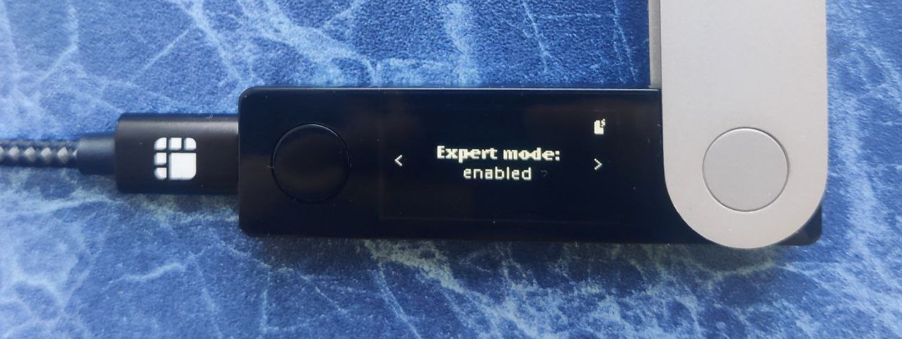
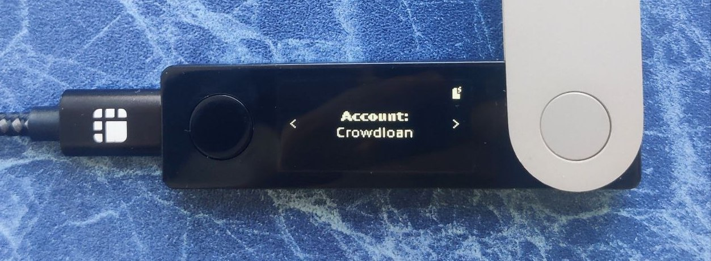

!!!info "Related concepts"
    For the underlying concepts, see [Ledger](../../general/ledger.md).

The Polkadot Ledger app can operate on any Substrate-based network since version 100.0.0. That means you can now use the Polkadot generic app to interact from its account on multiple networks, not just on Polkadot. However, it’s important to note that not all networks have met these requirements yet (i.e., have deployed '[CheckMetadataHash](https://data.parity.io/metadata)' in their runtime). For those networks, you may still need to use their dedicated Ledger app to access their specific features and functionalities.

!!! warning "IMPORTANT"

    Ledger is phasing out support for the [Ledger Nano S](https://support.ledger.com/article/Ledger-Nano-S-Limitations). Your funds remain safe, but upgrading is recommended to ensure compatibility with future Polkadot updates.

    Notice that other Ledger models (e.g., Ledger Nano S Plus) are not affected.

The article below focuses on the specific "legacy" apps required for the reducing number of networks that don't yet fulfill the requirements to use the Polkadot generic app.

!!! danger "READ THIS FIRST!"

    This article is for cases where the legacy parachain app is needed to access a Polkadot or Kusama account to recover funds sent on a parachain network.

    Use the Polkadot app or the [Polkadot Migration app](ledger-migrate-generic-app.md) for _parachains that are compatible_ with the most recent version of these apps:

    * Compatible [Polkadot parachains](https://data.parity.io/metadata?check=yes&relay-chain=polkadot)
    * Compatible [Kusama parachains](https://data.parity.io/metadata?check=yes&relay-chain=kusama)

#### **TABLE OF CONTENTS**

  * What are Legacy and Crowdloan accounts on Ledger
* Legacy
* Crowdloan
  * How to switch between Legacy and Crowdloan accounts on Ledger
  * How to use your Ledger account on parachains

* * *

### What are Legacy and Crowdloan accounts on Ledger

Ledger accounts for parachains are of two types: Legacy and Crowdloan. If you open a parachain app on your Ledger device and press the right button twice, you will see your current account type. By default, it's Legacy.

#### **Legacy**

This account cannot be used on other networks. Each parachain will have a different Legacy account, which is also different from your Polkadot or Kusama account. Each Legacy account has its unique private key, although the same recovery phrase gives access to all accounts on your Ledger.

#### **Crowdloan**

This account can be used on multiple parachains that connect to the same relay chain. If you are using a Polkadot parachain app, your Crowdloan account has the same private key as your Polkadot account. Crowdloan accounts on Kusama parachains have the same private key as your Kusama account.

!!! info

    Each network has its own address format. Your **Crowdloan account hasdifferent addresses** **on different parachains**. You can see all the addresses corresponding to your account using [Subscan's handy tool](https://polkadot.subscan.io/tools/format_transform).

* * *

### How to switch between Legacy and Crowdloan accounts on Ledger

1\. Connect your Ledger device and make sure that you have both the Polkadot or Kusama app and the parachain app installed. You can install and update apps in Ledger Live.

2\. Open the parachain app. Press the right button to see the Expert mode screen. Press both buttons to enable it:

3. Press the right button to see the Account screen. Press both buttons to switch from Legacy to Crowdloan or vice versa.

4\. Review configurations, and press both buttons on the Approve screen to allow the change (or go to the next screen to reject it).

5\. Done! You can see your new account type:

If you want to switch back, follow the same steps again.

* * *

### How to use your Ledger account on parachains

Ledger Live supports only some tokens you can store on Ledger. You may need a third-party wallet compatible with Ledger to use your account on a parachain.

You can check wallets compatible with Ledger and native to the Polkadot ecosystem in the article below:

[Where to Store DOT: Polkadot Wallet Options](where-to-store-dot.md)

In any case, please ensure that you have chosen the desired account type and that your parachain Ledger app is updated and open on your Ledger device.

* * *
