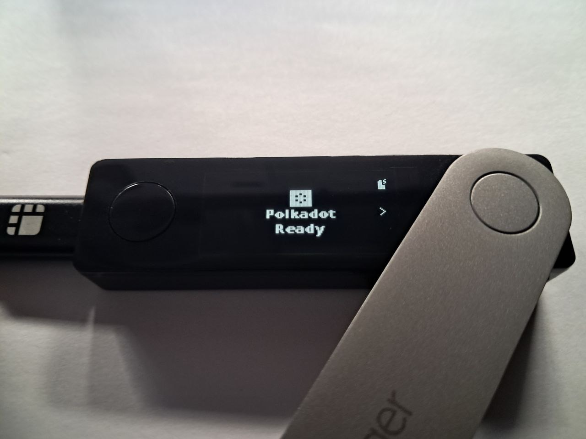
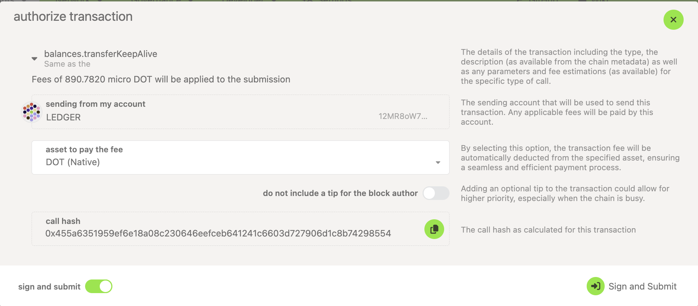
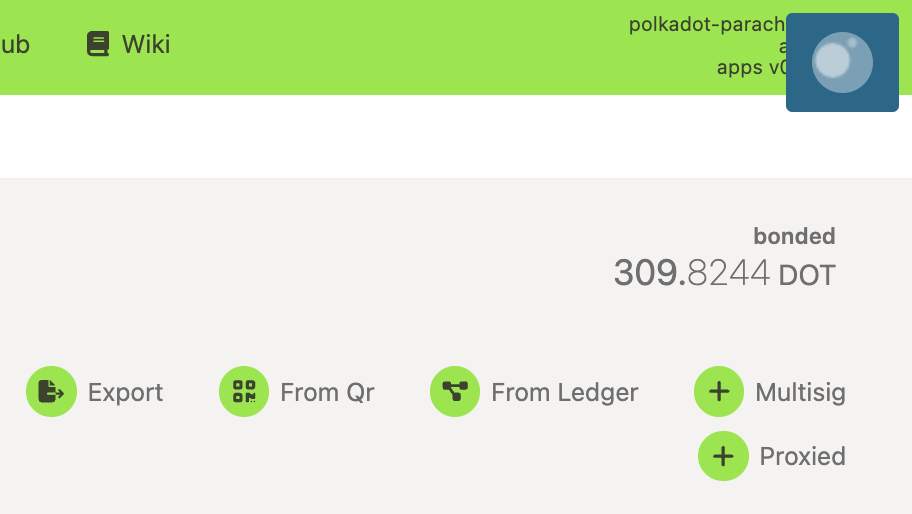
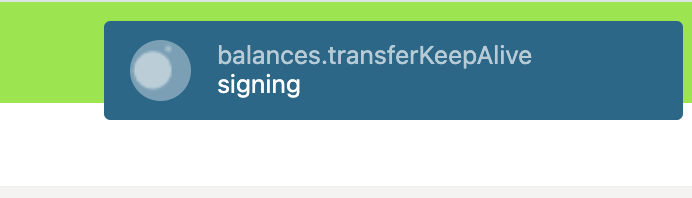
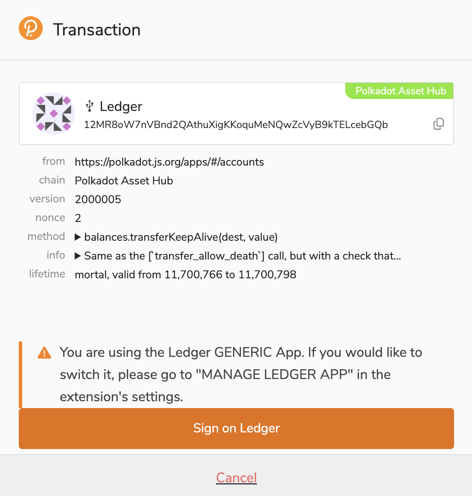
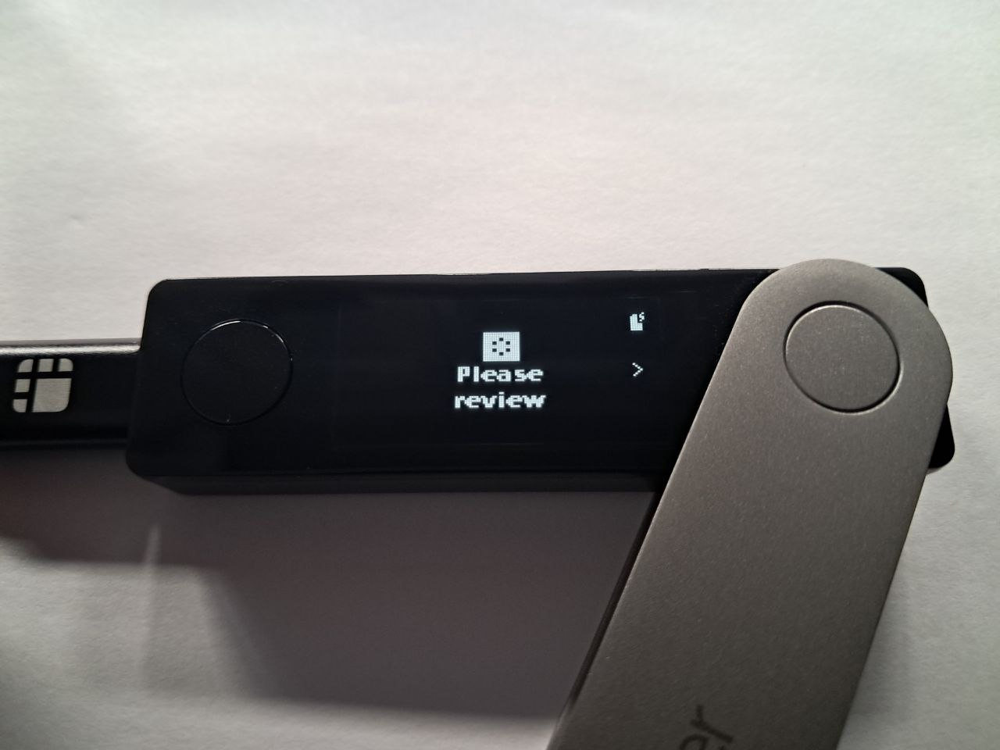

!!!info "Related concepts"
    For the underlying concepts, see [Ledger](../../general/ledger.md).

!!! warning "IMPORTANT"

    [Polkadot Developer Interface](https://polkadot.js.org/apps) is a web wallet meant for power users and developers. For everyday use, there are several user-friendly wallets funded by the Polkadot Treasury that support a plethora of features and platforms. Discover them in [this article](where-to-store-dot.md).

In this article, we demonstrate how to send DOT from your Ledger account using the Polkadot Developer Interface, with or without the help of the Polkadot Developer Signer. If you are using Ledger Live, please check [this article](../../general/ledger.md#using-ledger-live).

!!! warning "IMPORTANT"

    Ledger is phasing out support for the [Ledger Nano S](https://support.ledger.com/article/Ledger-Nano-S-Limitations). Your funds remain safe, but upgrading is recommended to ensure compatibility with future Polkadot updates.

    Notice that other Ledger models (e.g., Ledger Nano S Plus) are not affected.

* * *

### How to Send DOT from Your Ledger Account

The steps change slightly depending on whether your account is added [directly on the Polkadot Developer Interface](add-ledger-account.md) or [through the Polkadot Developer Signer](add-ledger-account-signer.md). We recommend adding your Ledger account through the extension for extra convenience and safety.

1\. Connect and unlock your Ledger and open the Polkadot app. Always remember to keep your app updated.

2\. Initiate the transfer from the Polkadot Developer Interface, either from the ["Account" tab](https://polkadot.js.org/apps/?rpc=wss%3A%2F%2Frpc.polkadot.io#/accounts) or from the top menu, as described in [this article](transfer-funds.md).

3\. When you reach the step to sign the transaction, you won't be asked for a password because Ledger accounts don't have one. Click "Sign and Submit":

4\. The modal will disappear, and on the top-right corner, a moving circle will appear, indicating there is a pending transaction, while the UI awaits confirmation from the Ledger device.

You can hover your mouse over the blue square to expand the entire message.

If your Ledger account is **not** in the Polkadot Developer Extension, skip to step 6.

5\. The pop-up window of the extension will appear. Click on "Sign on Ledger." The button will become inactive while awaiting confirmation from the Ledger device.

6\. The "Please review" message will appear on your Ledger. Click on the right button to review the details of the transaction, then "Approve" (or "Reject") the transaction.

To learn more about how to verify what extrinsic you're signing with Ledger (and other account types), check [this article](verify-extrinsic.md).

And that's it! After a few seconds, the transaction should be recorded and validated on-chain. You can check further details about it in any of the many [block explorers](block-explorers.md) in Polkadot.

* * *

If you are more of a visual learner, check this video:

[Transfer your Funds using Ledger Nano, Parity Signer, Polkadot-JS UI & Browser Extension](https://www.youtube.com/watch?v=gbvrHzr4EDY)

* * *
