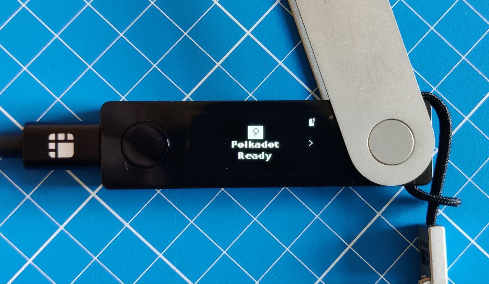
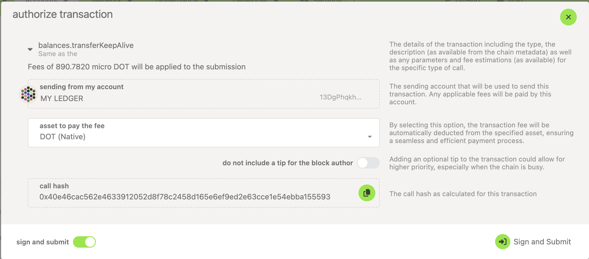
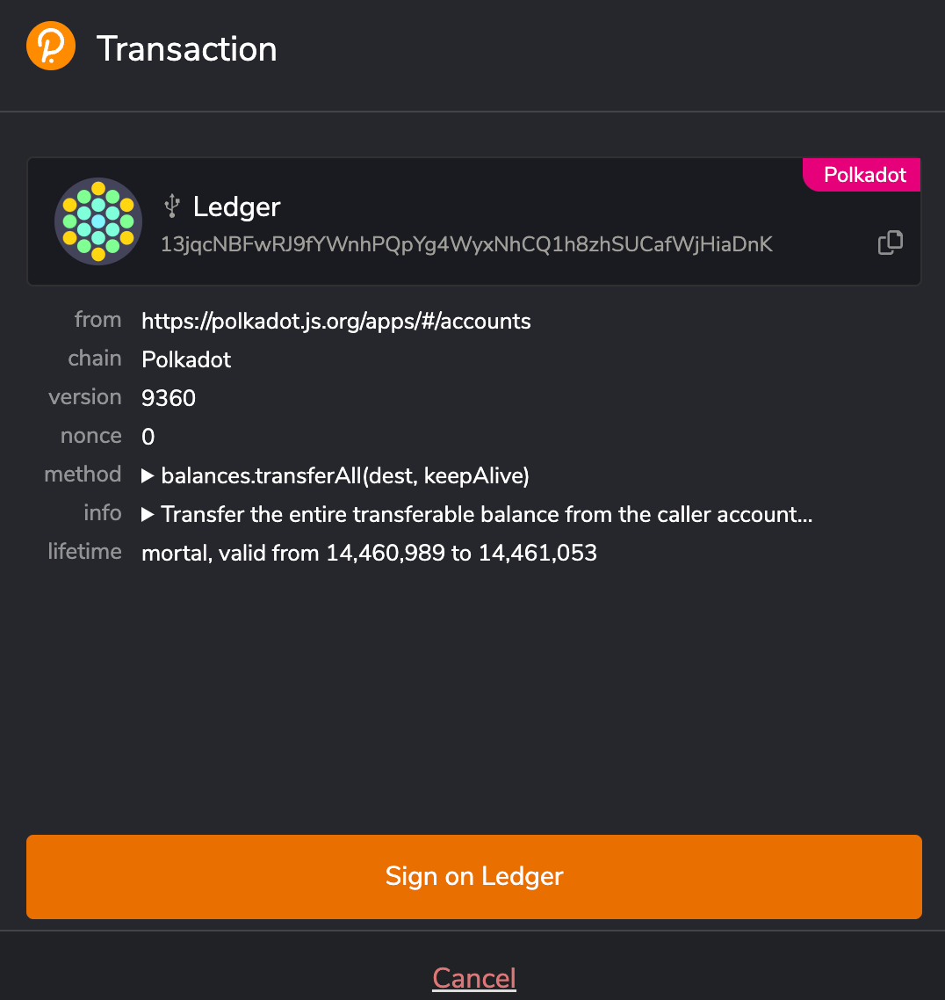
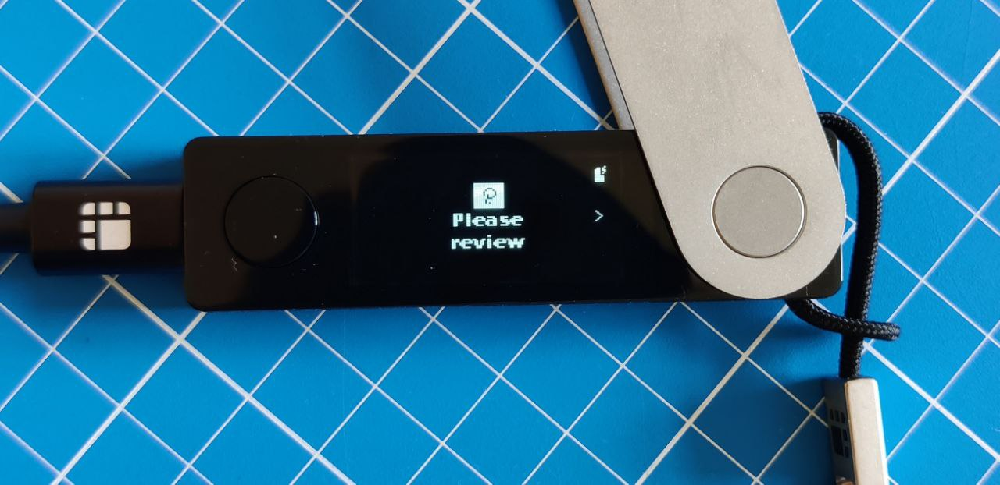
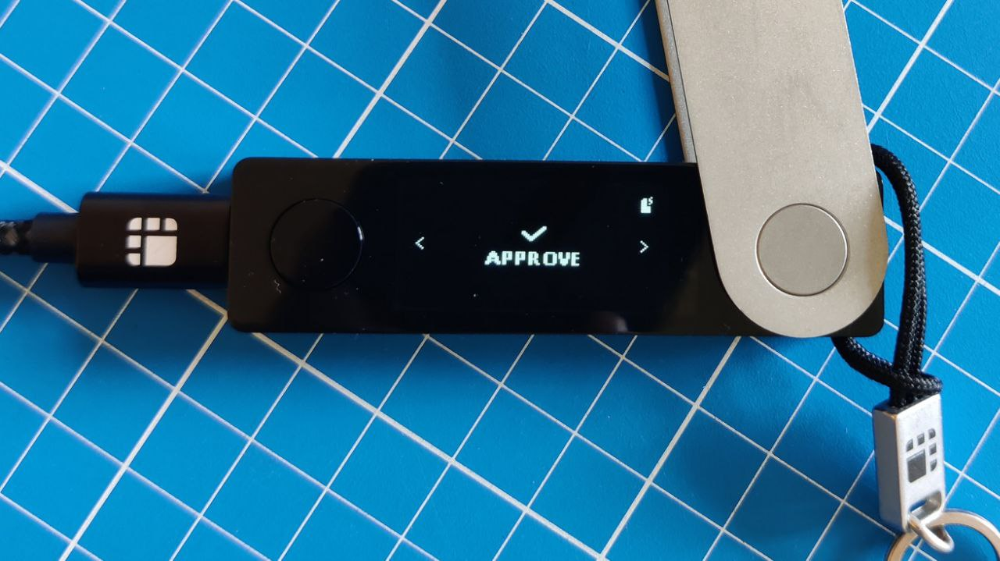
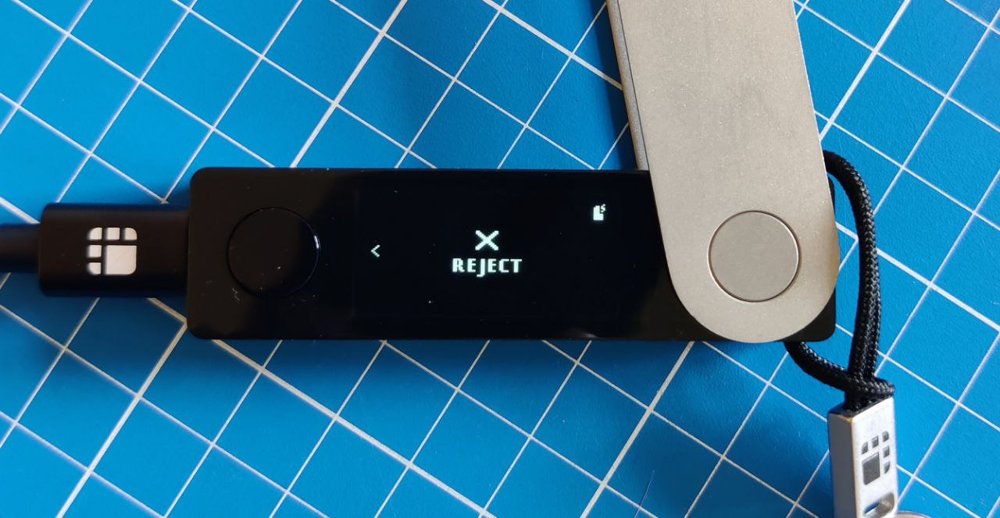
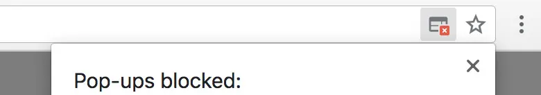

!!!info "Related Wiki page"
    For the underlying concepts, see [Ledger](../../general/ledger.md).

Signing a transaction is the final step of any transaction, like [sending funds out of your account](transfer-funds.md). A transaction will not be broadcasted in the blockchain until you sign it. You sign a transaction with your private key for your account, proving that you own this account. The signing process, however, depends on what wallet or account manager you use.

!!! warning "IMPORTANT"

    Ledger is phasing out support for the [Ledger Nano S](https://support.ledger.com/article/Ledger-Nano-S-Limitations). Your funds remain safe, but upgrading is recommended to ensure compatibility with future Polkadot updates.

    Notice that other Ledger models (e.g., Ledger Nano S Plus) are not affected.

### Signing a transaction on Ledger

!!! warning "IMPORTANT"

    For most users, we strongly recommend adding Ledger through the **Polkadot browser extension**. [Click here to see the benefits and instructions.](add-ledger-account-signer.md)

Whether you add your Ledger through the [Polkadot browser extension](add-ledger-account-signer.md) or directly on the[ Polkadot Developer Interface](add-ledger-account.md), you need a UI to interact with your accounts and initiate transactions.

1. Connect your Ledger to the computer, unlock it, and open the Polkadot app:

2\. On the Polkadot Developer Interface, initiate a transaction and click "Sign and Submit":

3. **Skip this step if you added your Ledger directly to the Polkadot Developer Interface.** If you added your Ledger through the Polkadot Developer Signer, a new window would pop up:

It is the Polkadot browser extension asking you to sign a transaction. Click on the "Sign on Ledger" button. The button will grey out, awaiting confirmation from your Ledger device.

4\. The message "Please review" will appear on your Ledger device:

Press the right button to check the transaction details:

[How can I verify what extrinsic I'm signing?](verify-extrinsic.md)

5\. After you have checked the transaction details, you will see "Approve" on your Ledger device. To sign the transaction, press both buttons on this screen:

To reject the transaction, move to the next screen that says "Reject" and press both buttons to confirm:

6\. Congratulations, you have signed a transaction! It will be included in the blockchain within a few seconds. You can now open any of the [block explorers](block-explorers.md) to view your transaction.

* * *

### Cannot sign a transaction?

#### **The new window doesn't appear**

If a new window doesn't pop up after you click "Sign and Submit," please check if your browser blocked it:

You can allow pop-ups after you click on the blocked window icon.

The Polkadot Developer Signer icon in the toolbar will have a red number on it if you have unsigned transactions waiting. If you blocked or accidentally closed the window, click the extension icon to open it and proceed.

If you have added your Ledger directly to the Polkadot Developer Interface and not through the extension, no new window will appear. You can move to the next step of the guide.

#### **My transaction failed**

Signing a transaction means that it will be included in the blockchain. However, it doesn't always mean it will be executed. You can check the result of your transaction on a block explorer. Sometimes a transaction cannot be executed, and it fails:

Please check [this article](why-cant-i-transfer-dot.md) to help you understand why your transaction failed, fix the issue, and send the transaction again.

#### **I get an error**

Several possible reasons can cause errors when signing a transaction on Ledger. If you can't resolve it, you can [contact Polkadot support](https://docs.polkadot.com/get-support/) for help.

* * *
