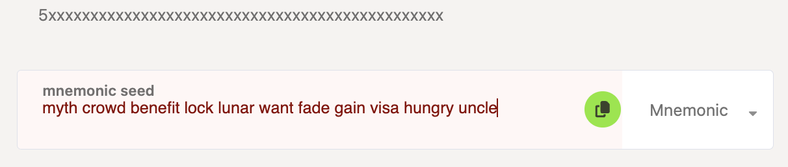
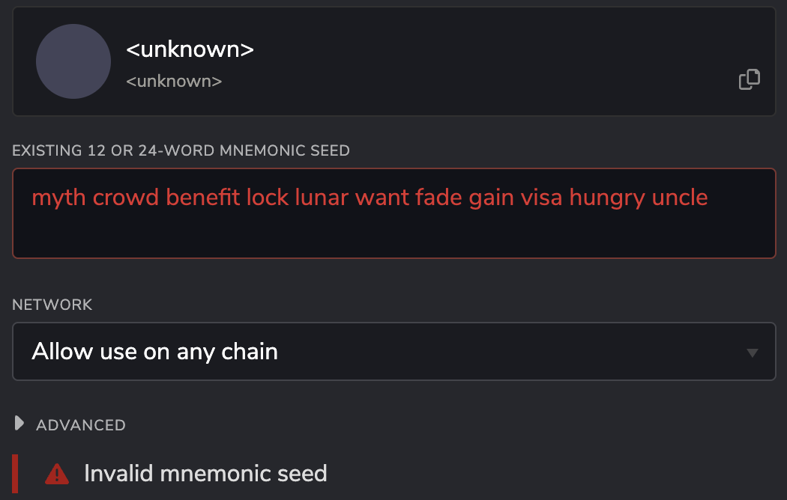

!!!info "Related concepts"
    For the underlying concepts, see [Accounts](../learn-accounts.md).

When you're trying to restore your account on the Polkadot Developer Interface or the Polkadot Developer Signer, you may get an error like in these screenshots.

Polkadot Developer Interface:

Polkadot Developer Signer:

If your mnemonic phrase appears to be invalid, please check the following:

  * That all the words are entered. The error message will show up until you fill out the whole mnemonic phrase correctly. Usually, a mnemonic phrase consists of 12 or 24 words.

  * All the words are spelled correctly. You can check them against [this list](https://github.com/bitcoin/bips/blob/master/bip-0039/english.txt) to ensure they are spelled properly.

  * You enter the words in small letters only.

  * You use only one space between the words and no space or new line at the end or beginning.

  * Your keyboard is set to English.

* * *
