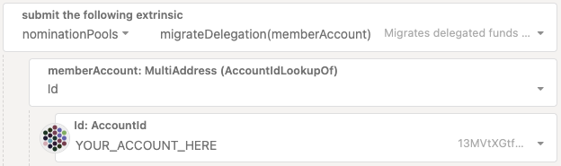

!!!info "Related Wiki page"
    For the underlying concepts, see [Nomination Pools](../learn-nomination-pools.md).

Changes deployed with the [runtime version 1.4.0](https://github.com/polkadot-fellows/runtimes/releases/tag/v1.4.0) in Polkadot and Kusama allow members of a Polkadot nomination pool to participate in any referendum on [Polkadot OpenGov](../learn-polkadot-opengov.md). Now, you can stake as low as 1 DOT and be part of any decision concerning the network's future.

As part of these changes, accounts in nomination pools were automatically migrated to the new setup. In most cases, the transition was seamless, so you likely didn’t notice any difference.

During the migration, if your account was a member of both a nomination pool and a solo staker (referred to as "dual-staking"), you might encounter a '**NotMigrated** ' error when attempting to approve any action about nomination pools.

!!! danger "READ THIS FIRST!"

    After Polkadot and Kusama runtime upgrade to version 1.6.1, any account can be a member of a nomination pool and a solo staker. **The error message "NotMigrated" is not longer relevant**.

    This article is temporarily available for reference.

If that’s the case, this article is for you.

### Past and new system

In the past, one of the [differences between staking solo and joining a nomination pool](../learn-nomination-pools.md) was that, if you joined a nomination pool, your funds were transferred and locked in a [system account](../learn-account-advanced.md#system-accounts) representing the pool, allowing it to act as a single nominator. Unfortunately, by losing direct ownership of the funds, the pool member also lost the ability to use these locked funds in Polkadot OpenGov.

This system was updated so the nomination pool accounts were transformed into special staking accounts that receive staking delegations from their members. Just like governance delegations, these delegated funds remain in the member's account. This allows nomination pool members to use the funds marked as delegated for other activities, such as participating in Polkadot OpenGov.

For a more technical explanation of the process, visit the links below:

  * [Enabling governance participation for pool members](https://hackmd.io/@ak0n/454-np-governance)
  * [[FAQ] Allowing Opengov participation for Nomination Pool members](https://hackmd.io/@ak0n/delegate-stake-faq)

* * *

### Migration

Once the runtime upgrade deployed the change, an automatic script was run to migrate all nomination pool members to the new setup. Accounts that were "dual-staking"  were the only exceptions to this automatic migration since they cannot be migrated. If you are in this situation and you cannot manage your nomination pool membership, please read the following section and follow the steps.

* * *

### 'NotMigrated' error message

!!! info

    If you recently joined a nomination pool, your account is now part of the new "delegate-and-stake" system, and no further action is needed. You can actively participate in Polkadot OpenGov using the funds reserved in the nomination pool.

If you continued dual-staking after the migration, you may encounter the **'NotMigrated'** error when trying to issue any extrinsics related to nomination pools. If that's the case, follow the steps below to migrate manually:

1\. Go to the [Staking Dashboard](https://staking.polkadot.cloud/) and connect your account ([Staking Dashboard: How to Connect Your Account](connect-account.md))

2\. Initiate the unbonding of the funds that are _staking solo_ ([Staking Dashboard: How to Unbond Your Tokens](unbond-tokens.md))

3\. After the unbonding period ends (7 days on Kusama, 28 days on Polkadot), withdraw the unbonded funds.

4\. Manually run the migration on your account by issuing the extrinsic 'nominationPools.migrateDelegation(memberAccount)' from the [extrinsic tab in Polkadot-JS UI](https://polkadot.js.org/apps/#/extrinsics).

!!! tip "GOOD TO KNOW"

    If you face any difficulties issuing the extrinsic 'nominationPools.migrateDelegation(memberAccount)', [let us know](https://docs.polkadot.com/get-support/) and we'll do it for you.

* * *
