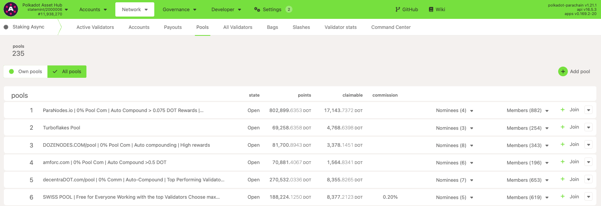
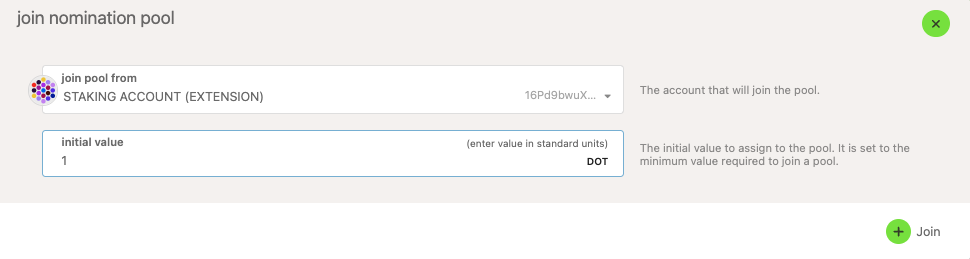
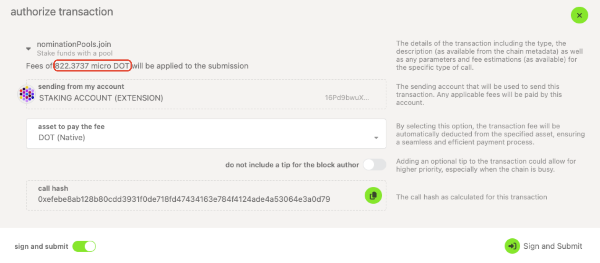
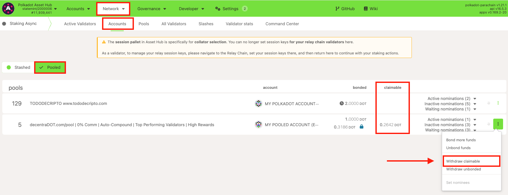

!!!info "Related Wiki page"
    For the underlying concepts, see [Nomination Pools](../learn-nomination-pools.md).

!!! warning "IMPORTANT"

    Polkadot Developer Interface (Polkadot-JS UI) is a web wallet meant for power users and developers. For everyday use, there are several user-friendly wallets funded by the Polkadot Treasury that support a plethora of features and platforms. Discover them in [this article](where-to-store-dot.md).

Nomination pools are designed to permissionlessly allow members to pool their funds together and act as a single nominator account. You can read more details about this feature [here](../learn-nomination-pools.md).

### Benefits of a Nomination Pool

Benefits of joining a nomination pool:

  * 1 DOT as minimum staking.
  * No minimum to receive rewards (as low as 1 DOT can earn rewards!)
  * More control over rewards.
  * The pool nominator will select validators on your behalf.
  * Selected validators can attract more staking input.

* * *

### How to Join a Pool

Any nominator can join a nomination pool, either through the staking dashboard (instructions on how to do it in [this article](join-nomination-pool.md)) or the Polkadot Developer Interface. In this article, we will go through the steps to do it using the latter.

!!! info

    The convenience of being a member of a nomination pool may involve having to pay a commission set by the pool manager. Check the pool's commission before joining one.

1. To join a nomination pool, navigate to the **Network > Staking Async > Pools** [page](https://polkadot.js.org/apps/#/staking-async/pools) on the Polkadot Developer Interface and select the "**\+ Join** " button next to the selected pool:

!!! warning "ATTENTION"

    Choose your nomination pool wisely. Before switching pools, a member must wait for the unbounding process: 28 days on Polkadot and 7 days on Kusama.

!!! tip "GOOD TO KNOW"

    An account can only be a member of one pool at a time.

2\. Enter the value you would like to contribute to the pool:

3\. Take the transaction fees into account and sign and submit the transaction:

* * *

### How to Exit a Pool

!!! warning "ATTENTION"

    You **cannot rebond during the unbonding period** with a nomination pool. If you change your mind, you must wait for the unbonding period to end before you can join a nomination pool again.

Members can exit the pool at any time by selecting "**Unbond funds** " instead, as shown in the screenshot above. This is in the same drop-down menu under "**Network** "  **> "Staking**"  **> "[Accounts](https://polkadot.js.org/apps/#/staking-async/actions)" >** **Pooled**.

!!! tip "GOOD TO KNOW"

    Funds exiting a pool will be subject to the normal unbonding period, which is 7 days on Kusama, and 28 days on Polkadot.

* * *

### How to Claim Rewards

The member can claim their portion of any rewards that have accumulated since the previous time they claimed (or, in the case that they have never claimed, any rewards that have accumulated since the era after they joined). Rewards are split pro rata among the actively bonded members.

On the Polkadot Developer Interface, navigate to "**Network** "  **> "Staking**"  **> "[Accounts](https://polkadot.js.org/apps/#/staking-async/actions)" > "Pooled**", where you can view your pool member account details. To claim rewards, click on the three vertical dots and click on "**Withdraw claimable**."

* * *

### Withdraw Unbonded Funds

Similar to nominating manually, the funds will need to be fully unlocked after the unbonding period ends. Withdrawing completely ends the relationship to the pool, allowing you to join a different pool if desired.

To do this, select the "Withdraw unbonded" button from the menu above after the necessary period of time has elapsed. If you would like to unbond all funds, it is highly recommended that you use the "all unbonded" toggle. Doing so ensures that all funds are unbonded, even some that may not display due to rounding by the UI.

* * *

### Limitations

  * In order for a member to switch pools, they must wait for the unbonding period to end: 28 days on Polkadot and 7 days on Kusama.

  * Auto-compounding is not active by default, but it can be done either manually or permissionlessly if you opt for it.
  * A member can partially unbond the staked funds in the pool (at most 16 partial unbonds).
  * Rebonding during the unbonding period is not possible.

See the [wiki](../learn-nomination-pools.md) for more information on how to create and destroy pools.

* * *
