!!!info "Related concepts"
    For the underlying concepts, see [Polkadot OpenGov](../learn-polkadot-opengov.md).

Participating in Polkadot OpenGov allows you to raise your voice on the trajectory of the network protocol and its Treasury. User-friendly interfaces like Subsquare facilitate the process, offering easy access to discussions, voting on referenda, and monitoring past votes. Whether casting a direct vote or delegating voting power to community members you trust, you can actively contribute to shaping Polkadot's governance with just a few clicks.

This article guides you on the basic functionalities offered by [Subsquare](https://www.subsquare.io/).

!!! danger "READ THIS FIRST!"

    The delegations or votes cast for this article are for educational purposes only and do not imply a position for or against any referenda.

### How to use Subsquare

[Subsquare](https://www.subsquare.io/) is a complete platform that allows you to engage with the democratic processes across multiple Substrate-based networks. The sections below outline how to participate in Polkadot OpenGov using Subsquare.

#### **Connect your wallet**

You can check the content and status of any proposals without connecting an account. However, any further interaction with Subsquare (e.g., voting, delegation, commenting, etc.) will require you to connect an account from your wallet. Follow the steps below to do so.

1\. Go to [Subsquare.io](https://www.subsquare.io/) and expand the network selector by clicking the "Launch App" button on the top-right corner. Select the network in which you want to participate. This article guides you on Polkadot, but many features are shared on other networks.

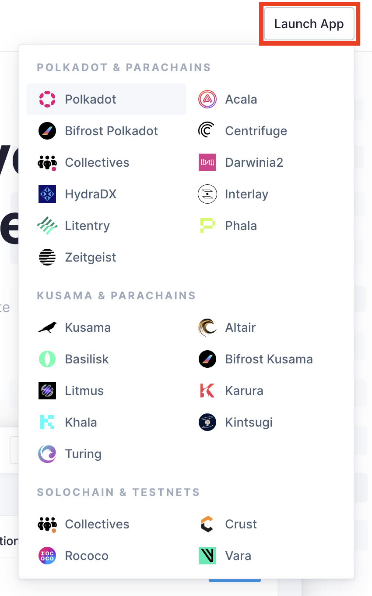2\. Once on the main site, click "Connect".

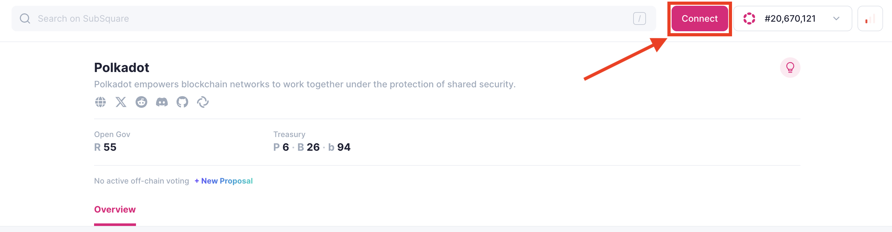

3\. From the wallet selection panel, connect with the one controlling your account. Then, choose it from the drop-down menu at the bottom of the panel.

4\. Click "Next," and Subsquare will use the selected account to interact with Polkadot OpenGov.

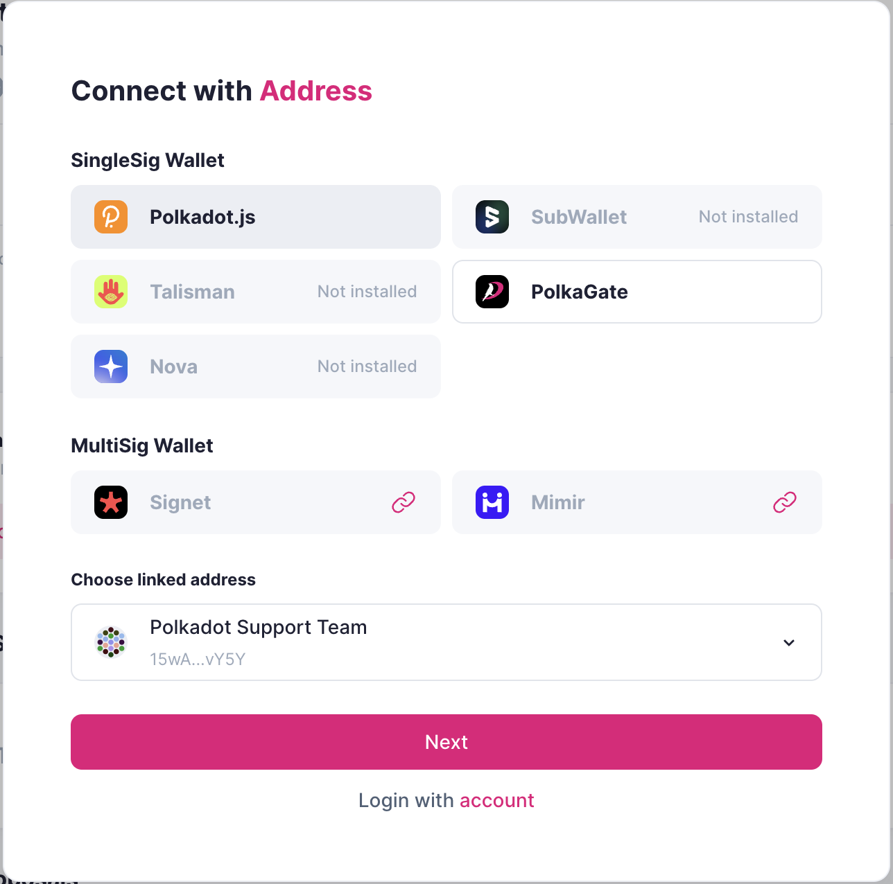

#### **How to vote**

Once you have connected your account, you can vote on any ongoing referenda. To do it, follow the simple steps below:

1\. To vote on a referendum, navigate to it by selecting it from "Recent Proposals" or by hovering over the left panel and clicking on the track where the desired referendum is located.

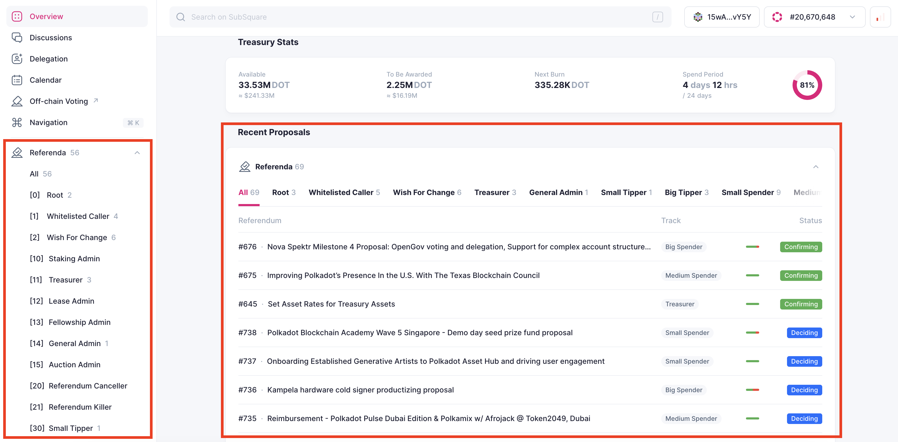

2\. After selecting a referendum, the right side of the site should display the current voting status. You can click '"Vote" at the bottom of that panel to cast your vote.

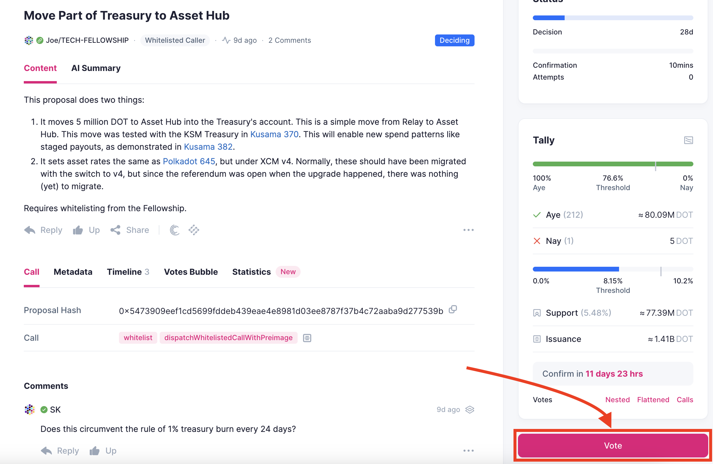

3\. On the following panel, you'll be able to set up your vote. Begin by confirming the voting account.

4\. Select the direction of your vote:

  * Aye: Vote in favor of the referendum.
  * Nay: Vote against the referendum.
  * Split: Select the amount of voting power allocated for aye, nay, or abstention.
  * Abstain: Your vote won't be taken into account for the approval of the referendum, but it will increase the [support](../learn-polkadot-opengov.md#approval-and-support) for it.

5\. Enter the amount of tokens you wish to lock. The "voting balance" is displayed in the top-right corner. Keep in mind that locks can overlap, allowing the same balance to be used for staking or voting on other referenda.

6\. Select the conviction with which you want to vote. This factor will multiply your voting power while increasing the locking period.

7\. Once you have entered and reviewed all the required information, click “Confirm" and sign the voting extrinsic with your account from your wallet.

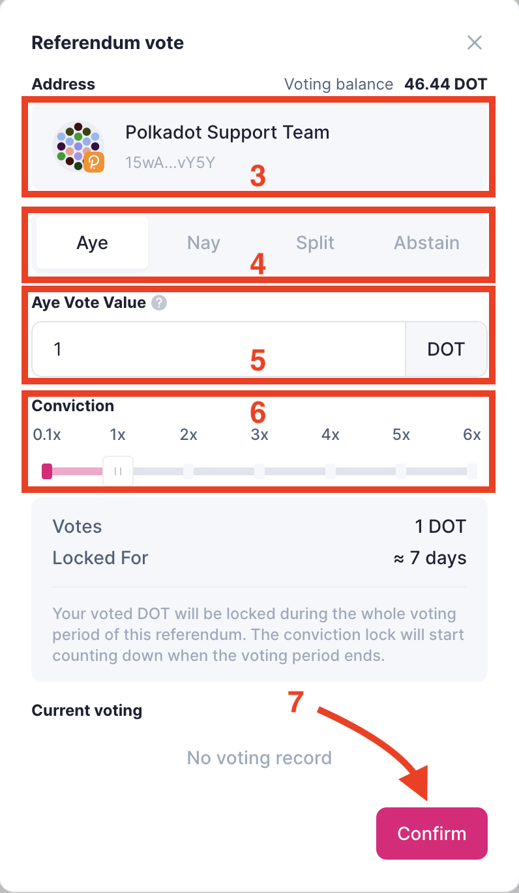

#### **How to remove and unlock expired votes**

Once the referenda on which you voted have finished, you can remove and unlock expired votes. You can do it easily in just one extrinsic from Subsquare. Follow the steps below:

1\. Click Overview on the left side of the screen.

2\. Go to the “Account” tab.

3\. In the “Account” tab, you can remove each vote separately by clicking the “X” to the right of each referendum.

4\. You can also remove and unlock all your expired votes by clicking “Clear expired votes.”

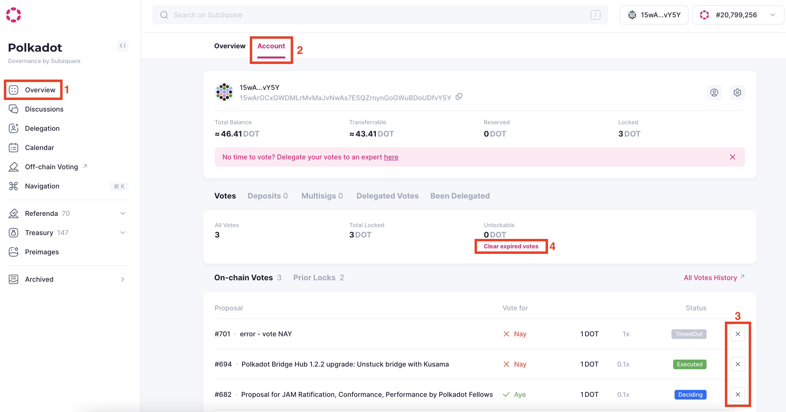

5\. In the “Clear expired votes” panel, you can review the referenda for which votes will be removed and tracks where they’ll be unlocked. Once you have checked the information provided, click “Confirm” and sign the extrinsic from your wallet.

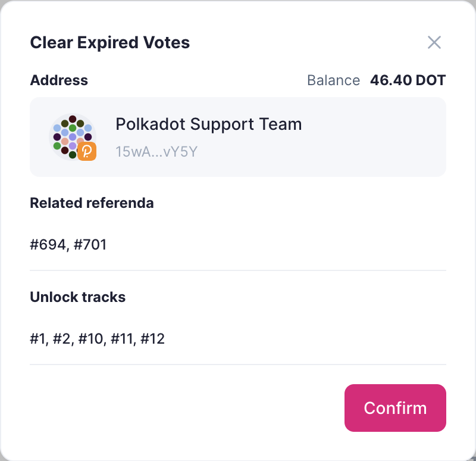

#### **How to delegate**

Participating in Polkadot OpenGov provides an avenue to contribute to decisive decisions for the protocol's future or Polkadot's Treasury management. However, keeping up with the continuous stream of proposals and analyzing them all may not be feasible. In such instances, you can delegate your voting power to a community member you trust.

You can easily delegate from Subsquare by following the steps below:

1\. Connect your account following the steps in the previous section.

2\. Go to the left panel and click on "[Delegation](https://polkadot.subsquare.io/delegation)."

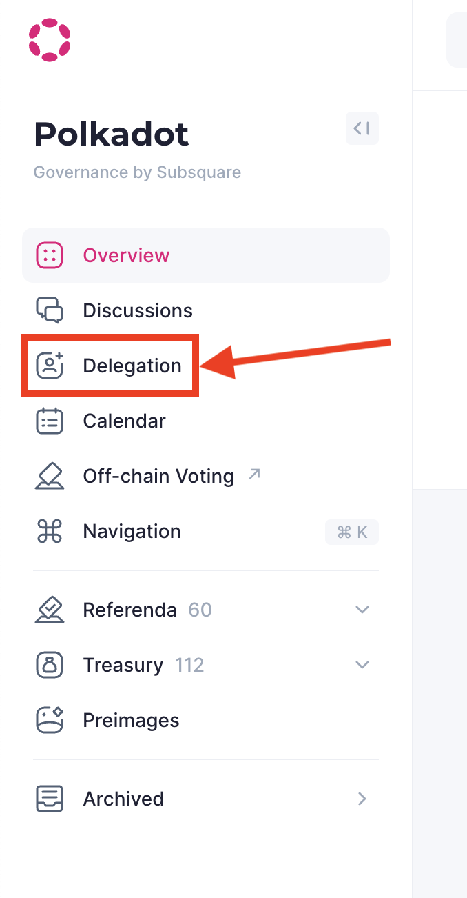

3\. In the screen below, you can view the current delegations (A) from your connected account, paste the account address of the delegate (B), or select one from the section at the bottom (C).

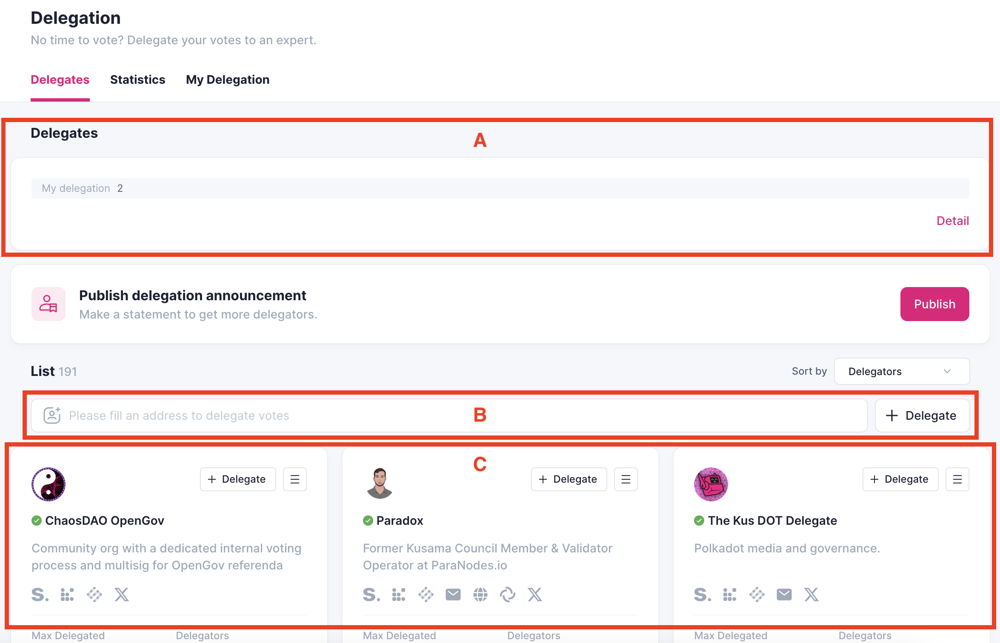

4\. To delegate, paste your delegate's address (B) or select it from the delegates who have shown their interest in being a delegate (C), then click "Delegate."

5\. On the screen below, configure your delegation by selecting the tracks you'd like to delegate on. Note that you can select multiple tracks, and you cannot delegate on tracks where you have non-expired votes or ongoing delegations.

6\. Enter the balance you'd like to delegate from the available "voting balance" on the top-right corner of the panel.

7\. Select the conviction that will be applied to your voting power. This will multiply your voting power and increase the locking period after you undelegate.

8\. After reviewing all set parameters, click "Confirm." Sign with your account, and you're all set!

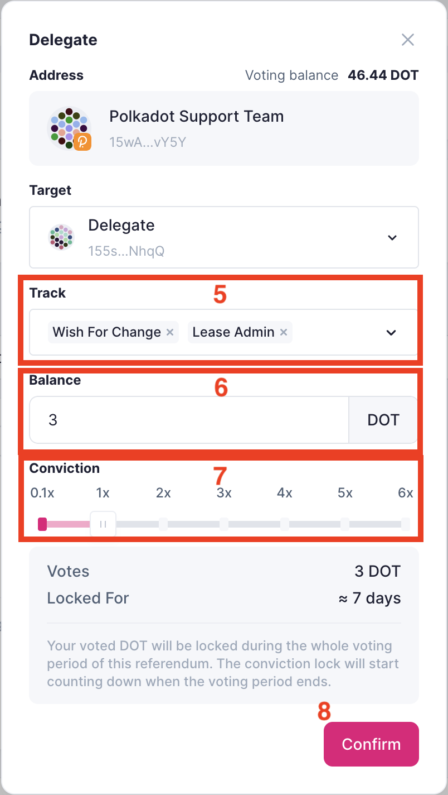

#### **How to undelegate**

Undelegating from Subsquare is as easy as delegating. Follow the steps below to undelegate from one or all tracks:

1\. Go to the "[Delegation](https://polkadot.subsquare.io/delegation)" section on the left side of Subsquare.

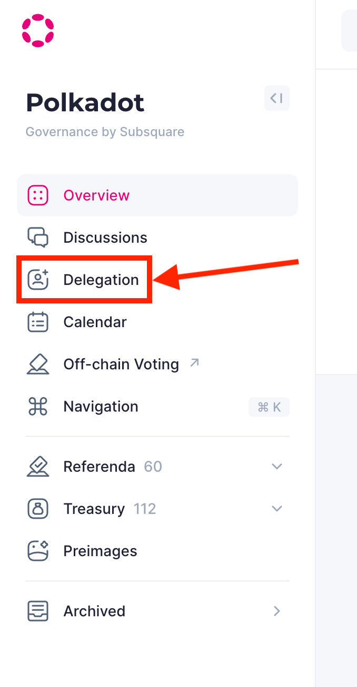

2\. Click "Detail" on the bottom-right of the "Delegates" panel.

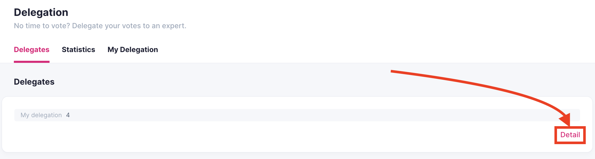

3\. In "My Delegation" tab, you'll see your current delegations on different tracks.

4\. Click the "X" at the top of the delegations section to undelegate your voting power in all tracks, or click the "X" next to each track to do it individually.

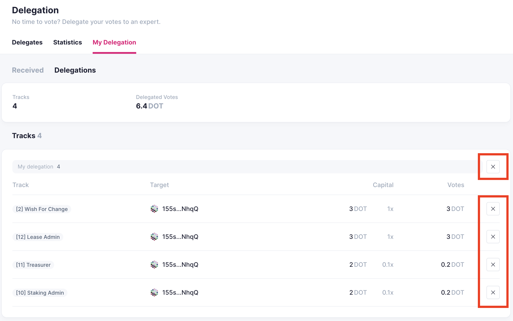

5\. Click "Confirm" on the displayed panel, sign the transaction from your wallet, and you're done. Depending on the conviction you delegated with, your balance will be ready to be unlocked once the locking period has passed since you initiated the undelegation.

!!! warning "ATTENTION"

    Once the unlocking period has passed after undelegating, you can unlock your votes by following the Polkadot Wiki article: "[Removing Expired Voting Locks](../learn-guides-polkadot-opengov.md#removing-expired-voting-locks)."

* * *
