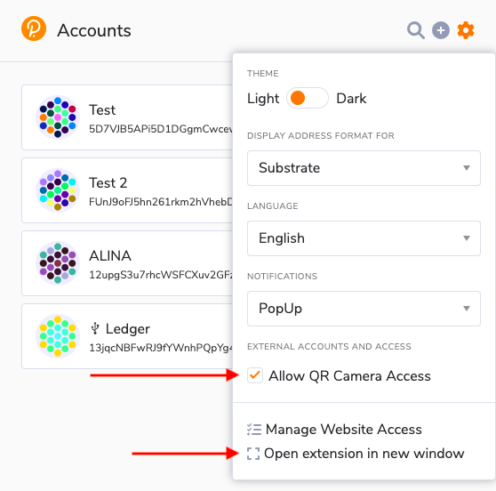
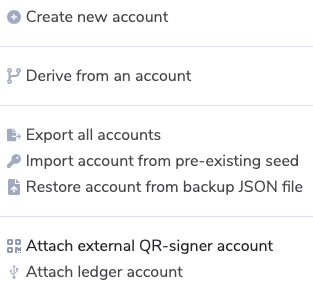
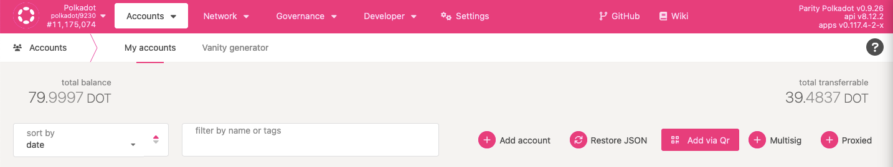

!!!info "Related concepts"
    For the underlying concepts, see [Polkadot Vault](../../general/polkadot-vault.md).

!!! warning "IMPORTANT"

    Polkadot Developer Interface is a web wallet meant for power users and developers. For everyday use, there are several user-friendly wallets funded by the Polkadot Treasury that support a plethora of features and platforms. Discover them in [this article](where-to-store-dot.md).

[Parity Signer](https://signer.parity.io/) is the iOS and Android account manager app. It is meant to be used on an old phone that can permanently stay offline. You will still need a UI, like the [Polkadot Developer Interface](https://polkadot.js.org/apps/#/accounts), to interact with your accounts and initiate transactions.

### How to add your account through the Polkadot Developer Signer

1\. [Create](parity-signer-create-account.md) or [restore](parity-signer-restore-account.md) an account in Parity Signer.

2\. Open the [Polkadot Developer Signer](signer-where-to-download.md) in your browser toolbar. Click on the gear icon to open the settings. Here, allow QR camera access, then choose "Open extension in new window".

3. The extension will open in a new window. You will see a camera icon in the URL bar: click on it and allow the extension to access your camera.

4\. You may need to reload the extension page. Then click on the plus icon and choose "Attach external QR-signer account".

5\. A camera will open on your browser. Now, open your Parity Signer app and navigate to the Keys tab. Tap on your account twice to see a QR code.

6\. Show the QR code in Parity Signer to the camera. Your Parity Signer account is now added to the extension! You will also see the account on the "[Accounts](https://polkadot.js.org/apps/#/accounts)" page on the Polkadot Developer Interface.

* * *

### How to add your account directly to the Polkadot Developer Interface

!!! warning "IMPORTANT"

    We highly recommend **adding your Parity Signer account through the**[**Polkadot Developer Signer**](signer-where-to-download.md). It provides better security and convenience.

1\. [Create](parity-signer-create-account.md) or [restore](parity-signer-restore-account.md) an account in Parity Signer.

2\. To add your account directly on the Polkadot Developer Interface, go to the "[Accounts](https://polkadot.js.org/apps/#/accounts)" page and click "Add via Qr":

3\. Allow the Polkadot Developer Interface to use your camera. If you do not see a pop-up request, click on a camera icon in the URL bar and allow the website to access your camera.

4\. A camera will open on your browser. Now, open your Parity Signer app and navigate to the Keys tab. Tap on your account twice to see a QR code.

5\. Show the QR code in Parity Signer to the camera. Your Parity Signer account is now added to the Accounts page!

* * *
