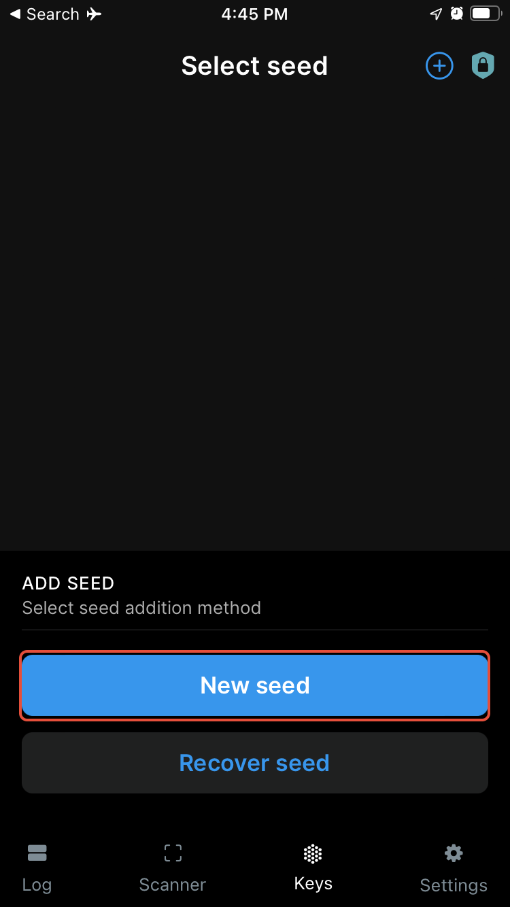
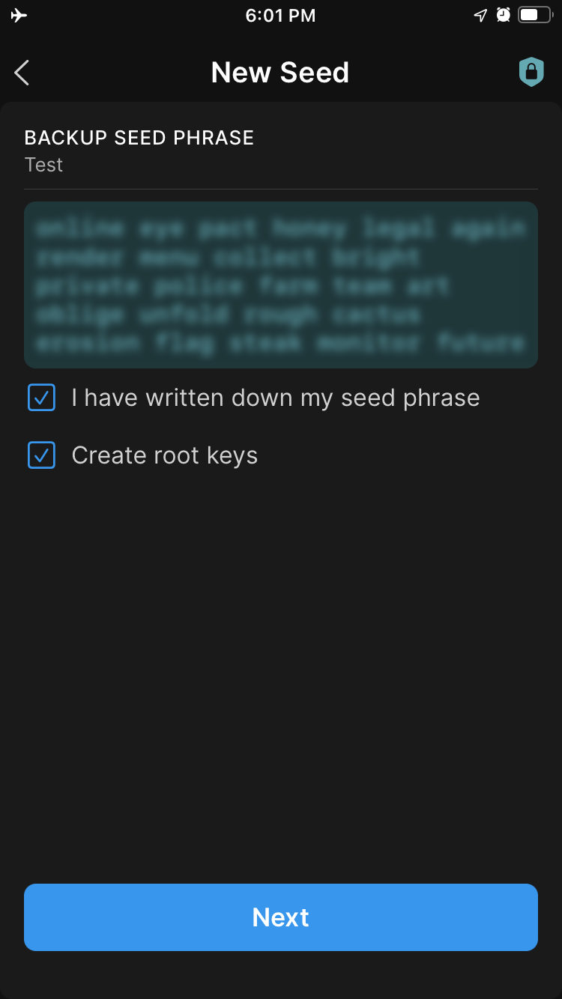

!!!info "Related concepts"
    For the underlying concepts, see [Polkadot Vault](../../general/polkadot-vault.md).

In this article you will learn how to **create a new account** in Parity Signer. If you want to know how to restore an account **originally created in Parity Signer** , please refer to [this article](parity-signer-restore-account.md).

!!! danger "READ THIS FIRST!"

    It is recommended that you install the Parity Signer app on an old phone that you **do not connect to the internet** anymore. This way you keep your private keys offline, and your phone becomes a cold storage wallet.

!!! info

    The Parity Signer app has been rebranded to **[Polkadot Vault](https://signer.parity.io/)**. If you want to create an account in Polkadot Vault, visit the following article: "[Polkadot Vault: How to Create an Account](vault-create-account.md)".

* * *

### How to create a new account in Parity Signer

1. Download the Parity Signer app from the [official source here](https://signer.parity.io/) and install it on your phone. After that, enable airplane mode, disable bluetooth, and disconnect any cables.

2\. Open the app, tap on the plus button in the Keys tab, and select **New seed.**

3. **[Save your mnemonic phrase safely](store-mnemonic-safely.md)**.  **Anyone who knows it can have full access to your account.**

****

4\. That's it. This will bring you back to your account on the Keys page.

!!! tip "GOOD TO KNOW"

    Your PIN matches your phone's passcode by default.

* * *

### What can I do next?

You can add your Parity Signer account to the Polkadot browser extension to use it with [Polkadot-JS UI](https://polkadot.js.org/apps/#/accounts). The step-by-step guide can be found [here](parity-signer-add-account.md) and video instructions can be found at the [4:58](https://www.youtube.com/watch?v=hgv1R9mPEXw&t=298s) timestamp in the video below.

!!! warning "IMPORTANT"

    It's important to update the metadata whenever there is a runtime upgrade, otherwise Parity Signer won't be able to decode and sign extrinsics. Parity Signer allows for air-gapped metadata updates. You can find the latest updates [here](https://metadata.parity.io/).

* * *

If you are more of a visual type, please check this video guide. The specific instructions on how to create the account can be found at the 2:00 timestamp, but watching the whole video is recommended.

[Create and Restore your Accounts on Parity Signer](https://www.youtube.com/watch?v=hgv1R9mPEXw&t=120s)

* * *
