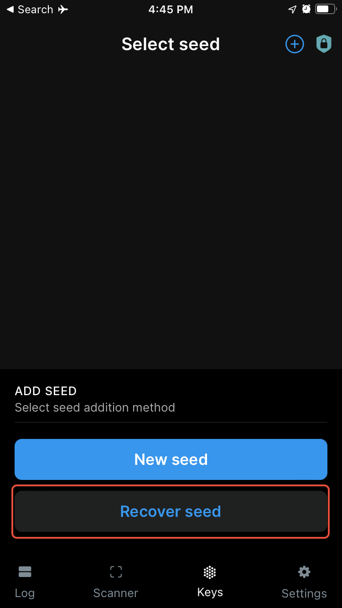
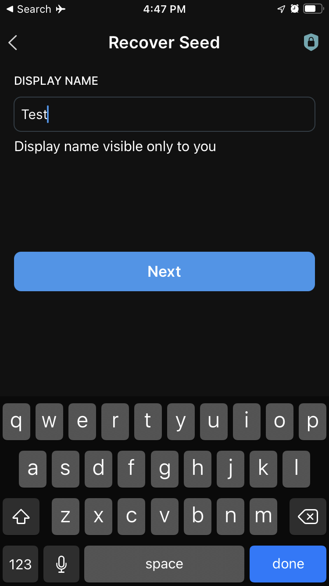
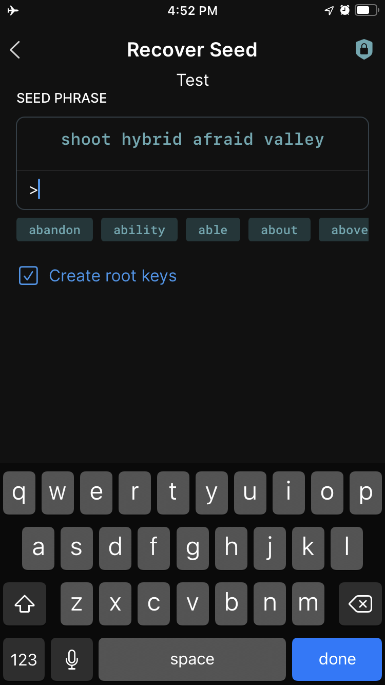
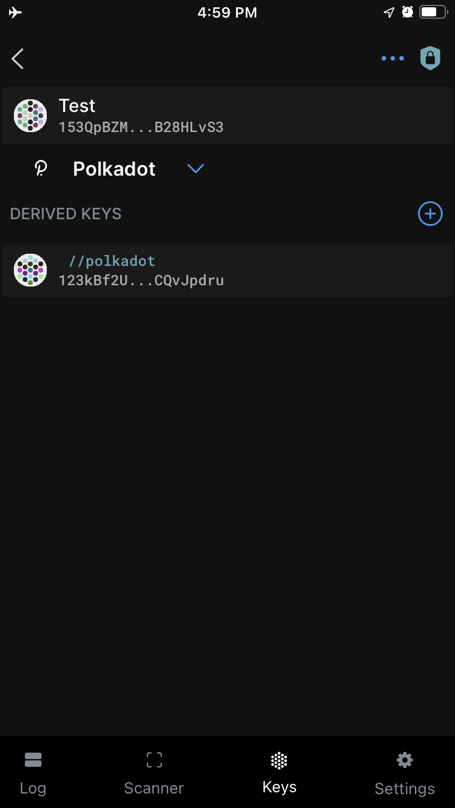
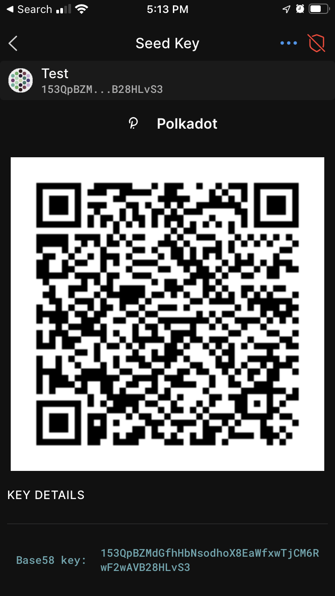
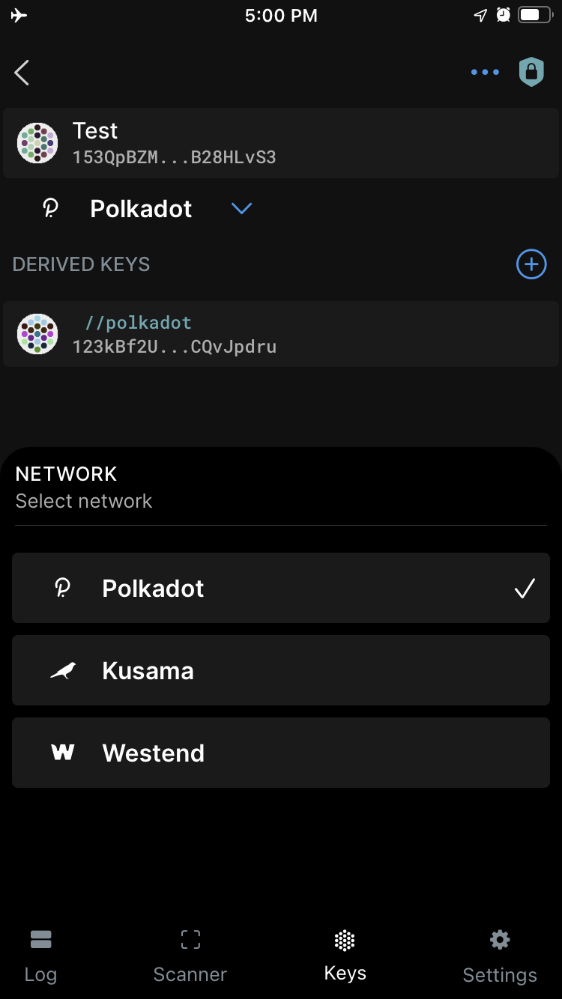

!!!info "Related concepts"
    For the underlying concepts, see [Polkadot Vault](../../general/polkadot-vault.md).

In this article, you will learn how to restore an account in Parity Signer that was originally created in Parity Signer. If you want to know how to **create a new account** in Parity Signer, please refer to the video tutorial in [this article](parity-signer-create-account.md).

!!! danger "READ THIS FIRST!"

    It is recommended that you install the Parity Signer app on an old phone that you **do not connect to the internet** anymore. This way you keep your private keys offline, and your phone becomes a cold storage wallet.

    From a security perspective, it is **not**  recommended to restore an account that has been online, like an account created in the Polkadot Developer Signer, into an offline storage solution (which Parity Signer is intended to be).

!!! info

    The Parity Signer app has been rebranded to **[Polkadot Vault](https://signer.parity.io/)**. If you want to restore your account in Polkadot Vault, visit the following article: "[Polkadot Vault: How to Restore Your Account](vault-restore-account.md)".

!!! tip "GOOD TO KNOW"

    If you previously created a Polkadot account in Parity Signer, you will have received a mnemonic phrase that you should have saved in a safe place offline. Parity Signer allows you to restore your account from your mnemonic phrase.

* * *

How to restore your account with your mnemonic phrase in Parity Signer

1\. Download the Parity Signer app from the [official website](https://www.parity.io/signer/) and install it on your phone. After that, enable Airplane mode, disable bluetooth, and disconnect any cables.

2\. Open the app and select  **"Recover seed.**"

3\. On the next screen, create a display name for the account.

4\. Next, enter your mnemonic phrase. The app will display auto-complete suggestions as you type. Press the "Next" button once you have entered all your words.

5\. Your account has successfully been restored. This will bring you back to the "Keys" page.

!!! tip "GOOD TO KNOW"

    Your PIN number matches your phone's passcode by default.

6\. Click on the account to view your Polkadot address as a QR code.

7\. Now, you can seamlessly switch between networks in Parity Signer. To select a network, click the down arrow under the account to expand the dropdown. By default, only three networks are available: Polkadot, Kusama, and Westend.

Your account should now be successfully restored.

* * *

### What can I do next?

You can add your Parity Signer account to the Polkadot browser extension to use it with [Polkadot Developer Interface](https://polkadot.js.org/apps/#/accounts). The step-by-step guide can be found [here](parity-signer-add-account.md) and video instructions can be found at the [4:58](https://www.youtube.com/watch?v=hgv1R9mPEXw&t=298s) timestamp in the link at the bottom of the article.

!!! warning "IMPORTANT"

    It's important to update the metadata whenever there is a runtime upgrade, otherwise Parity Signer won't be able to decode and sign extrinsics. Parity Signer allows for air-gapped metadata updates. You can find the latest updates [here](https://metadata.parity.io/).

* * *

If you are more of a visual type, please check this video guide. The instructions on how to restore your account can be found at the 6:47 timestamp:

[Create and Restore your Accounts on Parity Signer](https://www.youtube.com/watch?v=hgv1R9mPEXw&t=407s)

* * *
