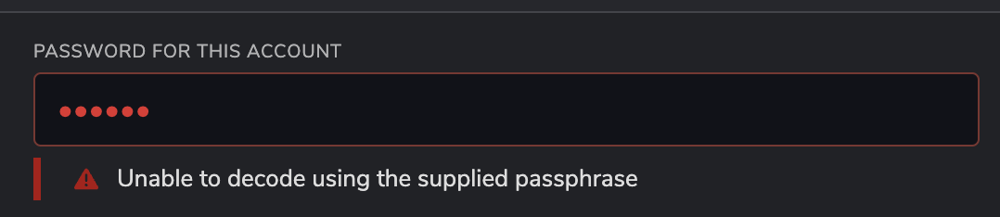

!!!info "Related Wiki page"
    For the underlying concepts, see [Accounts](../learn-accounts.md).

Whenever you issue an extrinsic with the [Polkadot Developer Interface](https://polkadot.js.org/apps/?rpc=wss%3A%2F%2Fpolkadot.api.onfinality.io%2Fpublic-ws#/accounts) or the [Polkadot Developer Signer](https://paritytech.github.io/polkadot-support/getting-started/basics/polkadot-developer-signer-where-to-download-it), for example, the purpose of staking or transferring funds out of your account, you will be asked for your password.

This is the password you set up when you first created your account, and it's the same password that encrypts [the JSON backup file](export-json-backup.md).

!!! warning "IMPORTANT"

    As mentioned in the article above, if you exported all your accounts in the Polkadot Developer Signer in a single batch file, the password for that file won't necessarily be the same as the passwords of the individual accounts within it.

* * *

### What to do if your password is not working

If your password does not work, check the following details:

  * **Is CAPS LOCK on?**  This is one of the most common oversights.

  * **Did you make a typo?** Type your password in a text file or a blank email to see what you are typing. This can also help if **your keyboard is switched to a different language.**

  * **Is there a blank space before or after your password?** This can accidentally happen when you copy/paste a password.

  * **Does your password contain special characters, like é?**  These characters will behave differently if typed or copy-pasted and may result in your password not being recognised. Please check [this issue](https://github.com/polkadot-js/extension/issues/892) for more information. Consider changing your password, as described below, and use only latin characters, numbers, and symbols.

  * **Do you use the correct password for the correct account?** If you have several accounts, make sure you are using the correct password for the corresponding account. Each account has its own password!

* * *

### How to reset/change your password

!!! tip "GOOD TO KNOW"

    The password of your account is used to encrypt your account's private key **on your computer** , because your account's details "live" **only** on your computer and **only** **you** have access to it.

    As a result, no one can reset or change your password for you. The only way to do that is by restoring with your account's mnemonic phrase.

If you have forgotten your password and you really cannot access your account, then **you can reset your password by restoring your account from your mnemonic phrase**. (You can also restore an account with your JSON file, but since that would require the same password, this won't be of use to you.)

During the process of restoring your account from your mnemonic phrase, you will have the chance to set a new password. For detailed instructions on how to restore an account on the Polkadot Developer Interface and the Polkadot Developer Signer, please see [this tutorial](restore-account-signer.md).

* * *
