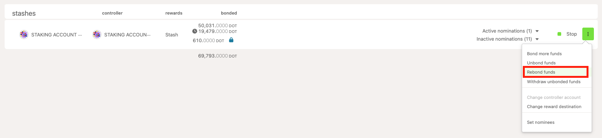
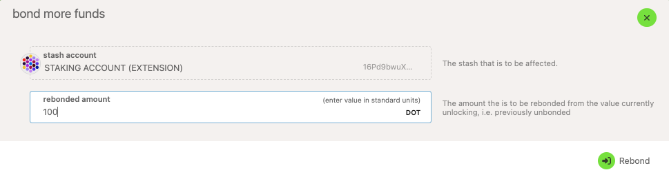

!!!info "Related concepts"
    For the underlying concepts, see [Staking (advanced)](../learn-staking-advanced.md).

_Discover the new Staking Dashboard that makes staking much easier and check the[extensive article list](../../general/dashboards/staking-dashboard.md) to help you get started._

* * *

If you unbonded your tokens but changed your mind, you can rebond them before the unbonding period is over through the  "**Network** "  **> "Staking**"  **> "**[**Account page**](https://polkadot.js.org/apps/#/staking-async/actions)" on the Polkadot Developer Interface. This extrinsic is issued by the **stash or staking proxy** account.

!!! tip "GOOD TO KNOW"

    Controller accounts have been removed from staking. Staking actions are now signed by your stash account or, optionally, a staking proxy that can act on its behalf with added flexibility.

    Check out the article on [creating a proxy account](create-proxy-account.md) for more information.

1\. Click on the three dots on the right side of your account under the "Stashes" section.

2\. Select "**Rebond funds** ":

3. On the window that opens up, enter the amount you want to rebond or leave the profiled amount if you want to rebond the entire amount that's unbonding:

4\. Then click "**Rebond** ," sign and submit the transaction. You have rebonded your DOT.

* * *
