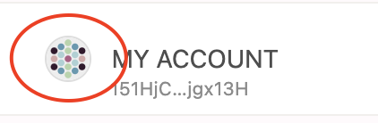

!!!info "Related concepts"
    For the underlying concepts, see [Accounts](../learn-accounts.md).

!!! warning "IMPORTANT"

    Polkadot Developer Interface (Polkadot Developer Interface) is a web wallet meant for power users and developers. For everyday use, there are several user-friendly wallets funded by the Polkadot Treasury that support a plethora of features and platforms. Discover them in [this article](where-to-store-dot.md).

In this article, you'll learn how to copy your account address in order to receive funds to your account. The process is the same whether you send DOT to yourself from another account or someone else sends it to you.

* * *

### How to receive funds to your account

To receive funds to an account, you need to copy your account address and either share it with the sender or use it yourself, if you are sending funds from an exchange or another one of your accounts.

1\. Go to the [Accounts](https://polkadot.js.org/apps/?rpc=wss%3A%2F%2Frpc.polkadot.io#/accounts) page Polkadot Developer Interface. That's where you can see all your accounts, regardless of [type](../learn-account-advanced.md).

2\. Click on the icon next to your account. This will **copy** the account's address.

3\. Paste the account to the proper destination.

  * If you receive funds from someone else, share the address with them.
  * If you withdraw funds from an exchange, paste the address in the appropriate field on the exchange's withdrawal page.
  * If you are sending funds from another account of yours on Polkadot Developer Interface, check [this article](transfer-funds.md) on how to do it.
  * If you are sending funds from a different wallet, paste the address in the recipient's field on that wallet.

!!! danger "READ THIS FIRST!"

    Always **triple-check** the address after you've pasted it to make sure it's the correct one. Blockchain transactions are **irreversible** and if you accidentally send funds to the wrong address, there's no way to get them back.

!!! info

    If you are using a Ledger you can confirm you have pasted the correct address on your Ledger device. Check [this article](ledger-confirm-address.md) on how to do that.

4\. After you have sent your funds to your account, your balance will update automatically after a few seconds. Keep in mind that exchanges don't process withdrawals right away, so if you are sending from an exchange, it may take longer for your funds to show up in your account.

* * *
