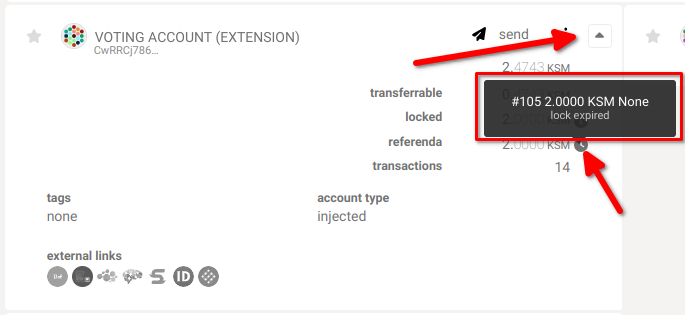
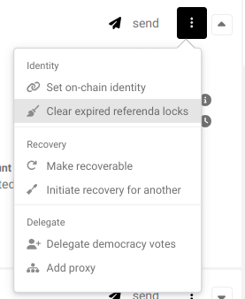

!!!info "Related concepts"
    For the underlying concepts, see [Polkadot OpenGov](../learn-polkadot-opengov.md).

!!! warning "IMPORTANT"

    Polkadot Developer Interface (Polkadot-JS UI) is a web wallet meant for power users and developers. For everyday use, there are several user-friendly wallets funded by the Polkadot Treasury that support a plethora of features and platforms. Discover them in [this article](where-to-store-dot.md).

Polkadot OpenGov allows all stakeholders to vote on proposals or delegate their voting power to others in order to participate in the decision-making process. When you vote your tokens are locked and the lock is removed either if you remove your vote while the referendum is ongoing or once the locking period expires. The same applies when you undelegate your voting power. Once that happens you need to remove these expired locks. This article explains how to remove them from Polkadot Developer Interface.

Removing referendum requires two extrinsics: one to remove the votes, the other to unlock them. Conveniently, Polkadot Developer Interface groups these extrinsics in a single batch call, so expired referendum locks are removed in just one action.

* * *

### **Check expired referendum locks**

By clicking on the arrow icon located at the far right of your account and hovering over the small clock icon next to the referenda locked balance, you can check for any expired locks.

****

* * *

### **Remove expired locks**

To remove all expired referenda locks from your account, follow these steps:

1\. Click on the three dots on the right side of your account.

2\. Select "Clear expired referenda locks":

****

3.  Then sign and submit the extrinsic and all the expired locks will be removed.

* * *
