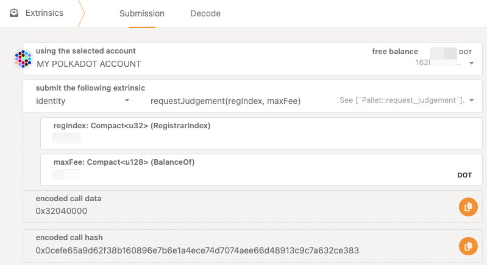
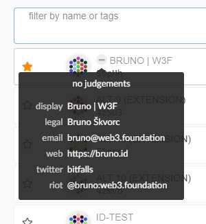
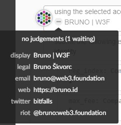
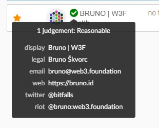
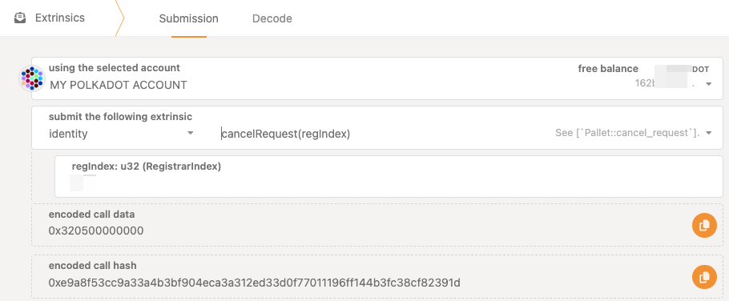

!!!info "Related concepts"
    For the underlying concepts, see [Identity](../learn-identity.md).

Polkadot offers an identity mechanism that enables users to include their personal details into their on-chain account and later request registrars to verify this information.

This article will go through the steps to request, and cancelling, a judgment from one of this registrars.

!!! warning "ATTENTION"

    Identities on **Kusama and Polkadot** have moved to the new **People** system parachains. To set an identity on Polkadot or Kusama networks, you need to perform the actions below on the Polkadot and Kusama People chains, respectively.

    Follow [this guide](switch-network-nodes.md) on how to switch networks, or you can follow this links:
    [Polkadot People](https://polkadot.js.org/apps/?rpc=wss%3A%2F%2Fpolkadot-people-rpc.polkadot.io#/explorer)
    [Kusama People](https://polkadot.js.org/apps/?rpc=wss%3A%2F%2Fkusama-people-rpc.polkadot.io#/accounts)

### Requesting a Judgement

1\. Navigate to the [Extrinsics](https://polkadot.js.org/apps/?rpc=wss%3A%2F%2Fpolkadot-people-rpc.polkadot.io#/extrinsics) tab and select '**identity.requestJudgement** '.

If you don't know which registrar to pick, first check the available registrars by going to "Chain State", under "Developer" > "Chain state", and selecting 'identity.registrars' to get the full list. You can also check [this page](../learn-identity.md#registrars), which lists the current Polkadot registrars.

**Modify the settings below according to the registrar's instructions, and click "****Submit Transaction"****.**

!!! warning "ATTENTION"

    Web3 Foundation's Registrar (Registrar Index 0) **no longer accepts judgement requests**. This change doesn't affect identities already judged by the registrar.

    For new identity judgments, please utilize the other registrars:

    [Registrars](../learn-identity.md#registrars)

This will make your identity go from unjudged:

To "waiting":

2\. At this point, direct contact with the registrar is required - the contact info is in their identity as shown above. Each registrar will have their own set of procedures to verify your identity and values, and only once you've satisfied their requirements will the process continue.

Once the registrar has confirmed the identity, a green checkmark should appear next to your account name with the appropriate confidence level:

_Note that changing even a single field's value after you've been verified will un-verify your account and you will need to start the judgement process anew. However, you can still change fields while the judgement is going on - it's up to the registrar to keep an eye on the changes._

* * *

###  Cancelling a Judgement

You may decide that you do not want to be judged by a registrar (for instance, because you realize you entered incorrect data or selected the wrong registrar). In this case, after submitting the request for judgement but before your identity has been judged, you can issue a call to cancel the judgement using an extrinsic.

1\. To do this, first, go to the "Extrinsics" tab and select the 'identity' pallet, then 'cancelRequest'. Ensure that you are calling this from the correct account (the one for which you initially requested judgement). For the 'reg_index', put the index of the registrar from which you requested judgement.

2\. Submit the transaction, and the requested judgement will be cancelled.

* * *

### Registrars

Registrars can set a fee for their services and limit their attestation to certain fields. For example, a registrar could charge 1 DOT to verify one's legal name, email, and GPG key. When a user requests judgement, they will pay this fee to the registrar who provides the judgement on those claims. Users set a maximum fee they are willing to pay and only registrars below this amount would provide judgement.

See [this article](../learn-guides-identity.md#registrars) for more on how to become a registrar.

* * *
