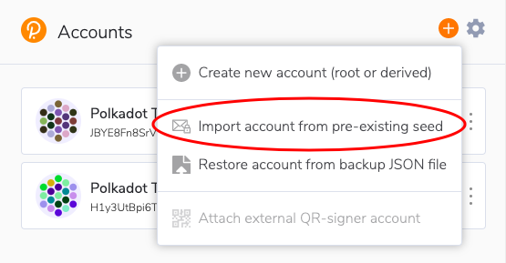
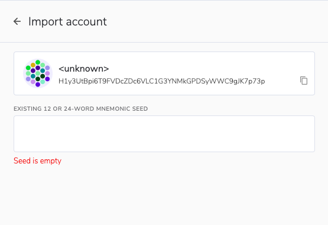
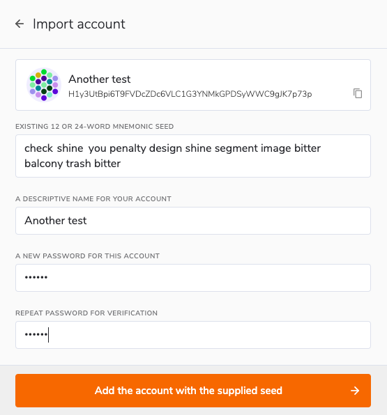
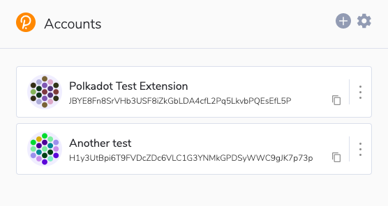
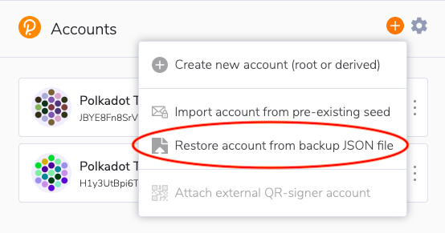
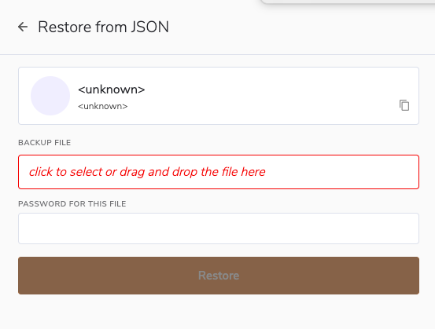
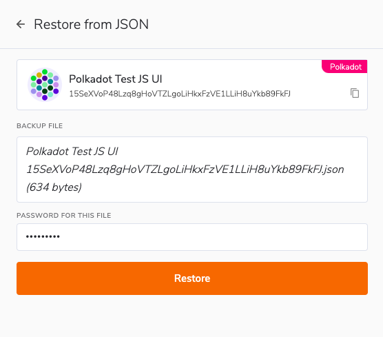
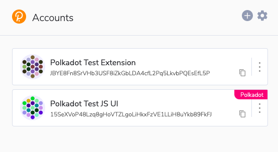

!!!info "Related Wiki page"
    For the underlying concepts, see [Accounts](../learn-accounts.md).

In this article, you will learn how to restore your Polkadot account in the Polkadot Developer Signer either with your account's 12-word mnemonic phrase or its JSON file and password.

!!! warning "IMPORTANT"

    The Polkadot Developer Signer is an account manager meant for power users and developers. There are several user-friendly browser extensions funded by the Polkadot Treasury that support a lot of features right from the extension. Discover them in [this article](where-to-store-dot.md).

**We highly recommend that you add your accounts in the browser extension, as it has many advantages:**

1. It provides better security than using the Web UI directly

2. Your browser won't "forget" your accounts if its cookies are cleared

3. It allows you to interact with any Web 3.0 compatible site in the Polkadot ecosystem

4. The extension recognizes all known Polkadot scams and alerts you when you try to visit a known scam site. This will help you protect yourself and your funds.

If you haven't installed the Polkadot Developer Signer yet, you can find download instructions [here](signer-where-to-download.md).

!!! tip "GOOD TO KNOW"

    The Polkadot Developer Signer is an account manager, not a wallet. You will still need to use Polkadot Developer Interface to interact with your accounts and see your balance.

* * *

### Restore from your 12-word mnemonic phrase

1\. Open the [Polkadot Developer Signer](signer-where-to-download.md) and click on the "plus (+)" sign on the top right. Then select "Import account from pre-existing seed".

2\. On the next screen, enter your mnemonic seed words.

!!! warning "IMPORTANT"

    If you're getting an error and your mnemonic phrase isn't accepted, please check [this article](mnemonic-invalid.md).

3\. Once entered, more fields will appear. Enter a name for your account and set a password, then click on the orange button at the bottom.

Your account has now successfully been restored and will appear in the list of accounts in the Polkadot Developer Signer.

It will also appear in the list of accounts on the Polkadot Developer Interface under the ["extension" category](https://paritytech.github.io/polkadot-support/getting-started/basics/polkadot-developer-interface-what-are-the-different-account-types) (you may have to refresh the page first before you can see it).

* * *

### Restore from your JSON file

1\. Open the Polkadot Developer Signer and click on the "plus (+)" button. Then select "Restore account from backup JSON file".

2\. On the next screen, select your JSON file from your computer or drag and drop it in the "Backup file" field.

3\. Now enter the **password you set for your account** when you created it and click "Restore".

!!! warning "IMPORTANT"

    If you are restoring a "batch" JSON file, which contains **all** the accounts in the extension, that you had previously [exported](export-json-backup.md) from the extension, the file will have its own password, the one you set when you exported it. This password may or may not be the same as any individual password for the accounts it contains.

Your account has now been successfully restored, and you will see it in the list of accounts in the Polkadot Developer Signer:

You will also see it in the list of accounts on the Polkadot Developer Interface under the ["extension" category](https://paritytech.github.io/polkadot-support/getting-started/basics/polkadot-developer-interface-what-are-the-different-account-types) (you may have to refresh the page first before you can see it).

* * *

If you are a visual learner, you can find the same instructions in the video below:

[Restore your Account using the Polkadot-JS Browser Extension](https://www.youtube.com/watch?v=9ohp8k4Hz8c)

* * *
