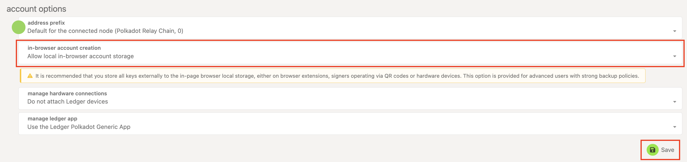
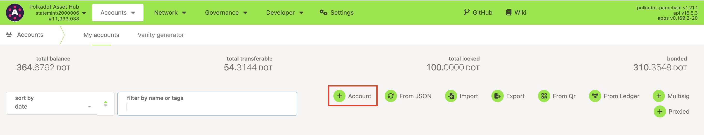
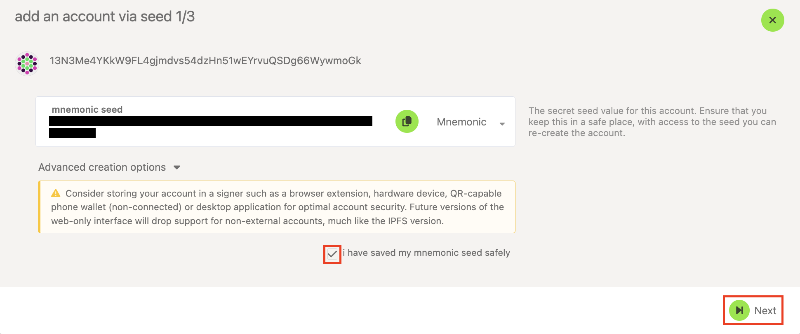
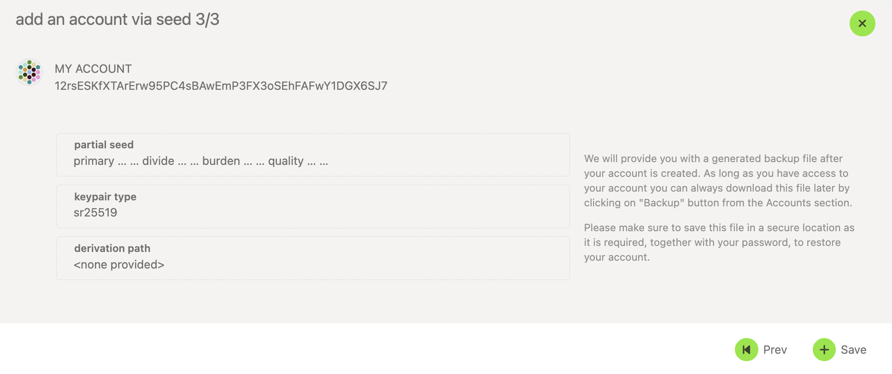
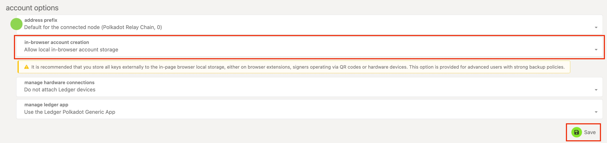
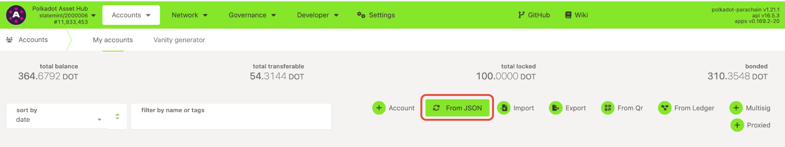
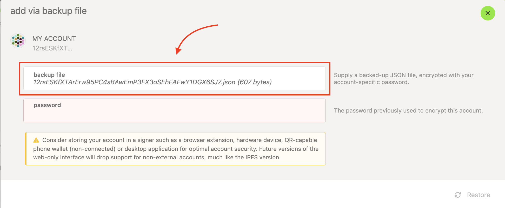
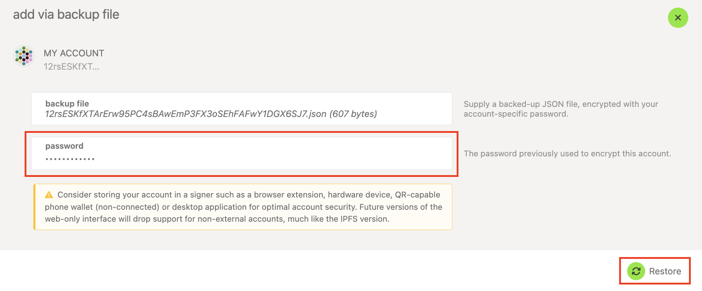
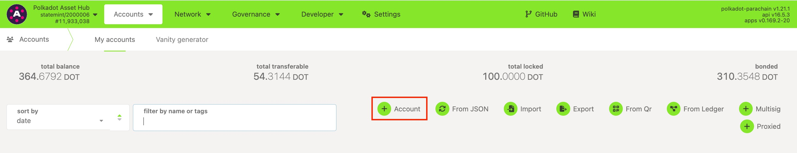
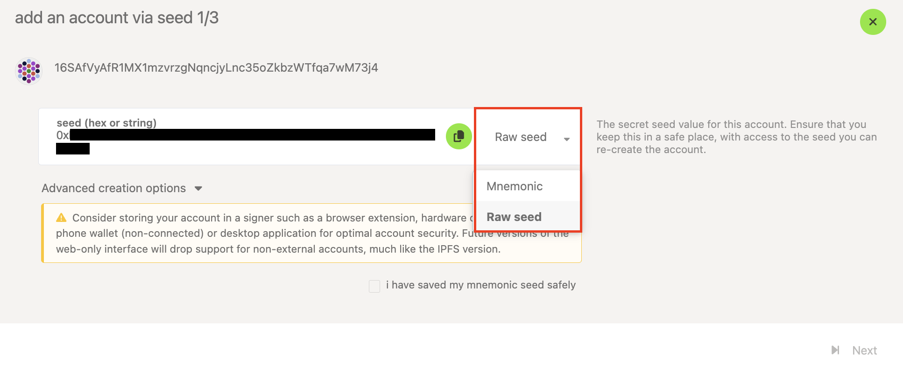

!!!info "Related concepts"
    For the underlying concepts, see [Accounts](../learn-accounts.md).

!!! warning "IMPORTANT"

    Polkadot Developer Interface is a web wallet meant for power users and developers. For everyday use, there are several user-friendly wallets that support a plethora of features and platforms. Discover them in [this article](where-to-store-dot.md).

In this article, you'll learn how to restore your Polkadot account either from your mnemonic phrase, your JSON backup file, or a raw private key in the Polkadot Developer Interface.

!!! warning "IMPORTANT"

    This guide restores your account directly in the Polkadot Developer Interface (the web UI). For everyday use, we recommend keeping your accounts in the [Polkadot Developer Signer browser extension](https://polkadot.js.org/extension/) instead — it offers better security, remembers your accounts even if browser cookies are cleared, and lets you connect to any Web 3.0-compatible app in the ecosystem. To restore into the extension, see [How to Restore Your Account (Developer Signer)](restore-account-signer.md).

* * *

!!! tip "GOOD TO KNOW"

    The Polkadot Developer Signer is an account manager, not a wallet. You'll still need to use the Polkadot Developer Interface to interact with your accounts and see your balance.

### Restore from your 12-word mnemonic phrase

1. On the Polkadot Developer Interface, navigate to the [Settings](https://polkadot.js.org/apps/#/settings) tab. In the account options, allow local in-browser account storage and click "Save":

2\. Navigate to the [Accounts](https://polkadot.js.org/apps/#/accounts) page and click on the "+ Account" button:

3\. Delete the pre-generated 12 words shown and enter your own mnemonic phrase instead. Once you enter all the words, you should see an account address and icon generated.

!!! warning "IMPORTANT"

    If you're getting an error and your mnemonic phrase isn't accepted, please check [this article](mnemonic-invalid.md).

4\. Tick the box "I have saved my mnemonic seed safely" and click "Next":

5\. Give your account a descriptive name and a good password, then click "Next":

6. Review the details and click "Save." This will also download the JSON backup file for the account on your computer.

7\. Your JSON backup file will have the name of your account and will go to your default download folder. Unless you rename it, it'll be named like this:

_12rsESKfXTArErw95PC4sBAwEmP3FX3oSEhFAFwY1DGX6SJ7.json_

Your account has been successfully restored, and you'll see it listed on your [Accounts](https://polkadot.js.org/apps/#/accounts) page.

* * *

### Restore from your JSON file

!!! warning "IMPORTANT"

    You can't restore a "batch" JSON file (that contains multiple accounts) directly on the Polkadot Developer Interface. These files can only be used to [restore in the Polkadot Developer Signer](restore-account-signer.md).

1. On the Polkadot Developer Interface, navigate to the [Settings](https://polkadot.js.org/apps/#/settings) tab. In the account options, allow local in-browser account storage and click "Save":

2\. Navigate to the [Accounts](https://polkadot.js.org/apps/#/accounts) page and click on the "From JSON" button:

3\. On the next screen, either click in the "backup file" field to select your JSON backup file or drag and drop it into the field. Once you add the file, you'll see the name and icon of the account:

4\. Enter the password you set for your account when you created it, and click Restore:

Your account has been successfully restored, and you'll see it listed on your [Accounts](https://polkadot.js.org/apps/#/accounts) page.

* * *

### Restore from your raw private key

1\. Go to the Polkadot Developer Interface and navigate to the [Settings](https://polkadot.js.org/apps/#/settings) tab. In the account options, allow local in-browser account storage and click "Save":

2\. Navigate to the Accounts page and click on the "+ Account" button:

3\. Click on the word "Mnemonic" and select "Raw seed" from the drop-down menu that appears. Delete the shown private key and enter yours instead.

!!! warning "IMPORTANT"

    **If your key doesn't start with 0x, add it manually in front of it.**

4\. This should generate your account address at the top of the window. Check the "I have saved my mnemonic seed safely" box and click "Next."

5\. Give your account a descriptive name and a good password. Click Next, then review the details and click Save.

Your account has been successfully restored, and you'll see it listed on your [Accounts](https://polkadot.js.org/apps/#/accounts) page.

* * *

If you would like to follow a video tutorial instead, here is a video to help you restore your account from the mnemonic phrase or the JSON file from the Polkadot Developer Interface:

[Restore your Account using the Polkadot Developer Interface](https://www.youtube.com/watch?v=cBsZqFpBANY)

* * *
