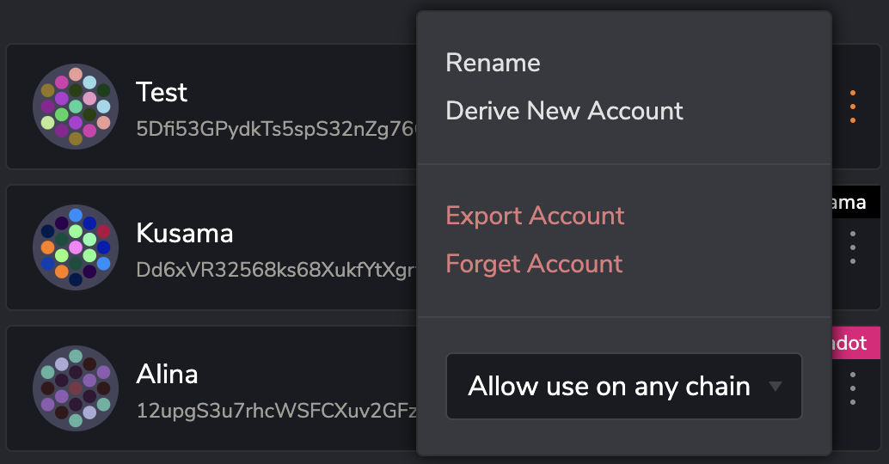
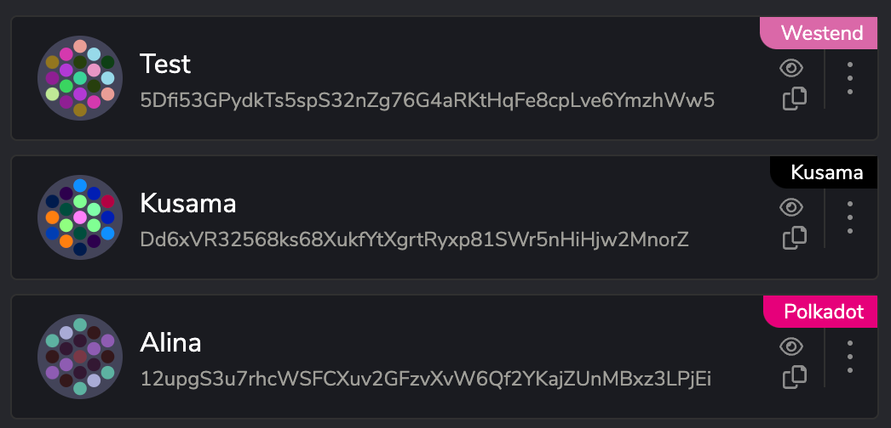
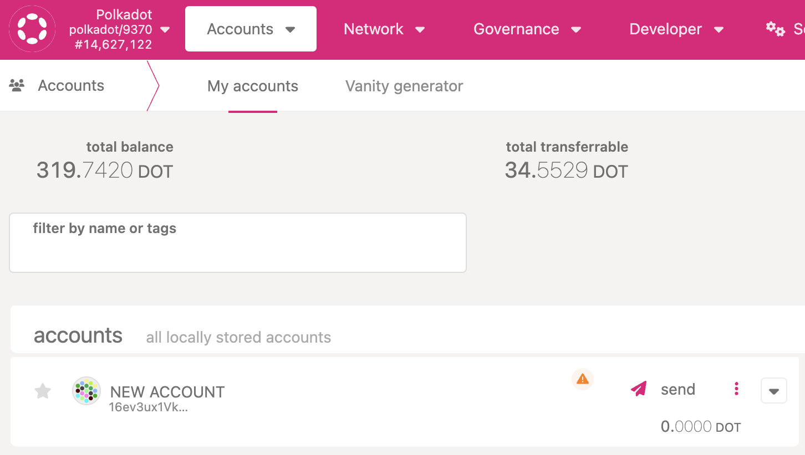
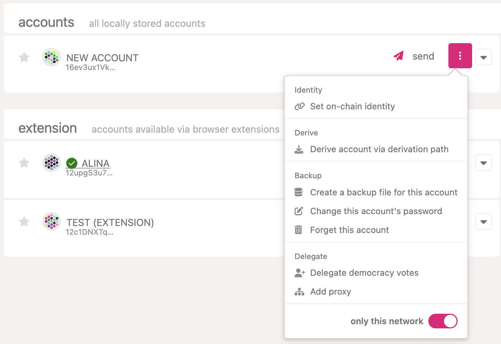

!!!info "Related concepts"
    For the underlying concepts, see [Accounts (advanced)](../learn-account-advanced.md).

With Substrate, you can use the same account on all chains. The [Polkadot Developer Interface](https://polkadot.js.org/apps/#/accounts) will show a warning sign when an account is enabled on all chains, but contrary to the message of that sign, allowing the account on all chains is usually preferable.

In some cases, however, you may want to restrict an account to just one chain. In this article, we explain how to do that on the Polkadot Developer Interface.

If you are interested in the advantages and disadvantages of each approach, you can check [this article](../learn-account-advanced.md).

#### **TABLE OF CONTENTS**

  * In the Polkadot Browser Extension
  * On the Polkadot Developer Interface

* * *

### In the Polkadot Browser Extension

**1.** Click on the Polkadot browser extension next to the URL bar to open it.

**2.** Click on the three dots next to your account, and pick the network from the drop-down menu instead of "Allow use on any chain":

**4.** A colorful tag with the network's name will appear next to your account. Your account now will only appear when you are connected to the chosen network:

Depending on the network, you may also see your [account address](../learn-accounts.md#unified-address-format) and identicon change.

* * *

### On the Polkadot Developer Interface

**1.** Navigate to the "[Accounts](https://polkadot.js.org/apps/#/accounts)" page and [switch to the network](switch-network-nodes.md) you want to use.

**2.** Your accounts added directly on the Polkadot Developer Interface will appear under "Accounts," and you will see a warning sign next to them if they are available on all networks:

**3.** Click on the three dots next to the account, and enable the "Only this network" switch:

**4.**  The warning sign will now disappear, and the account will only appear on the Accounts page when connected to this network.

* * *
