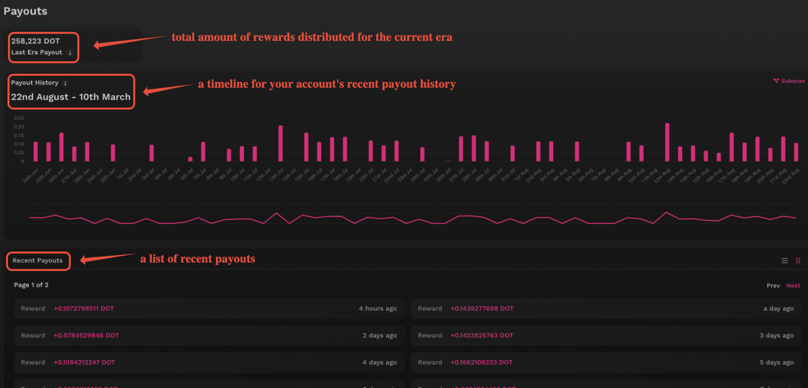
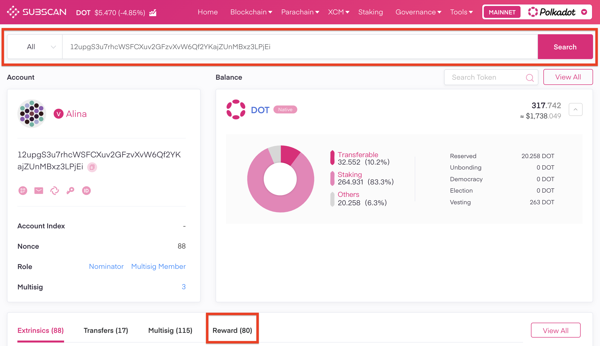

!!!info "Related concepts"
    For the underlying concepts, see [Staking](../learn-staking.md).

_Discover the new Staking Dashboard that makes staking much easier and check the[extensive article list](../../general/dashboards/staking-dashboard.md) to help you get started._

* * *

You can view your staking rewards on the new [Staking Dashboard](https://staking.polkadot.cloud/#/) or block explorers like [Subscan](https://www.subscan.io/).

### Staking Dashboard

To view your rewards on the Staking Dashboard, navigate to the [Payouts tab](https://staking.polkadot.cloud/#/payouts).

Here, you can view the following:

  * Total reward distribution for the current era
  * Timeline of your rewards payout history
  * List of your recent payouts

For a full breakdown of what each of these indicates, click on the small information icon next to each section.

* * *

### Block Explorers

On most block explorers, you can enter your address in the Search field to see information about it. Some, like [SubID](https://sub.id/), let you connect your account through a browser extension instead of searching by its address. Here's how to find staking rewards on [Subscan](https://www.subscan.io/).

#### Subscan

If your account has ever received staking rewards, you will see the "Reward" tab on your account's page. Clicking on it will bring up a list of all your incoming staking rewards:

* * *

If you're more of a visual learner, check this video guide. You can skip to 13:15 to see how to check your staking rewards:

[Staking on Polkadot: The After-Staking using the Dashboard](https://www.youtube.com/watch?v=58pIe8tt2o4&t=795s)

* * *
