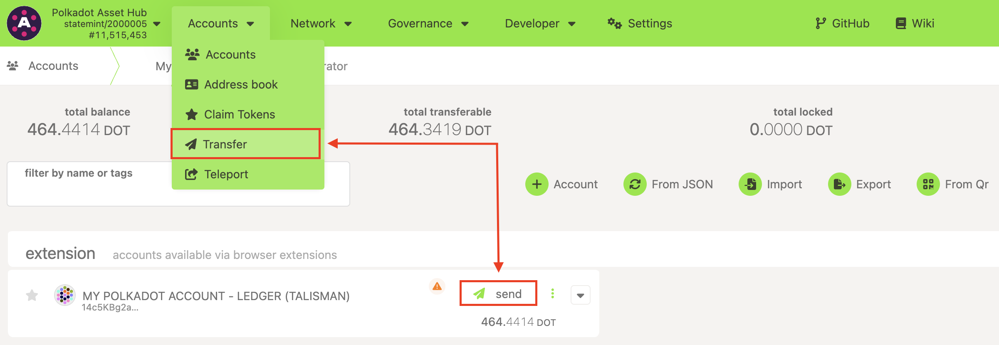
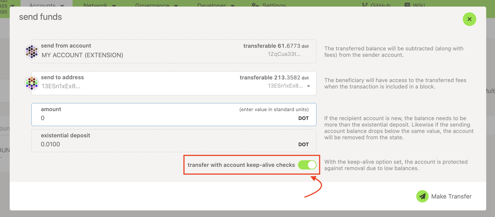
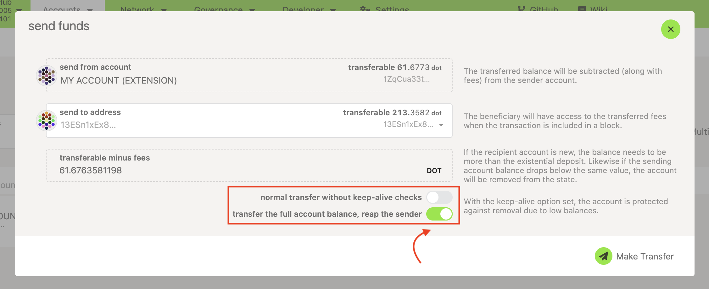
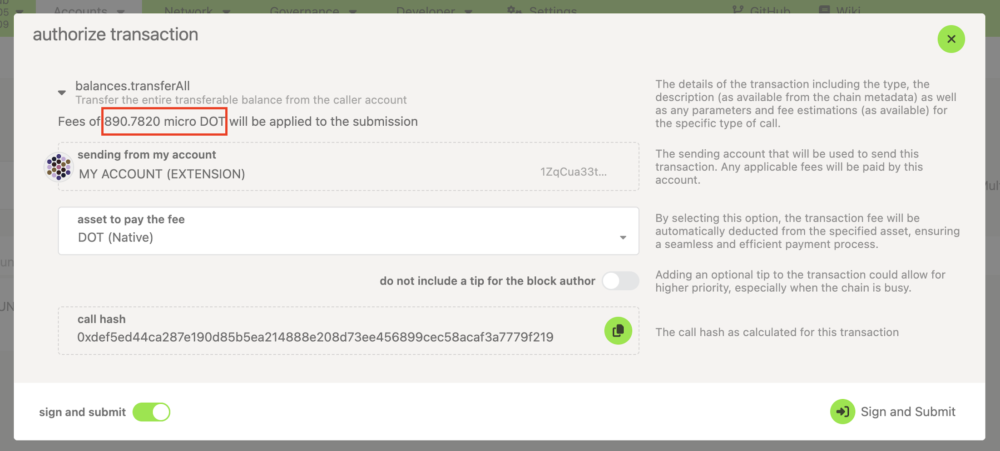
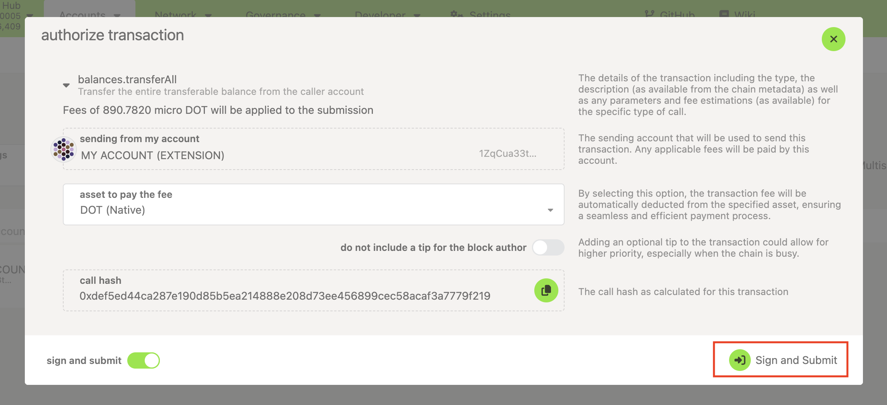

!!!info "Related Wiki page"
    For the underlying concepts, see [Transactions](../learn-transactions.md).

!!! warning "IMPORTANT"

    Polkadot Developer Interface (Polkadot-JS UI) is a web wallet meant for power users and developers. For everyday use, there are several user-friendly wallets funded by the Polkadot Treasury that support a plethora of features and platforms. Discover them in [this article](where-to-store-dot.md).

_Sometimes you want to empty an account by removing all the funds from it. For this case, you must configure the transaction accordingly. The account will be deactivated, and all your funds will be sent to the indicated account. Keep reading to learn how to do it._

* * *

If you want to send your total balance out of your account, be aware that your account will then be deactivated. Only accounts with a balance higher than the **Existential Deposit (ED)**  **of 0.01 DOT** are active on the Polkadot network. [You can learn more about this here.](existential-deposit.md)

!!! info

    Not all wallets that support DOT have the technical capability to allow you to send out the existential deposit. Below you will learn how to do this in the Polkadot Developer Interface.

    If your current wallet does not have this functionality, you can export your private key from there and import it to Polkadot Developer Interface or contact the support of your wallet to see if there's a way to deactivate your account. Once imported, you can proceed as below. Note that exposing your private keys on a website comes with a security risk, therefore you should only do this if you do not plan on reactivating this account in the future.

### Send all of your funds

To send all of your funds and reap the account, you should follow the steps below:

1\. Click on "Transfer" in the Accounts menu or click the "Send" button on the [Accounts](https://polkadot.js.org/apps/#/accounts) page next to the account you want to send from:

2\. Both options will take you to the following pop-up window, where you can enter the destination account and the amount you want to send. If you clicked the "Send" button to get here, the "Send from" account will already be set.

For the receiving account, you can either select an account from the drop-down menu, which lists all your accounts and all the accounts in your Address Book, or simply paste an address. The receiving account doesn't have to be in your Address Book.

3\. On the same screen, first disable the "keep alive" check:

4\. This will make a new option appear below: "Transfer the full account balance, reap the sender":

5\. When you switch that option on and make the transfer, the transaction costs will automatically be deducted from the total amount. Also, your account will be reaped, as it will fall below the[ Existential Deposit](existential-deposit.md) amount.

You can reactivate it anytime by depositing a minimum of 0.01 DOT.

6\. Once you have entered all the details, click on the "Make Transfer" button. It will take you to the pop-up window shown below, which will display your expected transaction fees in [microDOT](../learn-DOT.md#the-planck-unit):

7\. Once you're ready to make your transaction, click the "Sign and Submit" button:

8\. Sign the transaction with the sender account on your wallet.

9\. Congratulations, you have signed a transaction, and it will be included in the blockchain within a few seconds. You can now open any of the [block explorers](block-explorers.md) to view your transaction.

* * *

### Missing "transfer the full account balance, reap the sender" option

If you do not see this option, your account either holds exactly 0.01 DOT or is very close to it.

To fix this, send a small amount of DOT to this account to increase the transferrable balance so that the transaction fee can be deducted without the transferrable balance dropping below 0.01 DOT. Transaction fees are very low on Polkadot, so increasing the balance to even 0.012 DOT should be sufficient, but to be safe, it's recommended that you have at least 0.02 DOT. You will then see the "Reap the sender" option appear, and you can send your entire balance out.

Another possibility is that your account has other types of balances, like locked or reserved. In that case, the account can't be reaped, so you must manually enter the amount you want to send. You can read about different types of balances [here](../learn-account-balances.md). Also, the transferable balance can be below 0.01 DOT, but if it's too low, the UI won't let you send out funds.

* * *

If you are more of a visual learner, check this video on the topic:

[Transfer your Funds using Ledger Nano, Parity Signer, Polkadot-JS UI & Browser Extension](https://www.youtube.com/watch?v=gbvrHzr4EDY)
