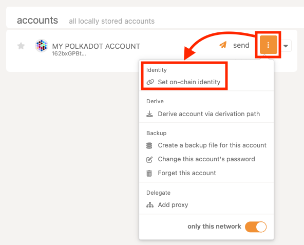
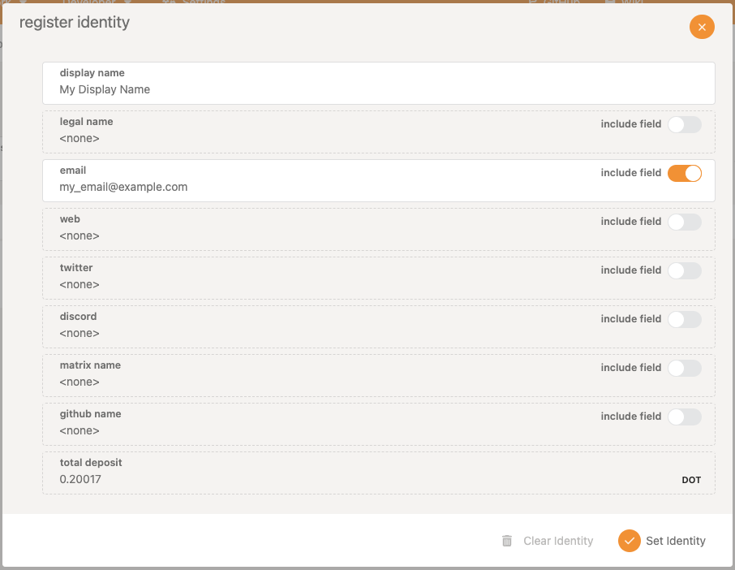
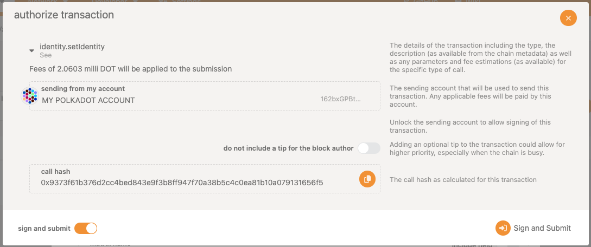

!!!info "Related concepts"
    For the underlying concepts, see [Identity](../learn-identity.md).

Polkadot provides a naming system that allows participants to add personal information to their on-chain account and subsequently ask for verification of this information by [registrars](../learn-identity.md#registrars).

!!! warning "IMPORTANT"

    Polkadot Developer Interface is a web wallet meant for power users and developers. For everyday use, there are several user-friendly wallets funded by the Polkadot Treasury that support a plethora of features and platforms. Discover them in [this article](where-to-store-dot.md).

This article will guide you through the process of setting up and clearing an identity on-chain on Polkadot.

!!! warning "ATTENTION"

    Identities on **Kusama and Polkadot** were moved to the **People** system chains. To set an identity on Polkadot or Kusama networks, you need to perform the actions below on the Polkadot and Kusama People chains, respectively.

    Follow [this guide](switch-network-nodes.md) on how to switch networks, or you can follow this links:
    [Polkadot People](https://polkadot.js.org/apps/?rpc=wss%3A%2F%2Fpolkadot-people-rpc.polkadot.io#/explorer)
    [Kusama People](https://polkadot.js.org/apps/?rpc=wss%3A%2F%2Fkusama-people-rpc.polkadot.io#/accounts)

### **Setting an Identity**

Users can set an identity by registering through default fields such as legal name, display name, website, X handle (formerly Twitter), Matrix handle, etc. along with some extra, custom fields for which they would like attestations (see [Judgements](../learn-identity.md#judgements)).

!!! warning "ATTENTION"

    Web3 Foundation's Registrar (Registrar Index 0) **no longer accepts judgement requests**. This change doesn't affect identities already judged by the registrar.

    For new identity judgments, please utilize the other registrars:
    [Polkadot Wiki: Registrars](../learn-identity.md#registrars)

Users must reserve funds in a bond to store their information on chain: 0.20017 DOT, and 0.00001 DOT per byte of encoded information (or about 0.006673 KSM and 0.0000003 KSM, respectively, in Kusama). These funds are _locked_ , not spent - they are returned when the identity is cleared.

These amounts can also be extracted by querying constants through the "[Chain state constants](https://polkadot.js.org/apps/?rpc=wss%3A%2F%2Fpolkadot-people-rpc.polkadot.io#/chainstate/constants)" tab on Polkadot Developer Interface.

To set an identity, follow the steps below:

1\. Click the three vertical dots next to your account and select "Set on-chain identity".

2\. A popup will appear, offering the default fields. Use the toggle to fill in any fields you wish.

3\. Click "**Set Identity** " to finish the process.

4\. Sign and submit the transaction.

* * *

### **Clearing an Identity**

Users can clear their identity information and have their deposit returned. Clearing an identity also clears all sub-accounts and returns their deposits.

To clear an identity:

1\. Make sure the account with your on-chain identity is connected to Polkadot Developer Interface and navigate to the "[Accounts](https://polkadot.js.org/apps/?rpc=wss%3A%2F%2Fpolkadot-people-rpc.polkadot.io#/accounts)" tab.

2\. Click the three dots corresponding to the account you want to clear and select "Set on-chain identity."

3\. Select "**Clear Identity** ", and sign and submit the transaction.

It is possible to kill an identity that it deems erroneous. This results in a slash of the deposit.

!!! warning "IMPORTANT"

    The set identity calls go on-chain. Hence, the contact information is available publicly, for both legitimate entities, like registrars or validators, but also scammers who might impersonate them.

    The strings in the identity fields are good candidates for homograph attacks, as someone could list a fraudulent website (web3.f0undation instead of web3.foundation for example) and still get verified by the registrar (if the checks are automated)!

    In a decentralized network, one should be cautious making transactions with accounts solely based on their identity. If an account on-chain claims to be of Web3 Foundation, it is wise to verify its authenticity by checking directly with Web3 Foundation or examining the established history of that account on-chain.

!!! info

    If you are looking to set sub-accounts instead, see [this article](set-subaccount-identities.md).

* * *
